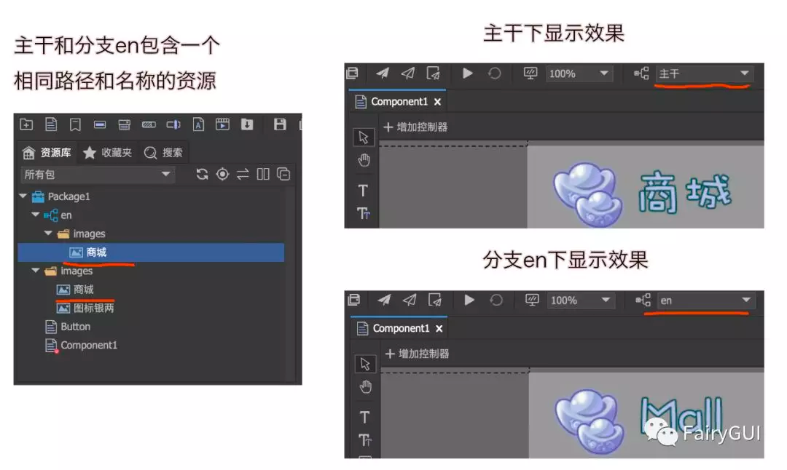
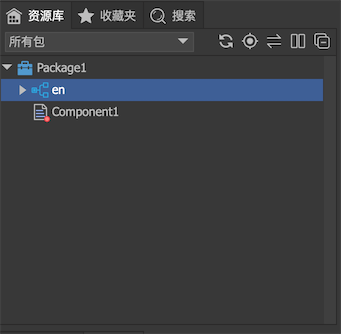
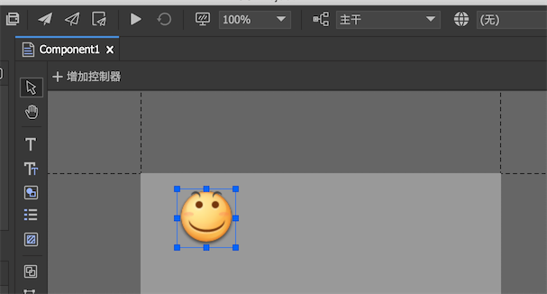
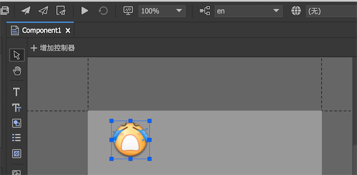

The branch function is used to implement the polymorphic design of the project, such as the differences in the UI in multiple language versions, and the differences in the UI in multiple channel versions.

There are many solutions that can be searched on the Internet. In general, they can be divided into two categories. One is the establishment of completely independent projects in various language versions, and the other is the runtime adjustment through code or configuration files. The former will bring a high price to iteration, while the latter is completely dependent on the programmer and cannot be WYSIWYG during design.

FairyGUI's solution to this kind of problem is a branch, which is completely WYSIWYG during the design period. You can directly see the effect of each version in the FairyGUI editor.

## Branching mechanism

The purpose of a branch is to make partial modifications to the trunk. We all develop on the trunk first, and then at any stage of the project, we can establish any number of branches. **Note that it is not the same as the branch concept in the code warehouse. The UI branch does not contain the resources of the trunk, it only places content that is different from the trunk.**



This mechanism works not only for images, but also for all types of resources, such as components and fonts. For example, if there is a requirement, the layout of the entire interface is completely different under different branches of a UI interface. Then we can also place components with the same path and name under the branch. As another example, when internationalizing our commonly used bitmap fonts, we also face the problem of using different materials in different languages, and the branching mechanism also supports bitmap fonts.

## Create branch

Click on "Project Settings-> Branch"Create a new branch. The name of the branch is suggested to be in English.

After the branch is created, a new resource directory is added to the project home directory. Assuming the branch name is en, its resource folder is "project home directory / assets_en". This directory is empty after the new branch is created. Next, we will create a branch for the package.

First switch the project to the branch in the main toolbar:


Then Context the package in the repository and select "Create Branch" from the context menu.



The specified package has an en branch. At this time, a new directory is also added in the "project main directory / assets_en", and the directory package is the package name, as shown in the figure:


Where package_branch.xml is the database file for the branch, and[package.xml](package.html#包的定义)Is a similar function.

## Resource mapping

In the editor, the branch is no different from a normal folder in the package. You can add resources to this folder, and you can also move or paste resources from other places without any restrictions. According to the mechanism of the branch, as long as the path and name of the resources of the branch and the trunk are exactly the same, they will automatically establish a mapping relationship.

**Demo one**

Import a face.png to the trunk, Branch also imports a face.png, And then create a new component Component1 on the trunk, drag the trunk's face.png into it:



Then switch the branch to en in the main toolbar, and you can see that the display of Component1 becomes:



This is the simplest demonstration of the branching mechanism.

**Demo two**

Let's demonstrate how to branch the entire component directly. Create a new component under the branch en, also named Component1, so that a mapping is established between the trunk / Component1 and en / Component1.

We switch branches to en,**If you directly open the trunk / Component1, you will find that the content of the stage will not be directly displayed as en / Component1, because you directly open the trunk / Component1 for editing.**

Now we create a new Component2 on the trunk, and then drag into the component1 of the trunk, and then we switch to branch, then we can find that Component1 in Component2 has been displayed as the content of en / Component2.

**Demo three**

We directly delete en / face in the resource library, and you will find that the image displayed in trunk / Component1 will immediately switch back to the trunk's face image. This shows that the relationship between the trunk and the branch is a weak connection. If this connection exists, the branch works; if it does not exist, it will not affect the content of the trunk.

## Branches and Controllers Home

In practical applications, we will also encounter the situation that some components on the interface need to be fine-tuned under different versions. If we establish a branch of a component according to the above scheme, each time the interface needs to be modified, it will also become a burden to modify all branches simultaneously. For this slight difference, we introduced a mechanism for the controller home page to match the branch name.


As shown above, the home page of the controller is set to "match branch name", and then the name of the page with index 1 is set to en. Then**When the component is created**If the current branch is en, the controller will automatically switch to the page with index 1. If the current branch is not en, the controller will stay on the page with index 0.

**Demo four**


In trunk / Component1, we have defined the home page of the controller as shown above, and added a position control to the image, and then click test (the controller home page function must be valid during the test):


It can be seen that when the branch is switched, the first page of c1 changes, and the position of the image changes accordingly. **(Note: The branch switch does not directly cause the controller to change. The branch switch in the editor actually restarts the test, that is, the component is re-created, so the home page function works.)**

## Release branch

There are two ways to handle branch releases:

- `Trunk contains all branches`The release results include the content of the trunk and all branches. The published content is placed on the "release path", not the "branch release path". With this approach, you can decide which branch to switch to at runtime.

   For example, the trunk has a face.png and the branch en also has a face.png. Then the release result contains two face.png. Which image is actually displayed at runtime is determined by the active branch name set by the code.

- `Trunk merge active branch`The release results contain the content of the trunk merged with the currently active branch. In other words, no matter what the current branch is, the release result first contains all the trunk content, and then to see which resources have branch mappings, the branch is used instead of the trunk. When the branch setting on the main toolbar is set to trunk, the published results are placed in the "release path"; when set to a branch, the published results are placed in "branch release path / branch name".

   For example, the trunk has a face.png, and the branch en also has a face.png. If the branch setting on the main toolbar is set to trunk, then the published results are placed in the "release path", and the face.png in the package is the trunk's face. png; if the branch is set to en on the main toolbar, the results of the release are placed in "branch release path / en", and the face.png in the package is the face.png in the branch en.

## Using branches at runtime

No matter which way the branch is released, the runtime must set the correct branch name through code.

```csharp
UIPackage.branch = "en";
```

Setting the branch name can be after AddPackage, but should be before any UI is created.