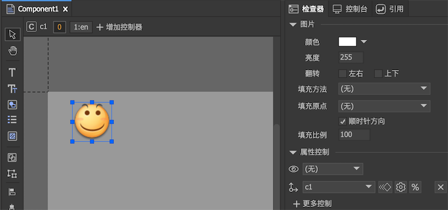
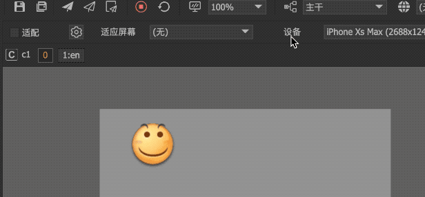

分支功能用于实现项目的多态设计，例如多国语言版本下UI的差别，又例如多个渠道版本下UI的差别。

网络上可以搜索到不少这方面的方案，总的来说可以分成两类，一类是各种语言版本建立完全独立的工程，另一类是通过代码或者配置文件进行运行时调整。前者会给迭代带来很高的代价，后者则完全依赖程序员，无法在设计期所见即所得。

FairyGUI解决这类问题的方案是分支，在设计期完全所见即所得，可以直接在FairyGUI编辑器看到各个版本的效果。

## 分支机制

分支的用途是对主干进行部分修改。我们都是首先在主干上开发，然后在项目的任何阶段，都可以建立任意多个分支。**注意，它和代码仓库中的分支概念不一样。UI分支不包含主干的资源，它只放置与主干有差别的内容。**


这种机制不但作用于图片，也同样作用于组件和字体等所有类型资源。例如，如果有一个需求，某个UI界面，在不同分支下，整个界面的布局完全不同。那么我们同样可以在分支下放置相同路径和名称的组件。又例如，我们常用的位图字体在国际化时，也要面临不同语言使用不同素材的问题，而分支机制也支持位图字体。

## 创建分支

在“项目设置->分支”里点击创建一个新分支。分支的名称建议使用英文。

分支创建后，在项目主目录会增加一个新的资源目录。假设分支名称是en，那么它的资源文件夹为“项目主目录/assets_en”。新分支创建后这个目录是空的，下面我们还要给包创建分支。

首先在主工具栏切换项目到分支：


然后在资源库里右键点击包，在右键菜单里选择“创建分支”。


这样指定包就有了一个en的分支。这时在“项目主目录/assets_en”内也增加了一个新目录，目录包就是包名，如图所示：


其中package_branch.xml是分支的数据库文件，和[package.xml](package.html#包的定义)是类似的功能。

## 资源映射

在编辑器内，分支就和包里的一个普通的文件夹没有任何区别，你可以向这个文件夹添加资源，也可以从其他地方移入或者粘贴资源，没有任何限制。按照分支的机制，分支和主干的资源只要路径和名称完全一致，他们就会自动建立一个映射关系。

**演示一**

向主干导入一个face.png ，分支也导入一个face.png ，然后在主干上新建一个组件Component1，把主干的face.png拖进去：


然后在主工具栏切换分支到en，可以看到Component1的显示变成：


这就是分支的机制的最简单的一个演示。

**演示二**

下面我们再来演示一下直接将整个组件做分支。在分支en下新建一个组件，名称也为Component1，这样主干/Component1和en/Component1就建立一个映射。

我们切换分支到en，**如果直接打开主干/Component1，你会发现舞台的内容是不会直接显示成en/Component1的，这是因为你是直接打开主干/Component1进行编辑。**

现在我们在主干上新建一个Component2，然后拖入主干的Component1，我们再切换分支到en，这时就可以发现Component2内的Component1已经显示为en/Component2的内容了。

**演示三**

我们在资源库中直接把en/face删除，你会发现主干/Component1中显示的图片会立刻切换回主干的face图片。这说明主干和分支的关系是弱连接，如果这种连接关系存在，则分支起作用；如果不存在，是不会不影响主干的内容的。

## 分支与控制器首页

在实际应用中，我们还会遇到在不同版本下，界面上的某些元件需要微调的情况。如果我们按上述方案建立一个组件的分支，那么每次界面需要修改时，同步修改所有分支也会成为一个负担。对于这种微小的差异，我们引入了控制器首页与分支名称匹配的机制。


如上图，控制器的首页设置为“匹配分支名称”，然后设定了索引1的页面的名称为en。那么**当组件创建的时候**，如果当前分支是en，控制器就会自动切换到索引为1的页面；如果当前分支不是en，那控制器还是停留在索引为0的页面。

**演示四**



在主干/Component1里，我们已经按上图定义好了控制器的首页，并且给图片加了一个位置控制，然后点测试（控制器首页功能必须在测试中才有效）：



可以看到当分支切换时，c1的首页发生了改变，图片的位置也随之发生了改变。**（注意：分支切换并不能直接导致控制器的改变，编辑器内的分支切换实际上是重新启动了测试，也就是组件是重新创建的，所以首页功能起到作用）。**

## 发布分支

分支发布处理方式有两种：

- `主干包含所有分支` 发布结果包含主干以及所有分支的内容。发布的内容放置在“发布路径”，而非“分支发布路径”。使用这种处理方式，可以在运行时再决定切换到哪个分支。

  例如主干有一个face.png，分支en也有一个face.png，那么发布结果就含有两个face.png。运行时实际显示哪个图片，由代码设置的活跃分支名称决定。
  
- `主干合并活跃分支` 发布结果包含主干合并当前活跃分支后的内容。也就是说，无论当前分支是什么，发布结果首先都包含所有主干的内容，然后查看哪些资源有分支映射关系的，就用分支的代替主干的。当主工具栏上分支的设置为主干时，发布出来的结果放置在“发布路径”；当设置为某个分支时，发布出来的结果放置在“分支发布路径/分支名称”。
  
  例如主干有一个face.png，分支en也有一个face.png，如果主工具栏上分支的设置为主干，那么发布出来的结果放置在“发布路径”，包里的face.png是主干的face.png；如果主工具栏上分支的设置为en，那么发布出来的结果放置在“分支发布路径/en”，包里的face.png是分支en里的face.png。

## 运行时使用分支

无论分支使用哪种方式发布，运行时都要通过代码设置正确的分支名称。

```csharp
  UIPackage.branch = "en";
```

设置分支名称可以在AddPackage之后，但应该在创建任何UI之前。