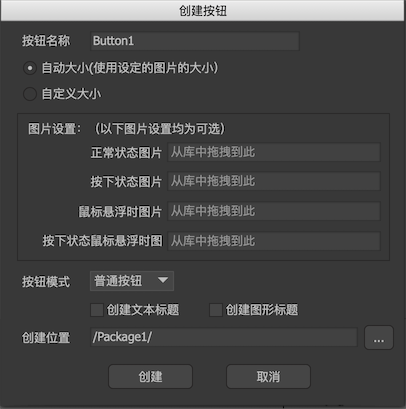
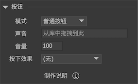
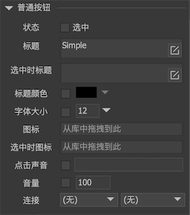

Buttons are the most commonly used extension components in FairyGUI. It is used for multiple purposes, such as RadioButton, Checkbox, List Item, etc. in the traditional UI framework, all of which are buttons in FairyGUI.

## Create button

There are two ways to create a button component.

- Click the main menu "Resources-> New button" and follow the wizard's prompts step by step to complete.

   

- Create a new component and select Expand to "Button" in the component properties. Then create a controller and click, Select a button template.

## Edit-mode properties

In the component editing state, the properties panel of the button component is:



- `mode`There are three button mode options.
   - `Ordinary button`Use for click response, stateless.
   - `single button`There is a state of being selected. After being clicked, it will be selected, and click again to remain selected. If you want to implement a radio button group, you can bind the "connection" property of multiple radio buttons to the same controller. For details, refer to [Controller](controller.html#Linkage-with-button)。
   - `Check button`There is a state of being selected. After being clicked, it is selected, and then clicked to become unselected.

- `sound`Set the sound effect when the button is clicked. If all buttons share a sound effect, there is no need to set each button, there is a global setting in the project properties dialog.

- `volume`Set the playback volume of the button click sound. 0-100。

- `Press effect`The controller can be used to control the shape of the buttons on different pages at will, but for convenience, several commonly used button pressing effects are built in.
   - `Zoom`The button becomes larger or smaller when pressed. Push-to-zoom is achieved by changing the ScaleX and ScaleY of the button component. Note: After the zoom is set, the axis will be automatically set to (0.5, 0.5) when the button is initialized. **(Except for the Unity platform, other platforms may have a set to make the press smaller. When pressed exactly on the edge of the button, there will be a press effect, but the click event is not triggered. The solution is to use a larger press than a smaller press. If you must press it to become smaller, it is recommended that the threshold value is not too large, it can be slightly effective,)**
   - `darken`The button appears dimmed when pressed. Dimming is actually achieved by changing the color of all images in the button component.**If you also have separate settings for the color of the image inside the button, this may conflict and cause the color settings to be lost.**

## Instructions

- `button`The button controller must be named "button". If you don't need the button to have a special effect, then this controller is not necessary.

   Description of each page of the button controller:

   `up`Normal state of the button;`down`The state when the normal button is pressed / the state when the radio or multi-select button is selected;`over`The state when the mouse pointer is hovering over the button;`selectedOver`The state of the mouse pointer when the radio button or multi-select button is selected;`disabled`State when the button is unavailable;`selectedDisabled`The state of a button when it is unavailable when a radio or multi-select button is selected.

   Usually we design a 4-state button, use up / down / over / selectedOver. If it is used on a mobile device, then use up / down. When the button is unavailable, FairyGUI provides a default grayed-out effect. If you don't want this effect, you should use disabled and selectedDisabled for design.

- `title`Can be plain text, rich text, labels, buttons.

- `icon`It can be a loader, or a label or button.

Note: There is not only “title” and “icon” inside the button component, you can place any component, such as placing as many texts, loaders, etc. The "title" and "icon" settings are only used for the button components to be intuitively set when the editor is instantiated.

## Instance properties

Select a button component on the stage, and the property panel list on the right appears:



- `status`The radio button or multi-select button can set whether the button is selected. Ordinary button properties have no meaning.

- `title`The set text will be assigned to the text property of the "title" element inside the button component. If the "title" element does not exist, nothing will happen.

- `Title when selected`When the button is selected, set the text property of the "title" component to the value set here; when the button is not selected, restore the value of the original title property.

- `Title color`The default title color is the text color of the "title" element in the button component. After checking, you can modify the text color. If the "title" element does not exist, nothing will happen.

- `font size`The default font size is the font size of the "title" element in the button component. After checking, you can modify the font size. If the "title" element does not exist, nothing will happen.

- `icon`The set URL will be assigned to the icon attribute of the "icon" element in the button component. If the "icon" element does not exist, nothing will happen.

- `Icon when selected`When the button is selected, the icon attribute of the "icon" element in the button component is set to the value set here; when the button is not selected, the original icon attribute value is restored.

- `Click sound`After ticking, you can reset the click sound of the button, which overrides the setting of the button during the design period.

- `volume`Set the playback volume of the button click sound. 0-100。

- `connection`The controller can be linked with buttons. See [controller](controller.html#Linkage-with-button)

## GButton

Set the button's title or icon. You don't even need to force the object to be the type of GButton. You can use the interface provided by GObject directly, for example:

```csharp
GObject obj = gcom.GetChild ("n1");
    obj.text = "hello";
    obj.icon = "ui://package name/image name";
```

If it is a radio or multi-select button, the following method sets whether it is selected:

```csharp
button.selected = true;
```

Normally for a single / multi-select button, the user can switch the state after clicking. If you don't need this and want to change the state only through the API, then you can:

```csharp
// After closing, you can only modify the state of the button by changing the selected property. The user will not change the state when clicked.
    button.changeStateOnClick = false;
```

The global sound of the button is set as follows:

```csharp
// The Unity version requires an AudioClip object. If you use the resources in the library, you can use:
    UIConfig.buttonSound = (NAudioClip) UIPackage.GetItemAssetByURL("ui://package name/sound name");

    // Other versions require a resource url, that is:
    UIConfig.buttonSound = "ui://package name/sound name";
```

The volume of the button global sound is set as follows:

```csharp
// Global volume
    UIConfig.buttonSoundVolumeScale = 1f;
```

This setting can only be set before any UI is created. If you want to dynamically control the global sound (including dynamic sound effects) on or off, the Unity platform can use the following methods, other platforms need to consult the functions provided by the engine.

```csharp
GRoot.inst.EnabledSound ();
    GRoot.inst.DisableSound ();

    // Adjust the global sound volume, this includes the button sound and the sound played by the effect
    GRoot.inst.soundVolume = 0.5f;
```

The method of monitoring the click of a common button is: (Note that the click event is not only a button, any touch-enabled components, such as common components, loaders, graphics, etc., and their click event registration method is the same as the button.)

```csharp
//Unity/Cry/MonoGame
    button.onClick.Add(onClick);

    //AS3
    button.addClickListener(onClick);

    //Egret
    button.addClickListener(this.onClick, this);

    //Laya
    button.onClick(this, this.onClick);

    //Cocos2dx
    button->addClickListener(CC_CALLBACK_1(AClass::onClick, this));

    //CocosCreator
    button.onClick(this.onClick, this);
```

The button can simulate a triggered click:

```csharp
// Simulate the trigger click, there will only be a triggered performance, and changing the button state will not trigger listening for the button click event.
    button.FireClick (true);

    // If the click event is to be triggered at the same time, an additional call is required: (only Unity / Cry examples, other platforms study it themselves)
    button.onClick.Call ();
```

There are notification events when the radio button and radio button state change:

```csharp
//Unity/Cry/MonoGame
    button.onChanged.Add(onChanged);

    //AS3
    button.addEventListener(StateChangeEvent.CHANGED, onChanged);

    //Egret
    button.addEventListener(StateChangeEvent.CHANGED, this.onChanged, this);

    //Laya
    button.on(fairygui.Events.STATE_CHANGED, this, this.onChanged);

    //Cocos2dx
    button->addEventListener(UIEventType::Changed, CC_CALLBACK_1(AClass::onChanged, this));

    //CocosCreator
    button.on(fgui.Event.STATUS_CHANGED, this.onChanged, this);
```
