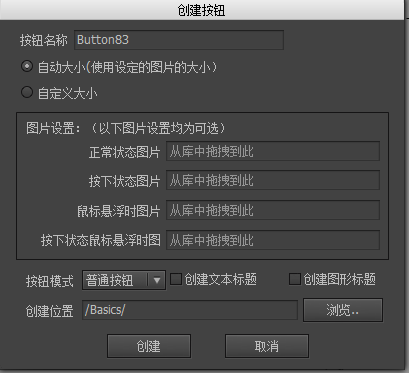
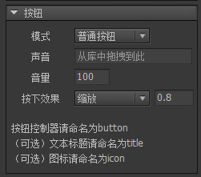
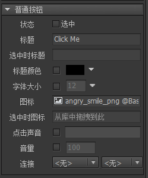

Buttons are the most commonly used extensions in FairyGUI. It's used for many purposes, such as `RadioButton`, `Checkbox`, `ListItem`, etc. in the traditional UI framework, all in the FairyGUI are buttons.

## Create Button

There are two ways to create a button component.

- Click on `Main Menu -> "Resources" -> "New Button"` and follow the wizard's prompts to complete step by step.



- Create a new component and select `Expand as "Button"` in the component properties. Then create a controller, click on `"Button Template"` and select a button template.

## Design Attribute

In the component editing state, the properties panel of the button component is:



- `Mode` There are three button mode selections.
 - `Common` is used for click->response purposes, no state.
 - `Radio` has a status of whether it's selected. After being clicked, it's selected, and then click to keep it selected. If you want to implement a radio button group, you can bind the "Connect" property of multiple radio buttons to the same controller. For details, please refer to [Controller](controller.html#和按钮的联动).
 - `Check` has a status of whether it's selected. After being clicked, it's selected, and then clicked to become unchecked.

- `Sound` Sets the sound effect when the button is clicked. If all buttons share a single sound effect, you don't need each button setting, there is a global setting in the project properties dialog.

- `Volume` Sets the playback volume of the sound effect that's played when the button is clicked. 0-100.

- `Down Effect` With the controller, you can control the shape of the buttons on different pages at will, but for convenience, several commonly used button press effects are built-in.
 - `Scale` The button becomes larger or smaller when pressed. Pressing the zoom is done by changing the ScaleX and ScaleY of the button component. Note: When the zoom is set, the axis will be automatically set to (0.5, 0.5) when the button is initialized. * (In addition to the Unity platform, other platforms may have a setting that is smaller and smaller, when pressed just at the edge of the button, there is a pressing effect, but the click event isn't triggered. The solution is to use the press to become bigger instead of Press to make it smaller. If it must be pressed down, it's recommended that the threshold shouldn't be too large, it will be slightly effective,)*
 - `Dark` The button is darkened when pressed. Darkening is actually done by changing the color of all the pictures in the button component. **If you have separate settings for the color of the image inside the button, this can be a conflict, resulting in a loss of color settings.***(Because the Egret and Laya platforms do not support image discoloration, darkening isn't available. In fact, on mobile phones, it's more appropriate to use the zoom effect.)*

**Naming Convention**

- `button` The button controller must be named "button". If you don't need a special effect on the button, then this controller isn't required.

Description of each page of the button controller:

`up` The button's default state;
`down` The state when the normal button is pressed/the status of the single or multi-select button is selected;
`over` The state when the mouse pointer is hovering over the button;
`selectedOver` When the single or multi-select button is selected, the state when the mouse pointer is hovered over the button;
`disabled` The state when the button isn't available;
`selectedDisabled` The state when the button isn't available when the single or multiple selection button is selected.

Usually we design a 4-state button, `up`/`down`/`over`/`selectedOver`. If designed solely for mobile devices, then `up`/`down` is fine. When the button isn't available, FairyGUI provides a default grayed out effect. If you don't want this effect, use `disabled` and `selectedDisabled` to design.

- `title` It can be plain text, `RichText`, `Label`s, or `Button`s.

- `icon` It can be a `Loader`, `Label`, or `Button`.

Note: There are not only "title" and "icon" in the button component. You can place any component, such as placing as many texts, loaders, and so on. The settings for "title" and "icon" are only used to intuitively set the button component when the editor is instantiated.

## Instance Attribute

Select a button component on the Stage and the list of property panels on the right appears:



- `Status` A radio button or a multi-select button sets whether the button is selected.

- `Title` The set text will be assigned to the text attribute of the "title" component within the label component. If the "title" component doesn't exist, nothing will happen.
   The input box here is relatively small. If you want to enter large text, you can press `CTRL+ENTER` when the input is activated, and then a window will pop up for inputting text.

- `Selected Title` When the button is selected, the title property is set to the value set here; when the button is unchecked, the value of the original title property is restored.

- `Color` The default title color is the text color of the "title" component in the label component. When checked, the text color can be modified. If the "title" component doesn't exist, nothing will happen.

- `Font Size` The default font size is the font size of the "title" component in the label component. When checked, the font size can be modified. If the "title" component doesn't exist, nothing will happen.

- `Icon` The set URL will be assigned to the icon property of the "icon" component within the `Label` component. If the "icon" component doesn't exist, nothing will happen.

- `Selected Icon` When the button is selected, the icon property is set to the value set here; when the button is unchecked, the value of the original icon property is restored.

- `Sound` After checking, you can reset the button click sound and override the button's setting during the design period.

- `Volume` Sets the playback volume of the sound effect that's played when the button is clicked. 0-100.

- `Connect` The controller can be linked to the button. Please refer to [Controller](controller.html#和按钮的联动)

## GButton

Set the title or icon of the button. You don't even need to force the object to be of type `GButton`. You can use the interface provided by `GObject` directly, for example:

```csharp
    GObject obj = gcom.GetChild("n1");
    obj.text = "hello";
    obj.icon = "ui://PackageName/ImageName";
```

If it's a single or multiple selection button, the following method settings are selected:

```csharp
    GButton button = gcom.GetChild("n1").asButton;
    button.selected = true;
```

Usually for the radio/multiple selection button, the user can switch states after clicking. If you don't need this, and you want to change the state only through the API, you can:

```csharp
    // After closing, you can only change the state of the button by changing the selected property. The user clicks it without changing the state.
    button.changeStateOnClick = false;
```

The way to link the controller to the controller via the code setting button is:

```csharp
    button.pageOption.controller = aController;
    button.pageOption.index = 1; //Set by index
    button.pageOption.name = "page_name"; //Or set by page name
```

Setting the global button sound:

```csharp
    // The Unity version requires an AudioClip object. If you are using the resources in the library, you can use:
    UIConfig.buttonSound = (AudioClip)UIPackage.GetItemAssetByURL("ui://PackageName/SoundName");

    // Other versions require a resource url, namely:
    UIConfig.buttonSound = "ui://PackageName/SoundName";

    // Global volume
    UIConfig.buttonSoundVolumeScale = 1f;
```

If you want to control the global sound toggle or volume, you can do like this:
*(This setting can only be set before any UI is created)*

```csharp
    // Switching sounds (Laya and Egret have their own sound switches, do not need to use this, please consult their documentation)
    GRoot.inst.EnabledSound();
    GRoot.inst.DisableSound();

    // Adjust the global sound volume, this includes the sound of the button sound and the sound of the animation
    GRoot.inst.soundVolume = 0.5f;
```

The way to listen to normal button clicks is:
*(Note that click events are not just buttons. On any touch-enabled components, such as normal components, loaders, graphics, etc., their click event registration method and button are the same.)*

```csharp
    // Unity/Cry
    button.onClick.Add(onClick);

    // AS3
    button.addClickListener(onClick);

    // Egret
    button.addClickListener(this.onClick, this);

    // Laya
    button.onClick(this, this.onClick);

    // Cocos2dx
    button->addClickListener(CC_CALLBACK_1(AClass::onClick, this));
```

A button simulating a trigger click:

```csharp
    // Simulating a triggered click will only have one triggered performance, as well as changing the button state, without triggering a click event on the listen button.
    button.FireClick(true);

    // If you want to trigger a click event at the same time, you need to make additional calls: (Unity/Cry example only, other platforms study it yourself)
    button.onClick.Call();
```

There are notification events when the radio and multi-select button states change:

```csharp
    // Unity/Cry
    button.onChanged.Add(onChanged);

    // AS3
    button.addEventListener(StateChangeEvent.CHANGED, onChanged);

    // Egret
    button.addEventListener(StateChangeEvent.CHANGED, this.onChanged, this);

    // Laya
    button.on(fairygui.Events.STATE_CHANGED, this, this.onChanged);

    // Cocos2dx
    button->addEventListener(UIEventType::Changed, CC_CALLBACK_1(AClass::onChanged, this));
```