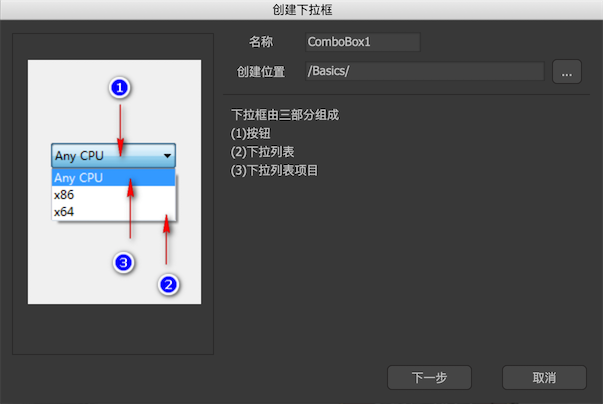
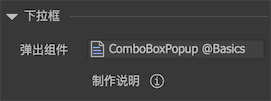
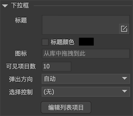
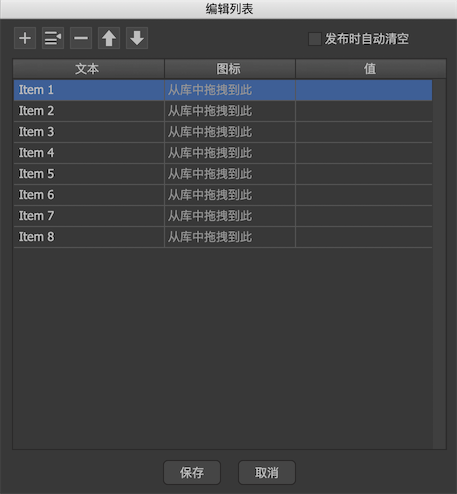

## Create a drop-down box

There are two ways to create a drop-down box component.

- Click the main menu "Resources"-> "New drop-down box", and follow the wizard's prompts to complete step by step.



- Create a new component, and then select Expand to "drop-down box" in the component properties.

## Edit-mode properties

In the component editing state, the properties panel of the drop-down box component is:



- `Eject component`The component that the drop-down box needs when the option pops up.

   The most basic design of this component is a background + a list. The background associates the width and height of the container component. The list needs to be named "list" and set "project resources". Generally speaking, the "overflow processing" of the list is set to "vertical scroll". The list does not require any relation.

   

   When the drop-down box needs to pop up the drop-down list, the width of the pop-up component is automatically set to the width of the drop-down box, then the list data is filled, and the height of the list is adjusted according to the "number of visible items" requirement, and finally displayed.

## Instructions

- `button`The drop-down box also needs a button controller, because it has the same shape as the button. The drop-down box can be designed as a design button. When the drop-down box is clicked to drop down, the "button" controller will stay on the "down" page. After the drop-down list is retracted, the "button" controller returns to the "up" or "over" page.
- 
- `title`Can be plain text, rich text, labels, buttons.

- `icon`It can be a loader, or a label or button.
- 
## Instance properties

Select a drop-down box component on the stage, and the property panel list on the right appears:



- `title`The set text is assigned to the text property of the "title" element inside the label component. If the "title" element does not exist, nothing will happen.

- `icon`The set URL will be assigned to the icon attribute of the "icon" element in the label component. If the "icon" element does not exist, nothing will happen.

- `Number of visible items`The maximum number of items displayed when the drop-down is displayed. For example, if the value set here is 10 and the data of the drop-down box is 100, then the viewport of the drop-down list will be adjusted to display only 10, others need to be scrolled.

- `Ejection direction`The pop-up direction of the drop-down list. If it is automatic, try popping down first, and if the display goes beyond the screen, try popping up.

- `Selection control`You can bind a controller. In this way, when the drop-down box selection changes, the controller also jumps to the page with the same index at the same time. Vice versa, if the controller jumps to a certain page, the drop-down box also selects the item with the same index at the same time.

- `Editing list items`After clicking, a dialog box will pop up, you can edit the items in the drop-down list:

   

   - `Clear when publishing`All items are cleared when publishing, that is, the settings here are only used for preview in the editor.
   - `text`Sets the title of this list item.
   - `icon`Set the icon for this list item.
   - `value`Set the value property of this list item, please refer to the API description below.

## GComboBox

We can edit the items in the drop-down list in the editor, or set them dynamically with code, for example:

```csharp
GComboBox combo = gcom.GetChild ("n1").asComboBox;

    // items is an array of list item titles.
    combo.items = new string [] {"Item 1", "Item 2", ...};

    // values is optional and represents the value of each list item.
    combo.values = new string [] {"value1", "value2", ...};

    // Get the index of the currently selected item
    Debug.Log (combo.selectedIndex);

    // Get the value of the currently selected item.
    Debug.Log (combo.value);

    // Set the selected item by index
    combo.selectedIndex = 1;

    // Set the selected item by value
    combo.value = "value1";
```

There is a notification event when the drop-down box selection is changed:

```csharp
//Unity/Cry/MonoGame
    combo.onChanged.Add(onChanged);

    //AS3
    combo.addEventListener(StateChangeEvent.CHANGED, onChanged);

    //Egret
    combo.addEventListener(fairygui.StateChangeEvent.CHANGED, this.onChanged, this);

    //Laya
    combo.on(fairygui.Events.STATE_CHANGED, this, this.onChanged);

    //Cocos2dx
    combo->addEventListener(UIEventType::Changed, CC_CALLBACK_1(AClass::onChanged, this));

    //CocosCreator
    combo.on(fgui.Event.STATUS_CHANGED, this.onChanged, this);
```

The pop-up box will automatically close when you click on the blank space. If you want to be notified of this shutdown, you can listen to the event of moving out of the stage, for example:

```csharp
//Unity/Cry
    combo.dropdown.onRemoveFromStage.Add(onPopupClosed);

    //AS3
    combo.dropdown.addEventListener(Event.REMOVED_FROM_STAGE, onPopupClosed);

    //Egret
    combo.dropdown.addEventListener(egret.Event.REMOVED_FROM_STAGE, this.onPopupClosed, this);

    //Laya
    combo.dropdown.on(laya.events.Event.UNDISPLAY, this, this.onPopupClosed);

    //Cocos2dx
    combo->getDropdown()->addEventListener(UIEventType::Exit, CC_CALLBACK_1(AClass::onPopupClosed, this));

    //CocosCreator
    combo.on(fgui.Event.UNDISPLAY, this.onPopupClosed, this);
```

If you want to close the popup box manually:

```csharp
GRoot.inst.HidePopup ();
```
