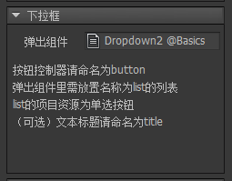
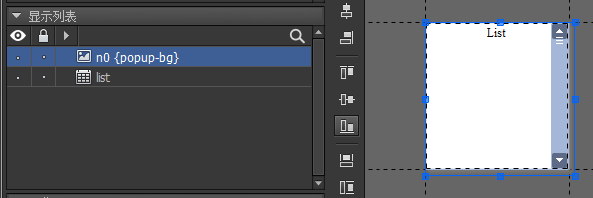

## Create ComboBox

There are two ways to create a`ComboBox`component.

- Click on the main menu "Resources" -> "New ComboBox" and follow the wizard's prompts to complete step by step.


- Create a new component and select Expand as "ComboBox" in the component properties.

## Design Properties

In the component editing state, the properties panel of the `ComboBox` component is:



- `Popup Component` The`ComboBox`is required for the option to pop up.



The most basic design of this component is a background + a list. The background makes a wide and high correlation to the container components. The list needs to be named "list" and set the "Project Resource". In general, the "overflow processing" of the list is set to "vertical scrolling". The list doesn't need any set `Relation`s.

When the `ComboBox` needs to pop up the drop-down list, the width of the pop-up component will be set to the width of the `ComboBox`, then the list data will be filled, and the height of the list will be adjusted according to the requirements of the number of visible items, and finally displayed.

**Naming Convention**

- `button` The `ComboBox` also requires a button controller because it's the same shape as the button. The `ComboBox` can be designed in the same way as the design button. When the `ComboBox` is clicked down, the "button" controller will stay on the "down" page. After the drop-down list is retracted, the "button" controller will return to the "up" page or the "over" page.

- `title` It can be plain text, rich text, labels, or buttons.

- `icon` It can be a loader, label, or button.

## Instance Attributes

Select a `ComboBox` component on the Stage and the list of property panels on the right appears:


- `Title` The set text will be assigned to the text attribute of the "title" component within the label component. If the "title" component doesn't exist, nothing will happen.

- `Icon` The set URL will be assigned to the icon property of the "icon" component within the `Label` component. If the "icon" component doesn't exist, nothing will happen.

- `View Count` The maximum number of items displayed when the drop-down is displayed. For example, if the value set here is 10, and the data in the`ComboBox`has 100, then the viewport of the drop-down list will be adjusted to display only 10, and the others need to scroll.

- `Popup` The pop-up direction of the drop-down list.

- `Selection Control` You can bind a controller. Thus, when the`ComboBox`selection changes, the controller also jumps to the same index page. Vice versa, if the controller jumps to a page, the`ComboBox`also selects the same indexed item.

- `Edit Items` After clicking, a dialog box pops up to edit the items in the drop-down list.:


- `Text` Set the title of this list item.

- `Icon` Sets the icon for this list item.

- `Value` Sets the value attribute of this list item. For the purpose, please refer to the description of the API below.

## GComboBox

We can edit the drop-down list of items in the editor or dynamically with code, for example:

```csharp
    GComboBox combo = gcom.GetChild("n1").asComboBox;

    // Items is an array of list item titles.
    combo.items = new string[] { "Item 1", "Item 2", ...};

    // Values are optional and represent the value of each list item.
    combo.values = new string[] { "value1", "value2", ...};

    // Get the index of the currently selected item
    Debug.Log(combo.selectedIndex);

    // Get the value of the currently selected item.
    Debug.Log(combo.value);

    // Set the selected item to pass the index
    combo.selectedIndex = 1;

    // Set the selected item, passing a value
    combo.value = "value1";
```

There's a notification event when the`ComboBox` selection changes:

```csharp
    // Unity/Cry
    combo.onChanged.Add(onChanged);

    // AS3
    combo.addEventListener(StateChangeEvent.CHANGED, onChanged);

    // Egret
    combo.addEventListener(fairygui.StateChangeEvent.CHANGED, this.onChanged, this);

    // Laya
    combo.on(fairygui.Events.STATE_CHANGED, this, this.onChanged);

    // Cocos2dx
    combo->addEventListener(UIEventType::Changed, CC_CALLBACK_1(AClass::onChanged, this));
```

After clicking in a blank space, the popup will automatically close. If you want to get this notification upon closing, you can listen to events based on exiting the Stage. For example:

```csharp
    // Unity/Cry
    combo.dropdown.onRemoveFromStage.Add(onPopupClosed);

    // AS3
    combo.dropdown.addEventListener(Event.REMOVED_FROM_STAGE, onPopupClosed);

    // Egret
    combo.dropdown.addEventListener(egret.Event.REMOVED_FROM_STAGE, this.onPopupClosed, this);

    // Laya
    combo.dropdown.on(laya.events.Event.UNDISPLAY, this, this.onPopupClosed);

    // Cocos2dx
    combo->getDropdown()->addEventListener(UIEventType::Exit, CC_CALLBACK_1(AClass::onPopupClosed, this));
```

If you want to close the popup manually:

```csharp
    GRoot.inst.HidePopup();
```