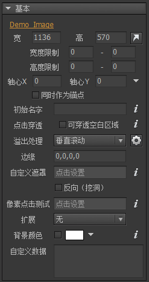
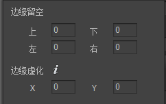
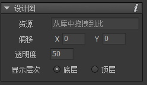
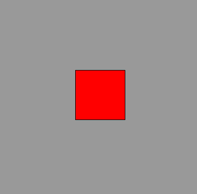
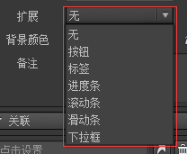

`Component` is a base container in FairyGUI. A `Component` can contain one or more base display objects, as well as components.

## Component Attributes

Click on the **blank** on the Stage, and the property bar on the right shows the properties of the container-component:



- `Width` `Height` Set the width and height of the component.

- `Width Limit` `Height Limit` The left side is the minimum value, the right side is the maximum value, and 0 means no limit. Note: Modifying the width and height limits doesn't modify the current width and height, even if the current width and height values don't meet the limit.

- `轴心` Rotate, scale, and tilt the pivot points of these transformations. The value ranges from 0 to 1. For example, X = 0.5 and Y = 0.5 indicate the center position. Click on the small triangle on the right to quickly set some commonly used values, such as center, bottom left corner, bottom right corner, and so on.

- `同时作为锚点` When this option is checked, the component's origin position will be set to the position of the axis. By default, each component's (0,0) is in the upper left corner; when the axis is selected as the anchor point, the component's (0,0) is at the axis position. Note that the associated system doesn't count towards the impact of this option, so check the components behind the anchor point, and then use the association of the wide and high class, may not behave normally.

- `初始名字` When the component is instantiated (within the editor), the name of the component is automatically set to the value set here. The most common use is that the FairyGUI requires the window frame component to be named frame. Then after you create a window frame component, set the "initial name" to the frame. After each dragging into the component, you will automatically get the name. You don't have to change it every time.

- `点击穿透` 默认情况下，组件的矩形区域（宽x高）将拦截点击，勾选后，点击事件可以穿透组件中**没有内容**的区域。详细说明在[点击穿透](#点击穿透)。

- `溢出处理` 表示处理超出组件矩形区域的内容的方式。注意:**溢出处理**不支持在代码里动态修改。
 - `可见` 表示超出组件矩形区域的内容保持可见，这是默认行为。
 - `隐藏` 表示超出组件矩形区域的内容不可见，相当于对组件应用了一个矩形遮罩。
 - `垂直滚动` `水平滚动` `自由滚动` 与其他UI框架很大不同，在FairyGUI中不需要拖入滚动控件实现滚动。任何一个普通的组件，只需要简单设置一个属性就可以使组件具有滚动功能。溢出处理中有三种滚动的选择，自由滚动就是横向和纵向都能滚动。详细说明在[滚动容器](scrollpane.html)。

- `边缘` Set the space around the component to be left blank. It is generally used when "overflow processing" is "hidden" or "scrolling". Edge blur is currently only supported on the Unity platform. If the component has been tailored to the content, it can create a blur effect on the edge to enhance the user experience. This value should be large to see the effect, such as 50.

<center>

</center>

- `Custom Mask` Details are in [Mask](#Mask).

- `Reverse (Burrowing)` Details are in [Mask](#Mask).

- `Pixel Hit Test` Detailed description in [Click Test](#ClickTest).

- `Extension` Detailed description in [Extension](#Extension).

- `Background Color` Set the background color of the component editing area, only for auxiliary design. The actual component background is transparent, there will be no color. If you need components with a real background color, you can place a graphic.

- `Custom Data` You can set custom data. FairyGUI doesn't parse it, and it's released to the final description file as-is. Developers can retrieve it at runtime. The acquisition method varies according to the SDK version. If the SDK supports the XML package format, the acquisition method is:
  ```csharp
    // Unity/Cry
    aComponent.packageItem.componentData.GetAttribute("customData");

    // Cocos2dx/Vision
    aComponent->getPackageItem()->componentData->RootElement()->Attribute("customData");

    // LayaAir
    aComponent.packageItem.componentData.getAttribute("customData");

    // Egret
    aComponent.packageItem.componentData.attributes.customData;

    // AS3/Starling
    aComponent.packageItem.componentData.@customData;
  ```
  If the SDK supports the binary package format, the acquisition method is:
    ```csharp
    // Unity/Cry/Laya/Egret
    aComponent.baseUserData;

    // Cocos2dx/Vision
    aComponent->getBaseUserData();
  ```

## Design Function



You can set the design of a component. The design will be displayed on the Stage and can be set to appear at the bottom or top of the component content. Using a design diagram can make the stitching UI faster and more accurate.

The design map won't be published to the final resource.

## Click Through

Within the component, the component shown in the front will receive the click event first. If the component is touchable, the click event ends and won't continue to be passed backwards.

Clicking on the test within the component's area is valid (no clicks uncaptured), regardless of whether there are subcomponents in this range. Let's look at an example.

This is component `A`, which is 400x400 in size and has 4 white rectangles.:


This is component `B`, which is 400x400 in size and has a red rectangle:



Add `B` to the Stage first, then add `A` to the stage. That is, `A` is displayed in front of `B`. The effect is as follows:


We can see that although `A` is above `B`, the red square is visible because `A` has no content in this area. When you click on the position of the green dot in the graph, the click event will trigger on `A`, and `B` won't click. This is because within the scope of `A`, the click isn't ignored.

What if I want `A` to be ignored? The settings are provided in the component properties:，and can also be set in code:

```csharp
    // True means clickable (captured) and false means ignored (uncaptured).
    aComponent.opaque = false;
```

After disabling its click-capturing, `A` only receives the click event when clicking 4 white blocks. If the green dot position is clicked, `B` will receive the click event.
**This feature is especially important when designing some fullscreen interfaces. For example, a main interface is added to the Stage and set to full screen. If the click isn't ignored, then `Stage.isTouchOnUI` will always return true.**

**Note: Pictures and normal text don't accept clicks. If a component that only contains images or plain text is set to clickable, then the entire component is completely ignored and no clicks are captured.**

## Pixel Hit Test

For some special needs, you need to use `Pixel Hit Test` on an irregular area. First you need to prepare a picture with irregular areas. The opaque pixels in the picture represent the areas that accept the click, the transparent pixels represent the areas where clicks are ignored, and the areas in the component that are beyond the scope of the image are also ignored areas.

Drag this image onto the Stage and select it in the component's `Pixel Hit Test` property.

<center>

</center>

## Mask

There are two types of masks for FairyGUI: rectangular masks and custom masks.

### Rectangular Mask

Set the component's `Overflow Processing` to `Hidden` or `Scroll`, and the component has a rectangular mask. Areas that are out of the component (rectangular area - edge left) aren't visible. This mask is the most efficient no matter what platform it's on.

### Custom Mask

You can set a picture or graphic inside the component as a mask for the component. Such masks are generally using Stencil Op technology. The strengths supported by each platform are different:

- `AS3/Starling/Egret` 使用图形（Graph）作为遮罩时，有图形的区域内容**可见**，例如，一个圆形，则圆形区域内可见，其他区域不可见。

  不能使用图片（Image）作为遮罩，因为使用图片作为遮罩也是取其矩形区域而已，用一个矩形（Graph）的图形效果是一样的。

  Starling版本要使用自定义遮罩必须在应用程序描述文件里加上:

  ```csharp
    <initialWindow>
        <depthAndStencil>true</depthAndStencil>
    </initialWindow>
  ```

- `Unity/Laya` 使用图形（Graph）作为遮罩时，有图形的区域内容**可见**，例如，一个圆形，则圆形区域内**可见**，其他区域不可见。

  使用图片（Image）作为遮罩时，图片内透明度为0的像素对应区域的内容**不可见**，反之可见。超出图片区域的内容**不可见**。

Note on the Unity version: If you want to set the tilt of a component that uses a custom mask, set `BlendMode`, set a filter, or a component with a custom mask in the surface UI, additional settings are required to display properly. Please refer to [PaintMode](../unity/special.html#PaintMode)

### Reverse Mask (Burrow)

The effect is the opposite of a normal mask, ie the visible area becomes invisible and the invisible area becomes visible
*(Only some of the engines support this, such as Unity, Laya)*. E.g:


使用图形（Graph）作为遮罩时，有图形的区域内容**不可见**，例如，一个圆形，则圆形区域内不可见，其他区域可见。

使用图片（Image）作为遮罩时，图片内透明度为0的像素对应区域的内容**可见**，反之不可见。超出图片区域的内容**可见**。

Note:
1. When the mask occurs, the click test will also change. Only the displayed content will accept the click detection, and the hidden content will not accept the click detection.
2. For components that are being edited, the mask will only see the effect when previewed.
3. The component that defines the mask, its internal components can never be combined with external components' draw calls because they have different material properties.

## Extensions



You can see that there are six "extended" options. Components can switch between these "extensions" at will. Which "extension" is chosen, the component has the extended attributes and behavioral characteristics.

Let's take a button as an example to show how "extension" works. After selecting "Extend" as the button, you can see the prompts and settings related to the button below the property panel.


Ignore the settings of the button component first, as detailed in the following tutorial. As you can see from the prompts, the definition of "extension" in FairyGUI is based on the "naming convention". A button with a title and an icon, the title (usually a text) and the icon (usually a loader) need to be placed into the component yourself and set their name to title and icon, like this:


Then we test the newly created component. Drag the button component to another component and set the "title" and "icon" as shown below:


The effect is coming out. This means that the title text is automatically set to the text component named "title" and the icon is automatically set to the loader component named "icon".

What if the loader control named icon isn't placed in the button component? Then setting the icon has no effect, nothing more. Other conventions are handled in the same way. There will be no errors.

From the button design you can see the advantages of the FairyGUI "extension" feature. If an editor provides off-the-shelf button components, no matter how thoughtful the designer is, it can't cover all the requirements. Just a button, the changes that come to mind may be: whether the icon/icon is on the left or the right/icon and text Distance/whether with text/text color/text size, etc. In FairyGUI, everything in the button component is left to you.

"Extension" also gives the component behavior, specifically to the button, is to handle a variety of mouse or touch events, change the state when pressed (single / multiple selection), play sound when clicked, and so on. These are all handled by the underlying "extensions". This part also works through the "name convention". For example, if a controller with the name "button" is provided in the button, when the mouse is hovered over the button, the controller will be automatically switched to the "over" page; when the mouse is pressed, the controller will be automatically switched. Go to the "down" page, and so on. What if the button doesn't provide a controller with the name "button"? The above behavior will not happen. The button controller isn't required, if you don't need the above behavior, you don't have to provide it.

Other types of "extensions" work in a similar way to buttons. Subsequent documentation details the properties and behavior of each "extension".

## GComponent

Components support dynamic creation, for example:

```csharp
    GComponent gcom = new GComponent();
    gcom.SetSize(100,100);
    GRoot.inst.AddChild(gcom);
```

Dynamically created components are empty components that can serve as containers for other components. A common use, if you want to build a multi-layer UI management system, then the empty component is a suitable hierarchical container selection. The dynamically created component is click-through by default, which means that if you directly add a new empty component as a receiving click, you have to set it like this:

```csharp
    // Set the component to capture the click.
    gcom.opaque = true;
```

If you want to create a component in the UI library, you should use this method:

```csharp
    GComponent gcom = UIPackage.CreateObject("PackageName","ComponentName").asCom;
    GRoot.inst.AddChild(gcom);
```

Similar to Flash/Cocos, FairyGUI organizes display objects in a tree structure. A container can contain one or more base display objects or a container. This tree structure is called a display list. FairyGUI provides a list of API management displays.

### Display List Management

- `numChildren` Get the number of child components in the container.

- `AddChild` `AddChildAt` Add components to the container. The former adds components to the end of the display list; the latter can specify the insertion position of an index control element.

- `RemoveChild` `RemoveChildAt` `RemoveChildren` Remove components from the container. When a component is removed from the display object, it no longer occupies display resources. However, after the component is removed from the display list, it isn't displayed and isn't destroyed. If you don't save the reference to the object for later use, or if you don't call the object's `Dispose` method to destroy the object, a memory leak will occur.

- `GetChild` `GetChildAt` Get a component reference by index or name. The name of the component is allowed to repeat, in which case `GetChild` returns the first object that matches the name.

- `GetChildIndex` Gets the index of the specified component in the display list.

- `SetChildIndex` `SwapChildren` `SwapChildrenAt` Sets the index of the component in the display list.

### Rendering Order

In FairyGUI, the display list is organized in a tree. Please note: the rendering order below refers to the order arranged under the **same parent component**. It's impossible to interlace the components of different parents.

The rendering order of the display object depends on the order in its display list, and the large sequential rendering is displayed in front. In general, we use `AddChild` or `SetChildIndex` to adjust the rendering order. For example, if you want a component to appear at the top of the container, then call `AddChild(component)`, `AddChild` can be called repeatedly. You can also call `SetChildIndex` to set the specific position of the object in the display list, such as `SetChildIndex(component, 0)` to put the component at the bottom.

There's another factor that can affect the rendering order, which is `GObject.sortingOrder`. **This property is for specific purposes only and isn't used routinely. It's generally used for functions like fixed topping. Also, never use sortingOrder in the list.** The larger the `sortingOrder`, the later the rendering order is, and the more advanced position is displayed. In general, the `sortingOrder` is 0, and the rendering order is determined by the order in which the display objects are displayed in the list. `SortingOrder` gives you more control over the rendering sequence. For example, if you want a component to always remain above other components, you can set its `sortingOrder` to a larger integer value so that the component still appears first, no matter how many components the container adds with `AddChild`. (`SortingOrder` is inefficient, don't use it frequently)

All of the aforementioned are the object-sort order in the display list. If you don't want to adjust the order (and adjust the rendering order), the component provides another way:

```csharp
    // Ascending order (this is the default value), according to the order of the objects in the display list, from small to large rendering. The effect is that the serial number is displayed in the front.
    aComponent.childrenRenderOrder = ChildrenRenderOrder.Ascent;

    // Descending, according to the order of the objects in the display list, from the largest to the smallest. The effect is that the serial number is displayed in the front.
    aComponent.childrenRenderOrder = ChildrenRenderOrder.Descent;

    // Arch, you need to specify an index of the peak, from the two ends to the index position in turn, the effect is that the object at this position is displayed in the front, the objects on both sides are displayed in the back.
    aComponent.childrenRenderOrder = ChildrenRenderOrder.Arch;
    aComponent.apexIndex = 3; // An object with an index of 3 is displayed first.
```

### Binding Extension Class

You can bind an extension class whose class is a component. First, write an extension class:

```csharp
    public class MyComponent : GComponent
    {
        GObject msgObj;

        // If you have initialization work that needs to access the contents of the container, you must do it in this method, not in the constructor. The parameters of the function prototype of each SDK may be slightly different. Please follow the code hints.
        override protected void ConstructFromXML(XML xml)
        {
            base.ConstructFromXML(xml);

            // Continue your initialization here
            msgObj = GetChild("msg");
        }

        public void ShowMessage(string msg)
        {
            msgObj.text = msg;
        }
    }
```

Then register your extension class. Note that **it must be registered before the component is built**. If you are using `UIPanel`, it isn't early enough to register in `Start`. It must be in `Awake`. In short, if the registration is unsuccessful, 90% may be registered later than Created, 10% may be a URL error, which can be checked by printing the URL.

```csharp
    UIObjectFactory.SetPackageItemExtension("ui://PackageName/ComponentA", typeof(MyComponent));
```

This binds component `A` with an implementation class, `MyComponent`. All objects created by component `A` in the future (including component `A` used in the editor) are of type `MyComponent`. Then we can add an API to `MyComponent` and manipulate component `A` in a more object-oriented way. E.g:

```csharp
    MyComponent gcom = (MyComponent)UIPackage.CreateObject("PackageName"， "ComponentA");
    gcom.ShowMessage("Hello world");
```

Note: If component `A` is just a normal component, there's no definition of "extension", then the base class is `GComponent`, as shown in the above example; if the extension of component `A` is a button, then the base class of `MyComponent` should be `GButton`, if the extension is a progress bar , then the base class should be `GProgressBar`, and so on. This must not be mistaken, otherwise there will be an error.
