A component is a basic container in FairyGUI. A component can contain one or more base display objects, and it can also contain components.

## Component properties

Click on the stage**Blank space**The property bar on the right shows the properties of the container component:

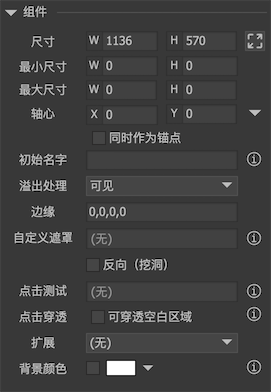

- `size`Set the width and height of the component.

- `smallest size` `biggest size`Set the size limit of the component. 0 means no limit. Note: Modifying the size limit does not modify the current width and height, even if the current width and height values exceed the limit.

- `Axis`Rotate, scale, and tilt the pivot points of these transformations. The value ranges from 0 to 1. For example, X = 0.5 and Y = 0.5 represent the center position. Click the small triangle on the right to quickly set some commonly used values, such as center, lower left corner, lower right corner, etc.

- `As anchor`When this option is checked, the origin position of the component will be set to the position of the axis. By default, (0,0) of each component is in the upper left corner; when the axis is also selected as the anchor point, the (0,0) of the component is at the position of the axis.

- `Initial name`When the component is instantiated (within the editor), the component name is automatically set to the value set here. The most common use is that the window frame component is required to be named frame in FairyGUI. Then you create a window frame component and set the "initial name" to frame. Each time you drag in this component, it will automatically get the name No need to modify each time.

- `Overflow handling`Represents how to handle content that extends beyond the rectangular area of the component. note:**Overflow handling**Dynamic modification in code is not supported.
- `visible`Indicates that content beyond the rectangular area of the component remains visible, which is the default behavior.
- `hide`Indicates that content beyond the rectangular area of the component is not visible, which is equivalent to applying a rectangular mask to the component.
- `Vertical scroll` `Horizontal scroll` ``Free scrolling is very different from other UI frameworks. There is no need to drag in scroll controls to achieve scrolling in FairyGUI. For any ordinary component, you only need to set a property to make the component have scrolling function. There are three scrolling options in overflow processing. Free scrolling is scrolling both horizontally and vertically. Detailed instructions[Rolling container](scrollpane.html)。

- `edge`Leave blank around the component. Generally used when the "overflow processing" is "hidden" or "scrolling". Edge virtualization is currently only supported on the Unity platform. If the component is clipped to the content, it can produce a blurred effect at the edges and enhance the user experience. This value should be relatively large to see the effect, such as 50.

   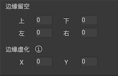

- ``Custom masks detailed at[Mask](#Mask)。

   - `Reverse (burrowing)`

- `Click to test`Detailed instructions[Click to test](#Click-Test)。

- `Click through`By default, the rectangular area (width x height) of the component will block clicks. When checked, the click event can penetrate the component.**lack of content**Area. Detailed instructions[Click through](#Click-through)。

- ``The extension is detailed in[Extension](#Extension)。

- `background color`Set the background color of the component editing area. It is only used for design assistance. The actual component background is blank and there will be no color. If you need a component to have a realistic background color, you can place a graphic.

## Other properties

- `Custom attributes`When a component is dragged into other components, the properties that can be set through the inspector are generally fixed. For example, a button, we can change its title, icon, whether to be selected, etc. These are fixed properties provided by the editor. But if I put extra text or loader in the button, and need to set their properties after instantiation, I need to use custom properties to expose the properties of the sub-components and even deeper components of the component.

   Click "Edit" to pop up the following interface:

   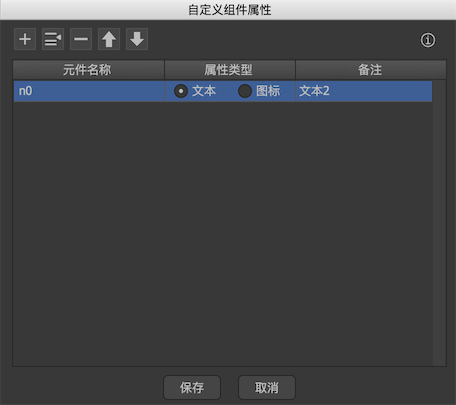

   - `Component name`The name of the component. You can use "." To refer to deeper components, such as n0.n1.n2, which means child n2 of child n1 of component n0.
   - `Attribute type`Two attributes are currently supported: text and icon.
   - `Remark`Optional. If it is filled, use the content here as the title in the inspector.
   After the definition, drag the component into other components, you can see that a new panel is added to the inspector on the right:

   

   After checking, you can modify the value here. Custom attributes are only used within the editor. This mechanism is not required at runtime. Because at runtime you can get any object with GetChild.

- `Custom data`You can set a custom data. This data is not parsed by FairyGUI, and is published to the final description file as it is. Developers can get it at runtime. Get it as:
   ```csharp
   //Unity/Cry/Laya/Egret
  aComponent.baseUserData;

  //Cocos2dx/Vision
  aComponent->getBaseUserData();

  //AS3/Starling
  aComponent.packageItem.componentData.@customData;
   ```

   **Custom data is defined in two places**Please note and[Custom data for components](object.html#自定义数据)distinguish,

## Design drawing

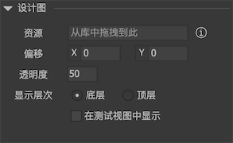

You can set the design drawing of a component. The design drawing will be displayed on the stage, and can be set to be displayed at the bottom or upper level of the component content. Using design drawings can make the splicing UI faster and more accurate.

Design drawings are not published to final resources.

## Click through

Within the component, the component displayed in front will receive the click event first. If the element is touchable, the click event ends and no further passes are made.

The click test is valid (impossible to penetrate) in the range of component width x height, regardless of whether there are sub-components in this range. Take an example.

Here is component A, 400x400 in size, with 4 white rectangles:

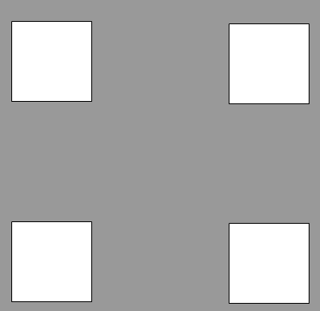

Here is component B, 400x400 in size, with a red rectangle:


Add B to the stage first, and then add A to the stage, that is, A is displayed in front of B, the effect is as follows:

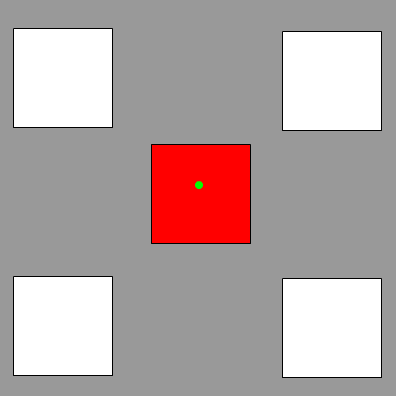

You can see that although A is above B, the red square is visible because A has no content in this area. When clicking on the green dot in the figure, the click event will be triggered on A, but B cannot be clicked. This is because in the range of A, the click cannot be penetrated.

What if I want A to be penetrated? The settings are provided in the component properties:, Check it. The code can also be set:

```csharp
// true means it is not penetrated, false means it is penetrated.
    aComponent.opaque = false;
```

After the penetration is set, A will receive the click event only when 4 white blocks are clicked. If the green dot is clicked, B will receive the click event. **This feature is especially important when designing some full-screen interfaces. For example, a main interface is added to the stage and set to full screen. If it does not penetrate, then Stage.isTouchOnUI will always return true.**

**Note: Images and ordinary texts do not accept clicks. If a component that contains only images or ordinary text is set to click through, then the entire component is completely penetrated and no clicks are intercepted.**

## Click Test

For some special needs, click testing in irregular areas is required. FairyGUI provides two solutions to this need:

1. Drag a shape into the component, select the shape as the polygon, and then use the polygon to draw the shape of the irregular area. Finally, in the component's "click test" property, select this graphic element.

2. If the irregular shape is a shape with holes, such as a ring, it cannot be drawn with graphics. In this case, pixel detection can be used.

First, you need to prepare an image with irregular areas. The opaque pixels in the image represent the areas that are clicked. The transparent pixels represent the areas that are clicked through. The components that are beyond the image range are also transparent areas.

Drag this image to the stage and select it in the component's "click to test" property.

**Note: This image used for pixel detection can only be placed in the same package as the component, nor can it use the loader, it can only be an image.**

## Mask

There are two types of FairyGUI masks: rectangular masks and custom masks.

### Rectangular mask

Set the component's "Overflow Handling" to "Hide" or "Scroll", then the component has a rectangular mask. Areas beyond the component (rectangular area-margins left) are not visible. No matter what platform, this mask is the most efficient.

### Custom mask

You can set a image or graphic in the component as the mask of the component. This kind of mask is generally used Stencil Op technology.

When using a graph as a mask, the content of the area with the graph****Visible, for example, a circle****Visible, other areas are not visible.

When using a image as a mask, the content of the area corresponding to the pixels with 0 transparency in the image**Invisible**And vice versa. Content beyond the image area**Invisible**。

Remarks:
1. To use a custom mask for the Starling platform, you must add it to the application description file:

```csharp
<initialWindow>
      <depthAndStencil>true</depthAndStencil>
  </initialWindow>
```
2. The AS3 platform does not support masking with images.
3. Unity platform: If you want to set the tilt of components using custom masks, set BlendMode, set filters, or the components in the surface UI contain custom masks, additional settings are required to display properly. Please refer to[PaintMode](../unity/special.html#PaintMode)

### Reverse masking (burrowing)

The effect is the opposite of a normal mask, that is, the visible area becomes invisible and the invisible area becomes visible. E.g:

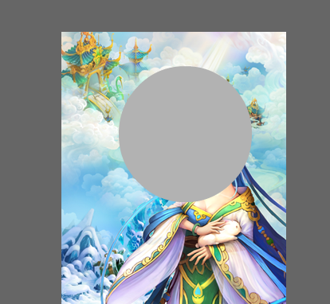

When using a graph as a mask, the content of the area with a graph**Invisible**For example, a circle is not visible in the circular area and other areas are visible.

When using an image as a mask, the content of the area corresponding to the pixels with 0 transparency in the image**visible**And vice versa. Content beyond the image area**visible**。

Remarks:
1. When a mask occurs, the click test also changes. Only the displayed content is subject to click detection. The blocked content is not subject to click detection.
2. For the component being edited, the mask will only see the effect when previewed.
3. A component that defines a mask, its internal components can never be merged with external components, because they have different material properties.
4. Only some platforms support reverse masking with images. Please refer to the test results.

## Extension

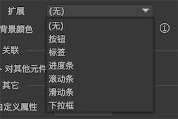

You can see that there are six "extended" options. Components can switch between these "extensions" at will. Which "extension" is chosen, the component has the extended properties and behavior characteristics.

Let's take a button as an example to introduce how "extension" works. After selecting "Extended" as the button, you can see the button-related tips and settings appear below the properties panel.

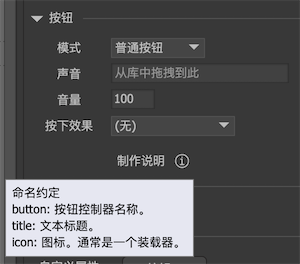

Ignore the setting of the button component here, which will be explained in detail in subsequent tutorials. As you can see, the definition of "extension" in FairyGUI is based on "name convention". A button can have a title and icon. The title (usually a text) and icon (usually a loader) need to be placed in the component by yourself, and set their names to title and icon, like this:

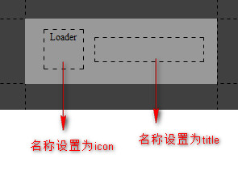

Then we test this newly made component. Drag the button component to another component and set the "Title" and "Icon", as shown below

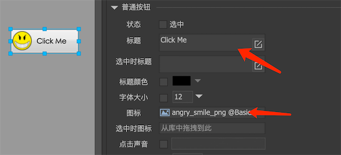

The effect came out. This means that the title text is automatically set to the text element named "title" and the icon is automatically set to the loader element named "icon".

What if there is no loader control named icon in the button component? Then setting the icon has no effect, nothing more. Other conventions are handled the same way. There will be no errors.

The advantages of FairyGUI's "extended" functionality can be seen from the design of the buttons. If an editor provides a ready-made button component, no matter how thoughtful the designer thinks, it can't cover all the requirements. Just one button, the changes you think about may be: whether the icon / icon is on the left or the right / icon and text. Distance / whether text / text color / text size, etc. In FairyGUI, everything in the button component is left to you.

"Extension" also gives component behavior, specifically to the button, which is to handle various mouse or touch events, change the state when pressed (single / multi-select), play sound when clicked, etc. These are all handled by the "extended" bottom layer. This part also works through "name conventions". For example, as long as a controller named "button" is provided in the button, when the mouse hovers over the button, the controller will automatically switch to the "over" page; when the mouse is pressed, the controller will automatically switch Go to the "down" page, and so on. What if the button doesn't provide a controller named "button"? The above behavior will not happen. The button controller is not required, if you don't need the above behavior, don't provide it.

Other types of "extensions" work similarly to buttons. Subsequent documents will detail the properties and behavior of each "extension".

## GComponent

Components support dynamic creation, for example:

```csharp
   GComponent = new GComponent ();  
   gcom.SetSize (100,100);
   GRoot.inst.AddChild (com);
```

A dynamically created component is an empty component and can serve as a container for other components. A common use case is if you are building a multi-level UI management system, then empty components are a suitable choice for hierarchical containers. Dynamically created components are click-through by default, which means that if you directly create an empty component for receiving clicks, you have to set it like this:

```csharp
// Set the component click to not penetrate.
    gcom.opaque = true;
```

If you want to create a component in the UI library, you should use this method:

```csharp
   GComponent com = UIPackage.CreateObject ("Package Name", "Component Name").asCom;
   GRoot.inst.AddChild (com);
```
FairyGUI is similar to Flash / Cocos. It uses a tree structure to organize display objects. A container can contain one or more base display objects, and it can also contain containers. This tree structure is called a display list. FairyGUI provides API management display list.

### Display list management

- `numChildren`Get the number of child elements in the container.

- `AddChild` `AddChildAt`Add components to the container. The former adds a component to the end of the display list; the latter can specify an index to control where the component is inserted.

- `RemoveChild` `RemoveChildAt` `RemoveChildren`Remove the component from the container. When a component is removed from a display object, it no longer takes up display resources. However, after the component is removed from the display list, it is not displayed and is not destroyed. If you do not save a reference to this object for subsequent use, or you do not call the object ’s Dispose method to destroy the object, a memory leak will occur.

- `GetChild` `GetChildAt`Obtain component references by index or name. Component names are allowed to be repeated, in which case GetChild returns the first object that matches the name.

- `GetChildIndex`Gets the index of the specified component in the display list.

- `SetChildIndex` `SwapChildren` `SwapChildrenAt`Sets the index of the component in the display list.

### Rendering order

In FairyGUI, the display list is organized in a tree structure. The rendering order mentioned below refers to**Same parent component**In the order of arrangement, the components of different parent components cannot be interleaved with each other. This is a prerequisite, please note.

The rendering order of a display object depends on the order in its display list, and the larger order is rendered later, that is, displayed earlier. Generally, we use AddChild or SetChildIndex to adjust the rendering order. For example, if you want a component to be displayed at the top of the container, you can call AddChild (component), and AddChild can be called repeatedly. You can also call SetChildIndex to set the specific position of the object in the display list. For example, SetChildIndex (element, 0) can place the element at the bottom.

There is another factor that can affect the rendering order, which is GObject.sortingOrder. ** This attribute is only used for specific purposes, not for general use. It is generally used for functions like fixed pinning. In addition, never use sortingOrder in a list. ** The larger the sortingOrder, the later the rendering order is, that is, it is displayed to the front position. In general, sortingOrder is 0, and the rendering order is determined by the order of the display objects in the display list. sortingOrder gives you more control over the rendering order. For example, if you want one component to always stay on top of the other components, you can set its sortOrder to a large integer value so that this component remains on top regardless of how many components the container has added using AddChild. (SortingOrder is inefficient, do not use it for frequent calls)

All of the above mentioned are adjusting the order of the objects in the display list. If you don't want to adjust the order, you must also adjust the rendering order. The component also provides another way.

```csharp
// Ascending order. This is the default value. The objects are rendered in ascending order according to the order of the objects in the display list.
    aComponent.childrenRenderOrder = ChildrenRenderOrder.Ascent;

    // Descending order, the objects are rendered in descending order according to the order in the display list, the effect is that the lower number is displayed in front.
    aComponent.childrenRenderOrder = ChildrenRenderOrder.Descent;

    // Arch, you need to specify an index of the peak, and render from the two ends to this index position, the effect is that the object at this position is displayed in the front, and the objects on both sides are displayed in order.
    aComponent.childrenRenderOrder = ChildrenRenderOrder.Arch;
    aComponent.apexIndex = 3; // The object with index 3 is displayed at the front.
```

### Binding Extension Class

You can bind a class as an extension of a component. First, write an extension class:

```csharp
public class MyComponent: GComponent
    {
        GObject msgObj;

        // If you need to initialize the contents of the container, you must // in this method, not in the constructor. The parameters of the function prototype of each SDK may be slightly different, please refer to the code hints. In Cocos2dx / CocosCreator, the method name is onConstruct without parameters
        override protected void ConstructFromXML (XML xml)
        {
            base.ConstructFromXML (xml);
            
            // Continue your initialization here
            msgObj = GetChild ("msg");
        }

        public void ShowMessage (string msg)
        {
            msgObj.text = msg;
        }
    }
```

Then register your extension class. note,**Must be registered before component build**If you are using UIPanel, it is not early enough to register in Start. You must be in Awake. In short, if the registration is not successful, 90% may be registered after the creation, and 10% may be a URL error. Print URL troubleshooting.

```csharp
UIObjectFactory.SetPackageItemExtension ("ui:// package name / component A", typeof (MyComponent));
```

This binds an implementation class MyComponent for component A. All future objects created by component A (including component A used in the editor) are of type MyComponent. Then we can add API to MyComponent to operate Component A in a more object-oriented way. E.g:

```csharp
MyComponent gcom = (MyComponent) UIPackage.CreateObject ("Package name", "Component A");
    gcom.ShowMessage ("Hello world");
```

Note: If component A is just a normal component and no "extension" is defined, then the base class is GComponent, as shown in the above example; if the extension of component A is a button, then the base class of MyComponent should be GButton, and if the extension is a progress bar , Then the base class should be GProgressBar, and so on. This must not be mistaken, otherwise an error will occur.