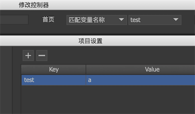

控制器是FairyGUI核心功能之一，它为UI制作中以下类似需求提供了支持：

- 分页 一个组件可以由多个页面组成。

- 按钮状态 按钮通常有按下、鼠标悬浮等多个状态，我们可以利用控制器为每个状态安排不同的显示内容。

- 属性变化 利用控制器，我们可以使元件具有多个不同的形态，并且可以方便地切换。

## 控制器设计

每个组件都可以创建一个或多个控制器，如下图所示：


1. 点击控制器名称，显示控制器设计界面。
2. 点击控制器页面按钮，切换页面。
3. 增加控制器。

控制器设计页面如下：


- `名称` 控制器的名称。同一组件内的控制器请不要同名。

- `备注名` 控制器的备注名，用于加强理解。

- `首页` 控制器创建后的默认页面。
  - `第一页` 这是默认值。一般控制器创建后都是在第一页（索引为0的页面）。
  - `指定页面` 可以指定某个页面。
  - `匹配分支名称` 跳转到名称和活跃分支名称相同的页面。假设第3页的名称是en，而当前分支是en，那么控制器创建后就自动跳转到第3页。
  - `匹配变量名称 ` 跳转到名称和指定变量值相同的页面。见下例：
  
    

    在编辑器内，变量可以在“项目设置->自定义属性”里定义。**在代码里，变量需要通过UIPackage.SetVar定义。**

- `导出为组件属性` 勾选后，当组件在编辑器里被实例化时，这个控制器将显示在组件的自定义属性面板上。见下例：

   

  

  可以看到，属性名称使用的是控制器的“备注名”，如果“备注名”为空，则使用控制器的名称。

- `自动调整单选组对象层次` 勾选后，组件内所有属于此控制器控制的单选按钮，选中状态的单选按钮自动调整到其他按钮的前面。例如，3个按钮是互相重叠的，在未勾选此选项时效果如左图，勾选后效果如右图：

   

- `页面管理` 增加、插入、删除页面，以及调整页面顺序。
  
  

- `按钮模板` 点击，这是快速创建按钮控制器的一种方式。在弹出的菜单中选择一种按钮页面模式后，控制器的名称自动变成“button”，然后自动添加模板中包含的页面。

- `动作` 可以定义页面切换时执行一系列动作。详细请参考[控制器动作](#控制器动作)。

## 控制器动作

可以定义页面切换时执行一系列动作。


目前支持两种动作，播放动效和切换页面。

1. 播放动效：指定页面变换时播放一个动效。点击进行更精细的设置：

   

   - `重复次数` 设定动效播放的次数。-1表示循环播放。

   - `延迟` 设定动效延迟多少秒开始播放。

   - `离开页面时停止` 如果离开页面时动效仍然在播放，勾选这个选项后将强制停止动效，不勾选的话动效会继续播放到停止（如果是循环的那就一直不会停止）。

2. 切换页面：可以切换其他控制器，实现一个控制器的联动功能。甚至可以设置孩子组件的控制器，前提是该孩子组件的控制器已经设置为“导出为组件属性”。目标页面有两个特殊的
选项：`相同索引的页面`和`相同名称的页面`。利用这个特殊的选项可以使两个控制器完全同步。

## 属性控制

创建了控制器后，下面介绍怎么使用控制器。控制器是通过各个元件的属性控制设置发生作用。

在舞台选定一个元件，可以看到在右边的属性栏出现“属性控制”的面板：


### 显示控制

显示控制指示该元件只有在控制器的活动页面属于参与页面之一时才显示，否则不显示。如果参与页面为空，则显示控制不起作用，元件将一直显示。

设置显示控制的方式：


左边选择控制器，右边勾选参与页面。

备注：
1. 显示控制不使用元件本身的可见属性(visible)，两者是独立的，最终是否可见是两者的“与”逻辑结果。

2. 当元件不可见时，它并不会被容器(GComponent)的显示列表剔除，但FairyGUI底层会处理，使不可见的元件不占用渲染资源。不受控制器干扰的显示列表保证了任何时候都可以通过GetChild访问到需要的元件。

3. 有需要时可以通过显示列表视图上的 屏蔽显示控制器。

   假设现在有两个元件A和B，都使用了显示控制，而他们在不同的页面显示。现在想将他们对齐一下，这显然做不到，因为他们不会同时显示，那只能手动填写他们的坐标了，或者将显示控制先取消掉，对齐好了再设置回来。这显然太麻烦，编辑器已经为你考虑到了这一点。

   点击“屏蔽控制器”后，所有被控制器隐藏的元件都能显示出来，你就可以方便地应用对齐，或者选中这些元件进行批量的操作了。

   这个功能只是辅助UI编辑的，所以只在设计的时候有效，实际运行时并没有屏蔽功能。

### 显示控制-2

显示控制-2一般和显示控制搭配使用，它可以实现两个控制器控制一个元件显隐的需求。特别还提供了一个逻辑关系的选项，可以选择“与”或者“或”。


### 位置控制

位置控制是指该元件在不同控制器页面中可以具有不同的XY坐标。

设置控制器后，在不同的控制器页面，你可以调整目标元件的X、Y属性值，编辑器会自动记录元件在不同页面的属性值，无需额外操作。

位置控制支持动画效果。选中后，当控制器页面改变时，元件不是立刻设置新的坐标，而是使用一个缓动到达新的值。点击可以设置缓动参数：


- `持续时间` 整个缓动过程持续的时间，单位秒。
- `延迟时间` 控制器页面切换后，延迟一定时间再开始缓动。单位秒。
- `缓动函数` 时间/速度曲线。详细请参考 [图解](../../images/20170802000005.jpg) [示例](https://greensock.com/ease-visualizer)。

位置控制器支持使用百分比记录坐标。选中后，坐标数值将使用百分比记录。例如元件放置在组件水平中心时，x值就记录为50%。当组件大小改变时，切换控制器页面后元件的坐标依然是中心即50%的位置。

**位置控制和关联系统的关系**

假设控制器C1有2个页面P1和P2，元件N现在设置了位置控制，在P1页面的坐标是V1（50，50），在P2页面的坐标是V2（100，100）。元件N设置了对容器组件右右的关联关系。控制器现在处于P1页，坐标为（50，50）。

现在容器组件大小发生改变，元件N的坐标被关联系统修改为（70，70），这时V1更新为（70，70），V2也同时自动更新为（120，120）。**也就是说，关联系统的动作会应用到所有页面保存的坐标中。**

### 大小控制

大小控制是指该元件在不同控制器页面中可以具有不同的宽和高以及Scale值。

设置控制器后，在不同的控制器页面，你可以调整目标元件的宽、高、ScaleX、ScaleY属性值，编辑器会自动记录元件在不同页面的属性值。

大小控制支持动画效果。缓动的设置方式与位置控制是相同的，请参考位置控制。

### 颜色控制

颜色控制是指该元件在不同控制器页面中可以具有不同的颜色。只有图片元件（对应图片的变色设置）、文本/富文本元件（对应文字的颜色）和装载器元件（对应载入的图片或动画的变色设置）才支持颜色控制。

设置控制器后，在不同的控制器页面，你可以调整目标元件的颜色值，编辑器会自动记录元件在不同页面的属性值。

颜色控制支持动画效果。缓动的设置方式与位置控制是相同的，请参考位置控制。

### 外观控制

外观控制是指该元件不同控制器页面中可以对具有不同的透明度、变灰、旋转和不可触摸属性。

设置控制器后，在不同的控制器页面，你可以调整目标元件的透明度、变灰、旋转和不可触摸属性值，编辑器会自动记录元件在不同页面的属性值。

外观控制支持动画效果。但只有透明度和旋转参与缓动，变灰和不可触摸都是立刻设置的。缓动的设置方式与位置控制是相同的，请参考位置控制。

### 文本控制

文本控制是指该元件在不同控制器页面中可以具有不同的文本。文本/富文本元件（对应文字的颜色）、标签组件、按钮组件和下拉框组件才支持文本控制。

设置控制器后，在不同的控制器页面，你可以调整目标元件的文本属性或标题属性，编辑器会自动记录元件在不同页面的属性值。

### 图标控制

图标控制是指该元件在不同控制器页面中可以具有不同的图标。只有装载器元件、标签组件、按钮组件才支持图标控制。

设置控制器后，在不同的控制器页面，你可以调整目标元件的URL属性或图标属性，编辑器会自动记录元件在不同页面的属性值。

### 动画控制

动画控制是指该元件在不同控制器页面中可以具有不同的动画相关设置。只有动画和装载器才支持动画控制。

设置控制器后，在不同的控制器页面，你可以调整目标元件的“播放”和“帧”属性，编辑器会自动记录元件在不同页面的属性值。

### 字体大小控制

字体大小是指该元件在不同控制器页面中可以具有不同的字体大小。只有文本、富文本、标签和按钮才支持字体大小控制。

设置控制器后，在不同的控制器页面，你可以调整目标元件的“字体大小”属性，编辑器会自动记录元件在不同页面的属性值。

## 和按钮的联动

控制器可以与按钮联动，当普通按钮被按下，或单选/复选按钮选中状态变化时，控制器的页面随之改变。选择一个按钮元件，在右边的“连接”属性设置里，可以设置一个控制器以及一个该控制器的页面：


设置完成后，根据按钮的类型不同会有不同的反应：

- 普通按钮 当按钮被点击时，控制器调转到指定的页面。

- 单选按钮 当按钮状态从不选中变成选中时，使控制器跳转到指定的页面。
  当控制器从其他页面切换到指定页面时，按钮变为选中状态。
  当控制器从指定页面切换到其他页面时，按钮变成不选中状态。

  这个特性一般用来实现单选组（RadioGroup）
  假设目前有3个单选按钮，他们是互斥的，也就是同一时间只有一个按钮是选中状态。这样的设计通常称为单选组。我们可以新建一个含有3个页面的控制器，将每个按钮的单选控制分别连接到这个控制器的3个页面，就实现了这个单选组。

  

  在程序中，要获得或设置哪个按钮被选中也非常简单，使用控制器的selectedIndex或者selectedPage方法就可以了。

  如果再将其他元件的属性控制绑定到这个控制器，例如将各种UI内容使用显示控制安排到各个页面后，那么一个传统意义上的TabControl也实现了。FairyGUI没有TabControl，RadioGroup这些复合组件，因为FairyGUI把这一切的设计自由度都交给了你，无需固化的组件。

  如果你的单选组的按钮个数不确定，或者数量很多，那也可以使用列表的方式解决。选择模式为“单选”的列表就相同于一个单选组。详细请阅读列表教程。

- 复选按钮 当按钮状态从不选中变成选中时，使控制器跳转到指定的页面。
  当按钮状态从选中变成不选中时，使控制器跳转到除指定页面外的另外一个页面。例如如果控制器具有页面0和1，指定页面是0，当按钮状态从选中变成不选中时，控制器跳转到页面1。
  当控制器从其他页面切换到指定页面时，按钮变为选中状态；
  当控制器从指定页面切换到其他页面时，按钮变成不选中状态。

## 和列表的联动

列表的“选择控制”可以绑定一个控制器：


这样当列表选择发生改变时，控制器也同时跳转到相同索引的页面。反之亦然，如果控制器跳转到某个页面，那么列表也同时选定相同索引的项目。

## 和分页滚动的联动

溢出处理为“滚动”的组件或列表，如果同时设置了滚动为“页面模式”，那么可以为它们指定一个“分页控制”。


这样当滚动发生翻页时，控制器也同时跳转到相同索引的页面。反之亦然，如果控制器跳转到某个页面，那么滚动容器同时滚动到相同索引的页面。

## 和下拉框的联动

下拉框的“选择控制”可以绑定一个控制器：


这样当下拉框选择发生改变时，控制器也同时跳转到相同索引的页面。反之亦然，如果控制器跳转到某个页面，那么下拉框也同时选定相同索引的项目。

## Controller

运行时，控制器常用的API有：

```csharp
    Controller c1 = aComponent.GetController("c1");
    
    //通过索引设置控制器的活动页面
    c1.selectedIndex = 1;

    //如果希望改变控制器时不触发Change事件
    c1.setSelectedIndex(1);

    //也可以使用页面的名称设置
    c1.selectedPage = "page_name";

    //获得控制器当前的活动页面
    Debug.Log(c1.selectedIndex); 
```

控制器改变时有通知事件：

```csharp
    //Unity/Cry/MonoGame
    c1.onChanged.Add(onChanged);

    //AS3
    c1.addEventListener(StateChangeEvent.CHANGED, onChanged);

    //Egret
    c1.addEventListener(StateChangeEvent.CHANGED, this.onChanged, this);

    //Laya
    c1.on(fairygui.Events.STATE_CHANGED, this, this.onChanged);

    //Cocos2dx
    c1->addEventListener(UIEventType::Changed, CC_CALLBACK_1(AClass::onChanged, this));

    //CocosCreator
    c1.on(fgui.Event.STATUS_CHANGED, this.onChanged, this);
```

改变控制器页面时，与之连接的属性控制可能带有缓动，如果你要获得缓动结束的通知，可以侦听GearStop事件：

```csharp
    //Unity/Cry/MonoGame
    aObject.OnGearStop.Add(OnGearStop);

    //Egret
    c1.addEventListener(GObject.GEAR_STOP, this.onGearStop, this);

    //Laya
    c1.on(fairygui.Events.GEAR_STOP, this, this.onGearStop);

    //Cocos2dx
    c1->addEventListener(UIEventType::GearStop, CC_CALLBACK_1(AClass::OnGearStop, this));

    //CocosCreator
    c1.on(fgui.Event.GEAR_STOP, this.onGearStop, this);
```

如果你正在做界面的初始化，可能不希望出现任何缓动。可以这样做：

```csharp
    //禁止所有控制器引起的缓动
    GearBase.disableAllTweenEffect = true; 
    c1.selectedIndex = 1;
    //记住要复原
    GearBase.disableAllTweenEffect = false;
```

通过代码设置按钮与控制器的联动的方式是（**一般没有此必要，尽量在编辑器设计完成**）：

```csharp
    button.relatedcontroller = aController;
    button.relatedPageId = aController.GetPageId(1);
```

可以用代码设置属性控制：（**一般没有此必要，尽量在编辑器设计完成**）：

```csharp
    //GearXXX对象是控制器和属性之间的连接。0-显示控制，1-位置控制，2-大小控制，
    // 3-外观控制，4-颜色控制，5-动画控制，6-文字控制，7-图标控制
    GearDisplay gearDisplay = obj.GetGear(0);

    gearDisplay.controller = obj.parent.GetController("c1");
    //注意这里是页面的id，不是索引或者名称。可以通过Controller.GetPageIdByName转换。
    gearDisplay.pages = new string[] { ... }; 

    GearXY gearXY = obj.GetGear(1);
    gearXY.tweenConfig.duration = 0.5f;
```

