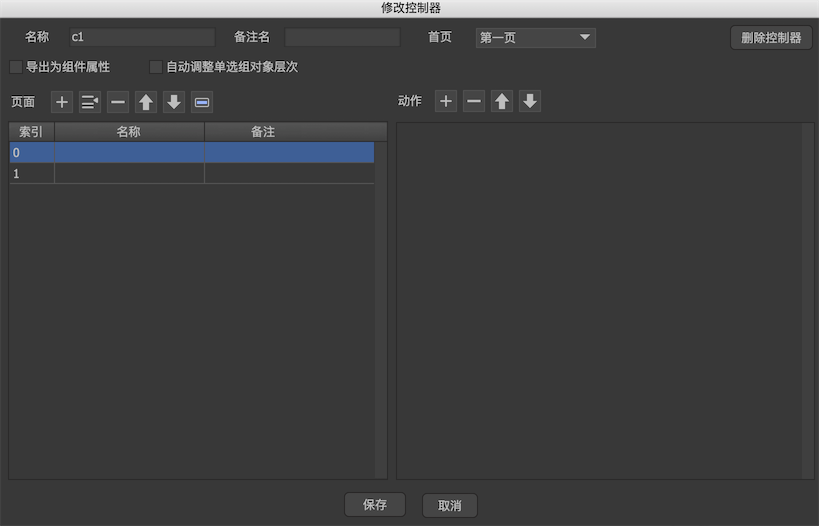
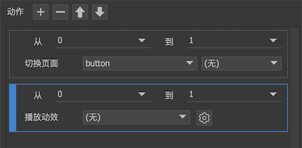
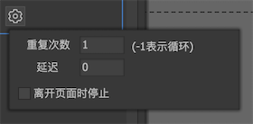
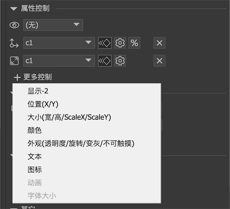
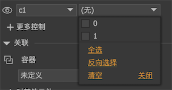
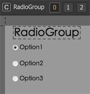

The controller is one of the core functions of FairyGUI, which provides support for the following similar requirements in UI production:

- Pagination A component can consist of multiple pages.

- Button states Buttons usually have multiple states such as pressed and mouse hover. We can use the controller to arrange different display contents for each state.

- Attribute change With the controller, we can make the component have multiple different shapes, and can easily switch.

## Controller design

Each component can create one or more controllers, as shown in the following figure:


1. Click the controller name to display the controller design interface.
2. Click the controller page button to switch pages.
3. Add controller.

The controller design page is as follows:



- `name`The name of the controller. Do not use the same name for controllers in the same component.

- `Remark name`Controller's remark name for better understanding.

- `Home`The default page after the controller is created.
   - `First page`This is the default value. Generally, after the controller is created, it is on the first page (the page with index 0).
   - `Specify page`You can specify a page.
   - `Match branch name`Jump to a page with the same name as the active branch. Assuming the name of page 3 is en and the current branch is en, the controller will automatically jump to page 3 after the controller is created.
   - `Match variable name`Jump to a page with the same name as the specified variable value. See the following example:

      

      In the editor, variables can be defined in "Project Settings-> Custom Properties". **In the code, variables need to be defined through UIPackage.SetVar.**

- `Export as component properties`When checked, this controller will be displayed on the component's custom properties panel when the component is instantiated in the editor. See the following example:

   

   

   It can be seen that the attribute name uses the controller's "Remark Name". If the "Remark Name" is empty, the controller name is used.

- `Automatically adjust radio group object hierarchy`When checked, all radio buttons in the component that are controlled by this controller are automatically adjusted to the front of other buttons. For example, the 3 buttons overlap each other. When this option is not checked, the effect is as shown on the left, and when checked, the effect is shown as the right:

    

- `Page management`Add, insert, delete pages, and adjust page order.

   

- `Button template`ClickThis is a way to quickly create a button controller. After selecting a button page mode in the pop-up menu, the name of the controller automatically becomes "button", and then the pages included in the template are automatically added.

- `action`You can define a series of actions to be performed when the page is switched. Please refer to details[Controller action](#Controller-action)。

## Controller action

You can define a series of actions to be performed when the page is switched.



Currently supports two actions, playing transition and switching pages.

1. Play transition: Specifies to play an transition when the page changes. ClickMake finer settings:

   

   - `repeat times`Set the number of transitions. -1 means loop playback.

   - `delay`Sets how many seconds the transition is delayed to start playback.

   - `Stop when leaving the page`If the transition is still playing when you leave the page, check this option to forcibly stop the transition. If you don't check this, the transition will continue to play until it stops (if it is a loop, it will never stop).

2. Switch page: You can switch other controllers to realize the linkage function of one controller. You can even set the controller of a child component, provided that the controller of the child component is already set to "Export as component property". The target page has two special
Options:`Pages with the same index``And a page of the same name`。 With this special option, the two controllers can be fully synchronized.

## Attribute control

After creating the controller, here's how to use the controller. The controller works by controlling the properties of each component.

Select a component on the stage, you can see the "Properties Control" panel appears in the right property bar:



### Display control

The display control indicates that the component is displayed only when the active page of the controller belongs to one of the participating pages, otherwise it is not displayed. If the participation page is empty, the display control has no effect and the component will always be displayed.

Set the display control mode:



Select the controller on the left and check the participation page on the right.

Remarks:
1. The display control does not use the visible property of the component itself. The two are independent. Whether they are visible in the end is the logical result of the AND logic.

2. When the component is not visible, it will not be removed from the display list of the container (GComponent), but the underlying layer of FairyGUI will handle it so that invisible components do not take up rendering resources. The display list that is not disturbed by the controller ensures that the required components can be accessed at any time through GetChild.

3. If necessary, you can display theShield display controller.

   Suppose there are now two components A and B, both using display controls, and they are displayed on different pages. Now I want to align them, this is obviously not possible, because they will not be displayed at the same time, then they can only fill in their coordinates manually, or cancel the display control, align it and set it back. This is obviously too cumbersome, and the editor has taken this into account for you.

   After clicking "Shield Controller", all the components hidden by the controller can be displayed, you can easily apply the alignment, or select these components for batch operations.

   This function only assists UI editing, so it is only effective at design time, and there is no shielding function in actual operation.

### Display Control-2

Display control-2 is generally used in conjunction with display control. It can achieve the needs of two controllers to control the display of a component. It also provides a logical relationship option, you can choose "AND" or "OR".


### Position control

Position control means that the component can have different XY coordinates in different controller pages.

After setting the controller, on different controller pages, you can adjust the X and Y attribute values of the target component. The editor will automatically record the attribute values of the component on different pages without additional operations.

Position control supports transition effects. SelectedLater, when the controller page changes, the component does not set new coordinates immediately, but uses an easing to reach the new value. ClickYou can set the easing parameters:


- `duration`Duration of the entire easing process, in seconds.
- `delay`After the controller page is switched, delay for a certain time before starting easing. Unit of second.
- `Easing function`Time / speed curve. Please refer to details[Graphic](../../images/20170802000005.jpg) [Example](https://greensock.com/ease-visualizer)。

The position controller supports the use of percentages to record coordinates. SelectedLater, the coordinate values will be recorded using percentages. For example, when the component is placed at the horizontal center of the component, the x value is recorded as 50%. When the component size is changed, the coordinates of the components after switching the controller page are still the center, that is, 50% of the position.

**Relationship between position control and correlation system**

Assume that the controller C1 has two pages P1 and P2, and the component N is now set to position control. The coordinates on the page P1 are V1 (50, 50) and the coordinates on the page P2 are V2 (100, 100). Element N sets the right-to-right relation relationship with the container component. The controller is now on page P1 with coordinates (50, 50).

Now the size of the container component changes, the coordinate of the component N is modified to (70, 70) by the correlation system, at this time V1 is updated to (70, 70), and V2 is also automatically updated to (120, 120). **In other words, the actions of the correlation system are applied to the coordinates saved on all pages.**

### Size control

Size control means that the component can have different width and height and Scale values in different controller pages.

After setting the controller, on different controller pages, you can adjust the width, height, ScaleX, and ScaleY property values of the target component, and the editor will automatically record the component property values on different pages.

The size control supports transition effects. The setting method of easing is the same as that of position control, please refer to position control.

### Color control

Color control means that the component can have different colors in different controller pages. Only image components (corresponding to the color setting of the image), text / rich text components (corresponding to the color of the text), and loader components (corresponding to the color changing settings of the loaded image or transition) support color control.

After setting the controller, in different controller pages, you can adjust the color value of the target component, and the editor will automatically record the attribute values of the component on different pages.

Color controls support transition effects. The setting method of easing is the same as that of position control, please refer to position control.

### Look control

Appearance control refers to the different controller pages of the element that can have different transparency, graying, rotation, and non-touch properties.

After setting the controller, you can adjust the transparency, graying, rotation, and non-touchable property values of the target component on different controller pages. The editor will automatically record the component's property values on different pages.

Appearance controls support transition effects. But only transparency and rotation participate in easing, graying and untouchable are set immediately. The setting method of easing is the same as that of position control, please refer to position control.

### Text control

Text control means that the component can have different text in different controller pages. Only text / rich text components (corresponding to the color of the text), label components, button components, and drop-down box components support text control.

After setting the controller, in different controller pages, you can adjust the text or title attributes of the target component, and the editor will automatically record the attribute values of the component on different pages.

### Icon control

Icon control means that the component can have different icons in different controller pages. Only loader components, label components, and button components support icon control.

After setting the controller, on different controller pages, you can adjust the URL or icon properties of the target component, and the editor will automatically record the property values of the component on different pages.

### transition control

transition control means that the component can have different transition-related settings in different controller pages. Only transition and loader support transition control.

After setting the controller, you can adjust the "play" and "frame" properties of the target component on different controller pages, and the editor will automatically record the property values of the component on different pages.

### Font size control

Font size means that the component can have different font sizes in different controller pages. Only text, rich text, labels, and buttons support font size control.

After setting the controller, you can adjust the "font size" property of the target component on different controller pages, and the editor will automatically record the property values of the component on different pages.

## Linkage with button

The controller can be linked with the buttons. When the normal button is pressed, or the radio / check button selection status changes, the controller's page changes accordingly. Select a button component. In the "connection" property setting on the right, you can set a controller and a page for the controller:


After the setting is completed, there will be different reactions depending on the type of button:

- Normal button When the button is clicked, the controller goes to the specified page.

- Radio button When the state of the button changes from unselected to selected, the controller jumps to the specified page.
When the controller switches from another page to the specified page, the button becomes selected.
When the controller switches from the specified page to another page, the button becomes unselected.

   This feature is generally used to implement radio groups
Suppose there are currently 3 radio buttons, they are mutually exclusive, that is, only one button is selected at the same time. Such designs are often called radio groups. We can create a controller with 3 pages, and connect the radio control of each button to the 3 pages of this controller respectively to achieve this radio group.

   

   In the program, it is also very easy to get or set which button is selected, using the controller's selectedIndex or selectedPage method.

   If the attribute control of other components is bound to this controller, such as arranging various UI content using display controls to various pages, then a traditional TabControl is also implemented. FairyGUI does not have TabControl, RadioGroup and other composite components, because FairyGUI gives you all the design freedom, no need to solidify the components.

   If the number of buttons in your radio group is uncertain, or there are many, you can also use the list method. A list whose selection mode is "single choice" is the same as a single choice group. Please read the list tutorial for details.

- Check button When the state of the button changes from unselected to selected, the controller jumps to the specified page.
When the button status changes from selected to unselected, the controller jumps to a page other than the specified page. For example, if the controller has pages 0 and 1, and the specified page is 0, when the button status changes from selected to unselected, the controller jumps to page 1.
When the controller switches from other pages to the specified page, the button becomes selected;
When the controller switches from the specified page to another page, the button becomes unselected.

## Link with list

The "selection control" of the list can be bound to a controller:


In this way, when the list selection changes, the controller also jumps to the page with the same index at the same time. Vice versa, if the controller jumps to a certain page, the list also selects the items with the same index at the same time.

## Linking with page scrolling

Components or lists whose overflow processing is "scrolling". If scrolling is also set to "page mode", you can specify a "paging control" for them.


In this way, when the page is scrolled, the controller also jumps to the page with the same index. Vice versa, if the controller jumps to a page, the scroll container scrolls to the same index page at the same time.

## Linkage with the drop-down box

The "select control" of the drop-down box can be bound to a controller:


In this way, when the drop-down box selection changes, the controller also jumps to the page with the same index at the same time. Vice versa, if the controller jumps to a certain page, the drop-down box also selects the item with the same index at the same time.

## Controller

When running, the APIs commonly used by controllers are:

```csharp
Controller c1 = aComponent.GetController ("c1");
    
    // Set the controller's active page by index
    c1.selectedIndex = 1;

    // If you do not want to trigger the Change event when you change the controller
    c1.setSelectedIndex (1);

    // can also be set using the name of the page
    c1.selectedPage = "page_name";

    // Get the current active page of the controller
    Debug.Log (c1.selectedIndex);
```

There are notification events when the controller changes:

```csharp
//Unity/Cry/MonoGame
    c1.onChanged.Add(onChanged);

    //AS3
    c1.addEventListener(StateChangeEvent.CHANGED, onChanged);

    //Egret
    c1.addEventListener(StateChangeEvent.CHANGED, this.onChanged, this);

    //Laya
    c1.on(fairygui.Events.STATE_CHANGED, this, this.onChanged);

    //Cocos2dx
    c1->addEventListener(UIEventType::Changed, CC_CALLBACK_1(AClass::onChanged, this));

    //CocosCreator
    c1.on(fgui.Event.STATUS_CHANGED, this.onChanged, this);
```

When changing the controller page, the property control connected to it may have easing. If you want to be notified of the end of the easing, you can listen to the GearStop event:

```csharp
//Unity/Cry/MonoGame
    aObject.OnGearStop.Add(OnGearStop);

    //Egret
    c1.addEventListener(GObject.GEAR_STOP, this.onGearStop, this);

    //Laya
    c1.on(fairygui.Events.GEAR_STOP, this, this.onGearStop);

    //Cocos2dx
    c1->addEventListener(UIEventType::GearStop, CC_CALLBACK_1(AClass::OnGearStop, this));

    //CocosCreator
    c1.on(fgui.Event.GEAR_STOP, this.onGearStop, this);
```

If you are initializing the interface, you may not want any easing. This can be done:

```csharp
// Prohibit easing caused by all controllers
    GearBase.disableAllTweenEffect = true;
    c1.selectedIndex = 1;
    // remember to restore
    GearBase.disableAllTweenEffect = false;
```

The way to set the linkage between the button and the controller through code is (**Generally not necessary, try to complete the design in the editor**）：

```csharp
button.relatedcontroller = aController;
    button.relatedPageId = aController.GetPageId(1);
```

You can set the property control with code: (**Generally not necessary, try to complete the design in the editor**）：

```csharp
// GearXXX objects are connections between controllers and properties. 0-display control, 1-position control, 2-size control,
    // 3-appearance control, 4-color control, 5-transition control, 6-text control, 7-icon control
    GearDisplay gearDisplay = obj.GetGear (0);

    gearDisplay.controller = obj.parent.GetController ("c1");
    // Note that here is the id of the page, not the index or name. Can be converted by Controller.GetPageIdByName.
    gearDisplay.pages = new string [] {...};

    GearXY gearXY = obj.GetGear (1);
    gearXY.tweenConfig.duration = 0.5f;
```

