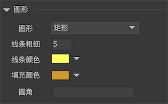

FairyGUI supports generating simple graphics. Click on the side toolbarThe button generates a graphic.

## Instance properties



- `Graphics`Select the shape as Rectangle, Circle, Regular Polygon, Polygon, or None. "None" indicates that this is an empty graphic. It does not consume any display resources and is usually used as a placeholder. See details below.

- `Line size`The stroke size of the shape. 0 means no stroke.

- `Line color`The stroke color of the shape.

- `Fill color`The fill color of the shape. If you want to draw a hollow shape, set the fill color transparency to 0.

- `Fillet`An integer or 4 comma-separated integers. For example, "4" indicates that the four corners of the rectangle are rounded corners with a radius of 4. For example, "2,1,1,4" specifies the radius of each corner.

- `Number of edges`Represents the number of sides of a regular polygon.

- `Spin`Sets the rotation angle of a regular polygon.

## Edit polygon

When the graphic type is polygon or regular polygon, double-click the component, or clickButton to enter graphic editing.


Common operations are:
1. Drag the dots to adjust the vertex position;
2. Left-click a dot and change the coordinate value of the point in the inspector;
3. Context on the stage and select "Add Vertex" from the context menu;
4. Context a dot and select "Delete Vertex" from the context menu;
5. Select "Lock Shape" in the inspector, and then change the position of a vertex by the first or second method. The other vertices will change the position at the same time, which is equivalent to moving all the vertices as a whole.

After editing, double-click the blank space on the stage to exit the graphic editing mode.

**If the shape is a regular polygon, the vertex position can only move along the axis.**

## Placeholder

As mentioned earlier, a blank graphic can be used as a placeholder. It may be replaced with other objects during operation. FairyGUI display objects need to use such blank graphics when they are mixed with native display objects.

Example: Now to put a native object aSprite in the UI, you can put a blank graphic in the appropriate position, assuming the object is a holder, then the code can be written like this:

```csharp
holder.SetNativeObject (aSprite);
```

This puts aSprite at the position and depth of the holder. In this way, any native display object can be easily inserted into FairyGUI's display list.

If SetNativeObject is called repeatedly, the previous set object is destroyed and a new object is inserted.

For Laya, Cocos2dx and CocosCreator platforms, all their nodes can join child objects at any time, so there is no need to use setNativeObject. You can use holder.displayObject.addChild (Laya) or holder.node.addChild (Creator) at any time to mount the native node.

## GGraph

Graphics support dynamic creation,**Dynamic creation of graphics requires attention to the size of the graphics, otherwise it will not be displayed**。 E.g:

```csharp
GGraph holder = new GGraph();
    holder.SetSize(100, 100);
    holder.DrawRect(...);
    aComponent.AddChild(holder);
```

When using a regular polygon to make a radar chart, you can use the API`distances`Controls the amplitude of each vertex. This is a floating-point array. The size of the array should be equal to the number of vertices. The range of each value is 0-1.

The Unity platform does not have a vector rendering engine, so it is simulated by generating a mesh. Here are some tips for using GGraph objects in Unity:

```csharp
// Draw the polygon at each vertex of the polygon. Note that the point must be passed in clockwise! !!
    aGraph.shape.DrawPolygon (new Vector2 [] {...}}, new Color [] {...};

    // Draw a gradient colored rectangle
    aGraph.shape.DrawRect (0, new Color [] {...});
```

For more drawing methods, please refer to Demo-Basics-Graph.