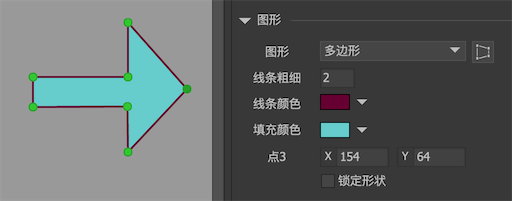

FairyGUI支持生成简单的图形。 点击侧工具栏的按钮生成一个图形。

## 实例属性


- `图形` 选择形状为矩形、圆形、正多边形、多边形或者“无”。“无”表示这是一个空的图形，他不消耗任何显示资源，通常用作一个占位的用途。详细可见下面的介绍。

- `线条大小` 形状的描边大小。0则表示不描边。

- `线条颜色` 形状的描边颜色。

- `填充颜色` 形状的填充颜色。如果你希望绘制中空的图形，那把填充颜色的透明度设置为0即可。

- `圆角` 一个整数或者4个用逗号分隔的整数。例如“4”，表示矩形的四个角均为半径为4的圆角。例如“2,1,1,4”，则指定了每个角的半径。

- `边数` 表示正多边形的边数。

- `旋转` 设置一个正多边形的旋转角度。

## 编辑多边形

当图形类型为多边形或正多边形时，双击元件，或者点击按钮进入图形编辑。



常用的操作有：
1. 拖动圆点调整顶点位置；
2. 左键点击一个圆点，在检查器里改变点的坐标数值；
3. 右键点击舞台，选择右键菜单中的“增加顶点”；
4. 右键点击一个圆点，选择右键菜单中的“删除顶点”；
5. 在检查器里勾选“锁定形状”，然后通过第1或者第2种方法改变某个顶点位置，其他顶点会同时改变位置，相当于一个整体移动所有顶点的效果。

编辑完毕后，双击舞台空白处退出图形编辑模式。

**如果图形是正多边形，则顶点位置只能沿着轴线移动。**

## 占位

前面提到，空白的图形可以用作一个占位的用途，运行中可能用其他对象替换这个空白图形。FairyGUI的显示对象与原生显示对象混合使用时就需要用到这种空白的图形。

举例：现在要在UI中放置入一个原生的对象aSprite，则可以在适当位置放入一个空白的图形，假设对象为holder，那么代码里可以这样写：

```csharp
    holder.SetNativeObject(aSprite);
```

这样就把aSprite放到了holder所在的位置和深度上。 通过这样的办法，任何原生显示对象都可以轻松插入到FairyGUI的显示列表中。

如果SetNativeObject被重复调用，则前一个设置对象被销毁，插入新的对象。

对于Laya、Cocos2dx和CocosCreator平台，他们的节点都是可以随时加入子对象的，因此不需要使用setNativeObject。你可以随时使用holder.displayObject.addChild（Laya）或者holder.node.addChild（Creator）进行挂接原生节点的操作。

## GGraph

图形支持动态创建，**动态创建图形需要注意一定要设置图形的大小，否则显示不出来**。例如：

```csharp
    GGraph holder = new GGraph();
    holder.SetSize(100, 100);
    holder.DrawRect(...);
    aComponent.AddChild(holder);
```

使用正多边形制作雷达图时，可以通过API`distances`控制各个顶点的幅度。这是一个浮点类型的数组，数组大小应该和顶点数量相等。每个值的取值范围是0-1。

Unity平台没有矢量绘制引擎，因此是通过生成网格来模拟的。以下是Unity里运用GGraph对象的一些技巧：

```csharp
    //传入多边形的各个顶点绘制多边形，注意点必须是顺时针方向传入！！
    aGraph.shape.DrawPolygon(new Vector2[] { ...} }, new Color[] { ... };

    //绘制一个渐变色的矩形
    aGraph.shape.DrawRect(0, new Color[] { ... });
```

更多的绘制方法可以参考Demo-Basics-Graph。