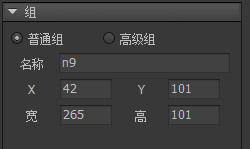
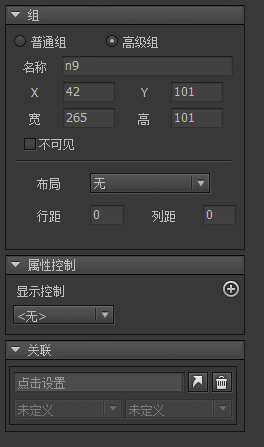
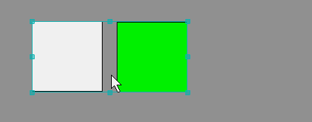

Select one or more components on the Stage and press `Ctrl+G` to create a group. There are two types of FairyGUI groups, `Normal Group` and `Advanced Group`.

## Normal Group

The normal group is only effective when editing, it's to assist you in UI design. The normal group does not exist after it's released, that is, it can't access the normal group at runtime.

The role of the general group is:
1. Can move together as a whole;
2. The depth can be adjusted together as a whole;
3. Can be copied and pasted as a whole.
4. Double-click the group to enter the inside of the group. You can adjust the depth of each component at will, without affecting anything outside the group.
5. When the group size changes, the contents of the group will increase or decrease at the same time.

The properties panel of the normal group:



- `Name` can give the name of the ordinary group, and the purpose is only the auxiliary design.

## Advanced Group

In addition to having all the functions of a normal group, the advanced group remains after it's released, that is, it can access advanced group objects through code at runtime. So it can set `Relation`s and property controls like a normal `Component`.

The role of the advanced group is:
1. You can set visibility. If the group isn't visible, all components within the group aren't visible.
2. Set the property control. The attribute controls supported by the advanced group are: display control, position control, and size control.
3. Set the `Relation`.
4. Set the Layout.

For example, if there are a batch of components that you want to hide on a certain page, then you can set a display control for each component. You can also set them up to a high-level group and then set a display control for the advanced group. The latter isn't very simple.

The properties panel of the advanced group:



Advanced groups have a simple layout feature. Currently supports `Horizontal Layout` and `Vertical Layout`.

- `Horizontal Layout`

The components within the group are arranged horizontally in the order in which they appear in the container, and the spacing between them is specified by the column spacing. As the width of the group changes, each component **is scaled up**, then rearranged, and the column spacing remains the same. When the width of the components themselves within the group changes, the groups are automatically rearranged according to the rules.

- `Vertical Layout`

The same as `Horizontal Layout`, except using height instead of width.

The following examples illustrate the difference between with a layout and without a layout:

This is a non-layout `Group`. As you can see, when the group size changes, the size of the square inside changes at the same time, but the position does not change.


This is a horizontal layout `Group` that can be compared to the above picture.



If there are components with size limits set in the `Group`, the size limit of these components will still take effect when the group size changes. In the following example, since the left and right color blocks are limited in size, when the group becomes large, only the middle The color patches change size.


## GGroup

Advanced `Group`s can be accessed through code at runtime. **But note that the `Group` isn't a container, it does not maintain a list of components within a group**. If you need to iterate through all the components in the group, you need to iterate through all the children of the container component and test their group properties. Code show as below:

```csharp
    GGroup aGroup = gcom.GetChild("groupName").asGroup;
    int cnt = gcom.numChildren;
    for(int i=0;i<cnt;i++)
    {
        if(gcom.GetChildAt(i).group==aGroup)
            Debug.Log("get result");
    }
```

**It must be noted that for advanced groups without layout, the runtime does not automatically change the size. That is, regardless of how the elements in the group change, the size of this advanced group does not change automatically!**
If you truly need to change it, you can simply call `GGroup.EnsureBoundsCorrect` yourself.
