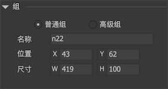
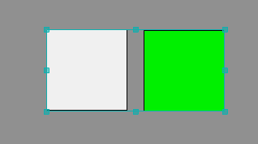

Select one or more symbols on the Stage and press Ctrl + G to create a group. There are two types of FairyGUI groups,`normal group and advanced group`。

## Normal group

The normal group is only valid during editing, and it assists you in UI design. The common group does not exist after it is published, that is, the common group cannot be accessed at runtime.

The roles of the general group are:
1. Can move together as a whole;
2. You can adjust the depth together;
3. Can be copied and pasted as a whole.
4. Double-click the group to enter the inside of the group, you can adjust the depth of each element at will, without affecting the things outside the group.
5. When the group size changes, the content in the group will increase or decrease at the same time.

Properties panel for common groups:



- `name`You can name common groups and use them only as an aid to design.

## Advanced group

The advanced group has all the functions of the normal group, but it is retained after the release, that is, the advanced group object can be accessed through code at runtime. So it can set relations and attribute control like a normal component.

The role of the advanced group is:
1. You can set visibility. If the group is not visible, all components within the group are not visible.
2. Set property controls. The advanced group supports attribute control: display control, position control, size control.
3. Set up the relations.
4. Set the layout.

Advanced group properties panel:


- `layout`The advanced group has simple layout features.

   - `no`No layout. Advanced groups without layouts will not automatically calculate enclosing, this is to improve running performance. Because the advanced group without layout is generally only used for explicit and implicit purposes.

   - `Horizontal layout`

      The elements in the group are arranged horizontally in the order they are displayed in the container, and the interval between them is specified by the column spacing. When the width of the group changes, each element is**Increase proportionally**, And then rearranged, the column spacing remains the same. When the width of the components in the group changes, the group automatically rearranges according to the rules.

   - `Vertical layout`

      The components of an assembly are arranged vertically in the order in which they appear in the container, and the spacing between them is specified by the line spacing. When the height of the group changes, each element**Increase proportionally**, Then rearrange them, leaving the line spacing unchanged. When the height of the components in the group changes, the group is automatically rearranged according to the rules.

- `Exclude hidden objects`

   Determines whether the advanced group reserves positions for hidden objects when applying layouts. If this option is checked, hidden objects will not participate in the arrangement.

- `Disable automatic bracketing`

   In general, advanced groups with layouts are automatically calculated by enclosing, that is, the size of the advanced group is determined by the elements within the group. When this option is checked, the size of the advanced group can be arbitrarily specified and is no longer affected by the elements in the group. This is used to achieve such a type of requirement: dynamically set up an advanced group. After a fixed size is set, no matter how many components are added to the group, these components automatically expand and contract, and are arranged strictly in layout.

- `Scale only specified index elements`

   In general, when an advanced group with a layout is stretched, the elements in the group are stretched uniformly. However, under certain requirements, only one component is required to be stretched, while other components remain the same size. Here you can specify the index implementation requirements for such a component.

**Demo one**

This is a group without layout. As you can see, when the group size changes, the size of the squares in it changes at the same time, but the position remains the same.



This is a group with a horizontal layout, which can be compared with the image above.


**Demo two**

If there are components in the group that have a size limit set, then the size limit of these components will still take effect when the group size is changed. In the following example, because the left and right color blocks are limited in size, when the group becomes larger, only the middle The color blocks change size.


## GGroup

Advanced groups are accessible through code at runtime. Note, however, that groups are not containers; they do not maintain a list of components within a group. If you need to iterate through all the elements in a group, you need to iterate through all the children of the container component and test their group property. code show as below:

```csharp
GGroup aGroup = gcom.GetChild("groupName").asGroup;
    int cnt = gcom.numChildren;
    for(int i=0;i<cnt;i++)
    {
        if(gcom.GetChildAt(i).group==aGroup)
            Debug.Log("get result");
    }
```

**It must be noted that for advanced groups without layout, the runtime will not automatically change the size, that is, no matter how the elements in the group change, the size of this advanced group will not automatically change! **If you really need to change, you can only call GGroup.EnsureBoundsCorrect yourself.
