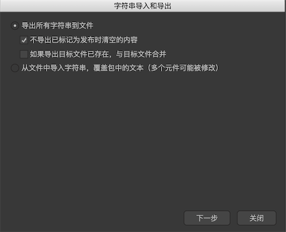

For UI multi-language support, FairyGUI provides such a solution: export all text on the interface to a file, then submit this file for translation, dynamically load the translated file at runtime, and replace the interface text by SDK .

In other words, FairyGUI's solution is to spell the interface first, and then translate; compared to the solution of making a language file first and then specifying a string id for the control, it is clear that the former is more efficient when spelling the interface, and when the interface needs to be refactored The former is more convenient than the latter.

The language files exported by the editor currently only support xml format, and will support formats such as excel in the future. The xml format may not be convenient for translators to handle. If necessary, please refer to the description of the xml format below to make an excel and xml conversion tool.

## Generate language files

Click the menu "Tools"-> "String Import and Export", the pop-up window is as follows:



- `Do not export content that has been marked as emptied when published`For example, the text is set to be cleared when publishing. If checked here, this text will not appear in the language file.

- `If the export destination file already exists, merge with the destination file`This option means, for example, that the exported content now contains a string with id x1, the value is a, and the target file also has a string with id x1, and the value is b, then the value of x1 in the exported result file Is b.

Use "Export all strings to a file" function, and get an xml file after completion,


This file contains all the text that appears on the UI (excluding pure Arabic numerals). `name`Is the unique id of the string, which corresponds to all the text appearing in the interface, this id cannot be destroyed;`mz`Is the name of the control. It is only used for prompts or mnemonics. It is not used by the bottom layer, even if deleted.

## Using language files in the editor

In Project Settings-> Multi-Language, clickAnd select the language file exported above. These two steps can also be reduced to one step, click directlyJust fine.

After adding one or more language files, you can switch the language used in the current interface in the main toolbar:


**Language files only take effect during preview, text content will not change during editing**。 When previewing, you can directly modify the content of the language file, and then click the, You can feedback your changes in real time, as shown below:


## Load language file

Load language files dynamically at runtime:

```csharp
// Unity
    string fileContent; // Load the language file by yourself, here it is assumed that it has been loaded into this variable
    FairyGUI.Utils.XML xml = new FairyGUI.Utils.XML (fileContent);
    UIPackage.SetStringsSource (xml);

    // AS3
    var fileContent: String; // Load the language file by yourself, it is assumed here that this variable has been loaded
    var xml: XML = new XML (fileContent);
    UIPackage.setStringsSource (xml);
```

**Note: The language file should be loaded before the UI is created. It does not support real-time language switching. If you want to switch languages in the game, you can only destroy all UI and uninstall all packages.**

## Replace all

The translated language files can be imported back into the editor and directly replace the original text content. This applies when copying a UI item for other languages.

Click the menu "Tools"-> "String Import and Export", and then select "Import strings from a file and overwrite the text in the package". This function will modify all text content, please proceed with caution.