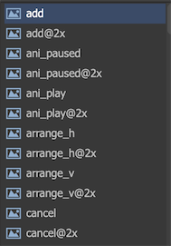
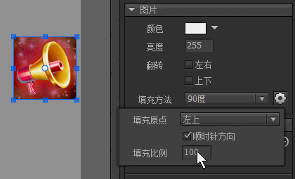

The image is the most basic element in FairyGUI. Its design is as simple and efficient as possible. Therefore, the function of modifying the image source is not provided, and clicks are not supported. If you need to change dynamically, or support clicking, please use the loader instead (if the image is already placed on the stage, then select the swap component in the context menu, and then select the loader, you can quickly modify the image into a loader).

FairyGUI supports image formats: PNG, JPG, TGA, PSD, SVG.

## Image properties

In the resource library or on the stage, double-click the image to enter the image setting dialog:


- `Image size`Image size, pixel size. ** If the image is in SVG format, it can be entered manually. ** Because SVG can be losslessly scaled, but general game engines do not provide direct support, so you need to specify a size for SVG so that SVG can be used like a bitmap.

- `Data size`The size of the image file, in bytes. If the words xxx-> xxx appear, it means that the image has been compressed. The number before it is the size before compression, and the number after it is the size after compression.

- `Zoom with Nine Palace`Jiugong grid drawing will follow the following rules:
   - Keep 4 corners from deforming
   - Stretch 4 sides in one direction (that is, the sides between 4 corners, such as the top side, only do lateral stretching)
   - Stretch the middle part in both directions (that is, the middle part of the Jiugong grid, horizontal and vertical stretching at the same time, PS: stretching ratio is not necessarily the same)
   (image from www.cocoachina.com)

   If you want the stretched part of the nine-square grid to be filled with tiles, you can check the "Tile some tiles" in the interface below, and then check the grids that need to be tiled: (This function only has Unity Partial platform support)

   

   **If the platform is egret, do not set any side of the Jiugong grid to the edge, otherwise the display will be abnormal.**

- `Zoom using tiles`The image is stretched using the tile mode to fill it. Except for the Flash and Haxe versions, you should try to avoid using smaller areas of the image tile to fill the larger area, because this will generate a large number of grids, and may even overflow error. If you do have this requirement, the Unity version provides an optimization strategy, you need to set this image to be exported separately (the texture set settings will be explained below), and then in the Unity editor, set the Wrap Mode of this texture For Repeat. After these two conditions are met, the performance of tiling with this image will be greatly improved, and there will be no overflow exception.

- `Allow smoothing`It indicates whether the image is smoothed when stretched. If this image is used to make a character in a pixel game, you may need to turn off smoothing, otherwise you should generally turn on. This option is not available for platforms using texture sets.

- `quality`This option is available for Flash and Haxe versions. You can control the compression ratio of a single image to get the best quality-to-space ratio. After changing the options, press "Apply" to immediately observe the changes in the image, and observe the results of the compression size in "Data Size". **This option is not available for platforms such as Unity that use texture sets.**

- `Texture set`A package can contain one or more texture sets, and each image can be arranged into a different texture set.
   - `alone`Indicates that this image is placed into a texture set alone, and the size of the texture set is a power of two.
   - `Alone (NPOT)`Indicates that this image is directly output at its original size.
   - `Alone (a multiple of 4)`Indicates that this image is placed into a texture set separately, and the size of the texture set is a multiple of 4.

- `Repeating edge pixels`When checked, the edge pixels of the image will be automatically expanded in the texture set to avoid gaps in the image when stitching or tiling.

function button:

- `Update`Select an external image to cover this image.

- `Crop edge margin`Permanently crop all transparent pixels (Alpha = 0) around the image. Images may become smaller.

- `@ 2x` `@ 3x` ``@ 4x If the image is in SVG format, then these features can be used to quickly generate a high-definition version of the image.

## HD resource selection

Those who have done APP development should be familiar with this mechanism. For example, we designed a set of interface for IPhone8 with a resolution of 1334x750. An image a.png is used. When this set of UI is displayed on IPhone XS Max, a.png needs to be displayed twice. The original image is blurred. Therefore, we will prepare an a@2x.png for this situation display, so that the interface display effect will show a high-definition effect.

Now we have built this mechanism into FairyGUI. In the Publish Settings dialog box, we have provided the options @ 2x, @ 3x, @ 4x. After checking, if there is a resource with the same name as the resource and with the @ 2x, @ 3x, @ 4x suffix, it will be included when publishing Bale. At runtime, the appropriate resources are automatically selected according to the interface magnification factor. This mechanism is fully automatic and programmers have no perception. The only thing that needs to be done is to place the resources in the editor.



## Instance properties

Select an image on the stage, and the inspector on the right appears:


- `colour`Modify the value of each color channel of the image to make the image change color.

- `brightness`Adjust the brightness of the image. This is actually modified by`colour`The property achieves the same effect as setting the color to grayscale. E.g. settings`colour`0xCCCCCC has the same effect as setting the brightness to 0xCC.

- `Flip`Flip the image horizontally or vertically. Different from the traditional flipping method with Scale set to -1, the flipping here is a flipping at the rendering level. It does not involve matrix transformations and is not affected by the axis, coordinates, etc. If you need a image flipping, it is recommended to use this option. *(Note: Egret, Laya, and Creator versions failed to implement this feature. Now it is implemented by setting Scale to -1. If you want to use it, please don't use Scale value again, they will conflict)*。

- `Filling method`Setting the fill method can achieve some cropping effects of the image.

   - `Level`
   

   - `vertical`
   

   - `90 degrees`
   

   - `180 degree`
   

   - `360 degrees`
   

## GImage

We generally do not use new directly to create images, and there is rarely a need to create images separately. It is usually placed directly in other components as a constituent element. If you really need to instantiate an image, you can use the following methods:

```csharp
GImage aImage = UIPackage.CreateObject("package name", "image name").asImage;
```

As a basic component of UI, images are designed with simplicity and efficiency in mind, so APIs are not provided to modify images. If you need to change the image dynamically, you should use the GLoader instead.

If the image has a fill mode, you can modify the fill ratio through code, for example:

```csharp
aImage.fillAmount = 0.5; // 0 ~ 1
```

In the Unity platform, if you need to assign a Texture2D object to GImage on some special occasions, you can do this:

```csharp
// It must be noted that GImage does not manage the life cycle of external objects and will not actively destroy your_Texture2D
    aImage.texture = new NTexture (your_Texture2D);
```
Again, this requirement is still recommended to be implemented using loaders whenever possible.

In the Unity platform, you can set custom materials or shaders for GImage. E.g:

```csharp
aImage.shader = yourShader; 
    //或者
    aImage.material = yourMaterial;
```
