## Open Project and Create Project

After launching the FairyGUI editor, the first window to open the project/create project is displayed:


- `History` Items that have been opened can be opened directly from the list.
- `Delete` Click the trash can button on the top right to delete the selected open history.
- `Open Other` Open an existing project by selecting a project description file xxx.fairy.
- `Open Directory` Open an existing project by selecting the directory where the project is located. Applicable to open the 2.x version of the project.

The editor supports opening multiple projects at the same time. On the Windows platform, multiple FairyGUI editors can be launched directly. On the Mac platform, you can open other projects after opening a project and then clicking `Main Menu -> "File" -> "Open project in new window"`.


Create a new UI project at the specified location.

- `Project name` Any item name.
- `Project Type` UI item type, which is the target platform. Different platform types have certain differences in resource organization and distribution. **You don't need to worry about choosing the wrong project type here. You can adjust the UI project type at any time after the project is created**. The operation location is in `Main Menu -> "File" -> "Project Properties"`.

## Resource Management

The structure of the FairyGUI project in the file system is:

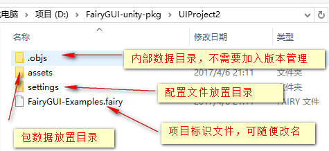

- FairyGUI organizes resources on a per-package basis. The package is embodied as a directory in the file system. Each directory in the assets directory is a package. Each resource in the package has an attribute that is exported. A package can only be set to an exported resource using another package, and the resource that isn't set to be exported is inaccessible. At the same time, only components that are set to be exported can be dynamically created using code.

- After the package is released, you can get a description file and one or more texture sets (the number of files and packaging methods may vary from platform to platform). FairyGUI doesn't handle the dependencies between packages. If the B package exports a component B1 and the A1 component of the A package uses component B1, then before creating A1, the B package must be loaded, otherwise A1 B1 doesn't display correctly (but doesn't affect the normal operation of the program). This loading needs to be manually called by the developer, and FairyGUI will not load automatically.

- How to divide packages. There's a principle - don't establish cross-reference relationships. For example, avoid the case where the `A` package uses the `B` package's resources, and the `B` package uses the `C` package's resources. We generally create one or more public packages, put the resources that need to be used frequently throughout the project, and put some basic components, such as buttons, scrollbars, window backgrounds, etc. here. Other packages need to be dragged directly from the public package when they need to be used. In addition to public packages, other packages don't have a reference relationship with each other. Simple dependencies make it easier for programmers to control the loading and unloading of UI resources.

- The granularity of package partitioning generally doesn't have a hard rule. In practice, there are different solutions. For example, some people prefer to be more detailed, one module and one package; some people prefer to pack less resources and components of different UI modules. These scenarios have little impact on the performance of the UI. However, the **image resources shouldn't be too scattered, because the images of different packages cannot be on the same texture set**. If the resources are too scattered, the texture set may be left too much and waste space.

**Add, Delete, and Change Resources**

You can do this directly in the file manager (or Finder):

- `Add resources` You can place the material directly into the package directory. You can also copy the package of another project directly into the assets directory. Then click the refresh button above the library panel.

- `Mobile Resources` You can move the material in various folders within the package. But it can't be moved across packages, otherwise the reference relationship will be lost. Then click the refresh button above the library panel.

- `Delete resource` You can delete the material directly in the package directory; then click the refresh button above the library panel.

- `Replace resource` You can open the material edit with an external tool, or you can directly replace the file. This type of operation doesn't need to be refreshed, and you can see the results of the latest changes when you return to the editor.

**package.xml**

Each package has a `package.xml` file, which is the package's database file. If the file is destroyed, the contents of the package won't be readable. In the case of multiplayer collaboration, if there's a conflict in `package.xml`, please handle it carefully.

## Library Panel

After entering the editor, the left side of the main interface is the library panel. The library panel includes two sub-panels, the repository and the favorites.


The library panel is displayed in a tree structure. The top-level nodes are packages, and folders can be created under each package. You can directly locate the package by directly typing the first letter of the first character of the package name on the keyboard.

You can drag images, sounds, animations, text, and so on directly from the file manager (or Finder) into the repository. The material can be moved at will, or you can use the copy and paste function. If you want to update the material, you can click on the resource, select "Update Resource" in the right-click menu, or you can directly replace the file in the file manager (or Finder), which is suitable for batch operations.

**Resource URL Address**

In FairyGUI, each resource has a URL. Select a resource, right-click menu, select "Copy URL", you can get the URL address of the resource. Resources can be referenced through this URL, both in the editor and in the code. For example, to set a button icon, you can drag directly from the library, or you can manually paste the URL address. This URL is a bunch of encodings that aren't readable. It can be difficult to read in development, so we usually use another format: ui://package/resource name. The two URL formats are generic, one unreadable, but not affected by package or resource renaming; the other is more readable.

**Resource Export**

Each resource in the package has an attribute that is exported. The icon of the exported resource has a small red dot in the lower right corner. Use the functions provided in the right-click menu to easily switch the export properties of one or more resources.

**Favorites**

Favorites provide a quick access to frequently used components. Some commonly used components or clips can be placed in favorites for quick access. It is also possible to implement a function similar to the control panel. You can add resources to your favorites by right-clicking one or more resources in the repository and selecting Add to Favorites from the context menu.


**Filter Display Package**

When there are more packages in the library panel, it's more troublesome to find things. You can hide some of the less commonly used packages. Click on the library panel


**Link with Editor**

When this function is activated, when the active document is switched, the component corresponding to the active document is also selected in the repository.

**Rapid Positioning**

Pinyin by resource name or the first letter of English can quickly locate the resource at the same level of the currently selected item.

**Copy, Paste, and Paste All**

Resources in the library can be copied and pasted. Use the "Copy" "Paste" "Paste All" or "Ctrl+C" "Ctrl+V" in the right-click menu to complete.

"Paste" and "Paste All" reflect the difference when copying across packages.
- `Paste all` Paste the selected resource and all the resources it references.
- `Paste` will only paste the selected resource and the resources it references (but) are **not set to export**. The shortcut is `Ctrl+V`.

Tip: The copy and paste function is supported across projects. After opening two projects at the same time, you can copy and paste to one another.

## Main Toolbar


- `Mask display controller`  All contents hidden by the display controller will be displayed after masking.
- `Blocking associated system`  Manually modifying the component coordinates and size associated with the system doesn't act.
- `Reminder information`  If there's an object with the same name in the current document, a yellow exclamation mark will be displayed.
- `Show `  in the library to locate this component in the library.

## Side Toolbar

 You can switch between drag and drop modes. In particular, in the selection mode, press and hold a space to temporarily switch to the drag mode, and release the space to switch to the selection mode.

 The base control area. Click and then click on a position on the stage to generate an object at the corresponding location.

 Combine and ungroup. The combined shortcut is Ctrl+G, and the ungrouped shortcut is Ctrl+Shift+G.

 Alignment operation. After selecting multiple components, click the button here to perform the corresponding alignment function. For example, after selecting two components and clicking left and right to center, the two components will be set to centerline alignment. If only one component is selected, the component performs a corresponding alignment function on the container-component. For example, after selecting a component and clicking `Align Left and Right`, the component will move to the middle of the container assembly. For another example, after selecting a component and clicking the same width, the component's width will be set to be the same as the container-component.

 Custom arrangement. Click to pop up the dialog box for custom arrangement.


## Controller Toolbar


Click the plus sign to add a new controller. Click on the controller name to enter the controller editing interface. Click the controller's various page buttons to switch pages.

## Motion Toolbar


Click on the plus sign to add new effects. Click on the effect name to enter the motion editing interface.

## Display List


The display list of the components currently being edited is displayed here. In the order in which they are displayed, the lower the component in the list is displayed in front.
The operations of the display list panel are:
- Click on the position corresponding to the "eye" of each line head to hide the component, only for auxiliary editing, without affecting the runtime.
- Click on the position corresponding to the "lock" in each line head to lock the component. After locking, the component cannot be selected, only for auxiliary editing, and doesn't affect the runtime.
- Click on the lock icon to unlock all components.
- Click on the eye icon to unhide all components.
- Drag and drop in the display list to change the position of the component in the display list.

## Stage


The stage is the editing area of ​​the component. Ways to add content to the stage are:

- Click on the base control on the side toolbar and click on the stage.
- Drag resources directly from the repository or favorites to the editing area.
- Paste text or images from the clipboard directly. The image is automatically imported into the repository and placed on the Stage.
- You can drag resources directly from Windows Explorer or Finder. If the resource is located in the assets directory, that is to say, it's already in the resource in the package, then the resources in the corresponding package will be placed on the stage, and there will be no repeated import of resources into the resource library. This design can partially solve the inconvenience that the current library panel can not display all the image thumbnails, because you can easily view the thumbnails in Windows Explorer or Finder, and if you're working with multi-screen, you can also play It is similar to placing the library panel on a separate screen.

What's different from the surrounding color in the middle is the component area. But you don't need to put everything in the component area. By default, content that exceeds the component area is still displayed, but the component's size is determined only by the component area. Some special features, such as filters, are only valid for the component area, so it's recommended to place the content in the component area.

Commonly used stage operations are:

- `Selected` Click on a component to single-select, hold down `SHIFT` and click on multiple components to select multiple. Click on the blank to cancel all selections. Press and drag in the blank space to select the box.

- `Move` Press and hold the component to drag. If you hold down `SHIFT` while dragging, the movement is limited to the vertical or horizontal direction. Use the up, down, left, and right arrow keys on the keyboard to move the selected component. Each press moves 1 pixel. If you press the SHIFT button at the same time, the motion is accelerated and moves 10 pixels at a time.

- `Zoom` Drag and drop the 8 adjustment points on the edge of the selected frame to change the width and component's height.

- `Combination` After selecting multiple components, press `CTRL+G` to create a combination.

**Stage Right-Click Menu**

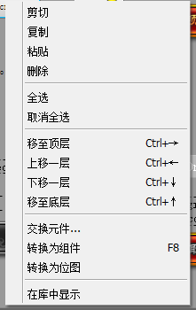

- `Replace component` You can replace the currently selected component with another component, and all attributes such as position size will be retained.

- `Convert to component` You can replace the currently selected component or components with a single component whose contents include the originally selected content.

- `Convert to bitmap` You can replace the currently selected one or more components with a single image. The content of this image is drawn from the original selected content. The generated image is automatically added to the repository.

- `Show in library` Highlights the currently selected component in the library.

## Preview

Click the  button on the main toolbar to enter preview mode.

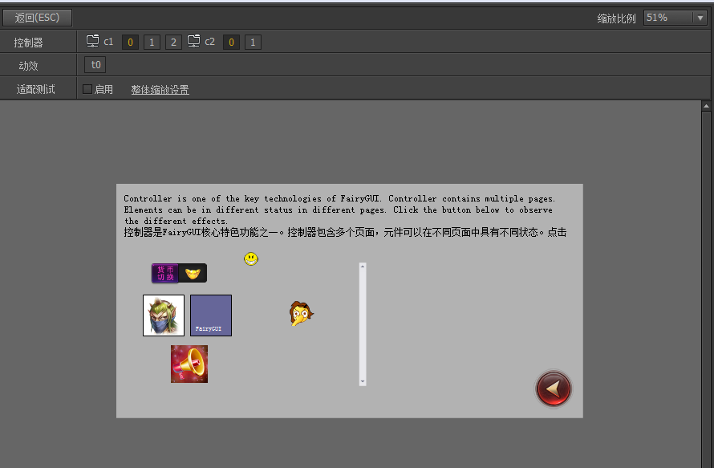

**Adaptation Test**


If the currently designed component requires an adaptation test, check the `"Adaptation Test"` option. After checking, if it's the first test, you need to click the `“Overall Zoom”` button to set the UI adaptive parameters. Then adjust the adaptive parameters of this component to test.
Note: If you change the screen size during the dynamic playback, and this motion involves components with adaptive settings, the animation may play abnormally. Please don't change the screen size during the animation.

## Property Panel

Click on any one or more components in the Stage, and the corresponding property settings panel will be displayed on the right side of the editor. If you click on the stage's blank space (don't click anything), the properties panel of the container-component is displayed.


The following explains the meaning of the attributes in detail when you use the methods of each resource type.

## Project Settings Dialog

Open the project settings dialog: `Main Menu -> "File" -> "Project Settings"`


Here you can modify the name and type of the project.


Modify some global settings related to the text.

- `Font` Sets the default font for all text. You can click on the "A" button to select other fonts in the system. If you need to use the ttf file, please double-click the ttf file, install the font to the system, and select it here (you need to restart the editor to see it). This font setting is only used in the editor. What fonts are used at runtime, you need to use UIConfig.defaultFont settings. In order to make the editor effect consistent with the runtime, you should try to choose the same font or similar font. E.g:

```csharp
    UIConfig.defaultFont = 'HeiTi';
```

- `Text size scheme` There are usually several fixed schemes for the font size used in a game or application. After defining this, when you need to set the font size when making the UI, you can select it directly in the drop-down menu without having to do it each time. Input.

<center>

</center>

- `Disable font rendering position optimization` This option is only available for Egret and Laya versions. When checked, FairyGUI will use the system to render the default position of the text, no longer automatically optimized. This difference is especially noticeable for Microsoft Yahei. This option can help solve some of the problems with the H5 engine rendering font position.


Set the scheme for color settings. There are usually several options for the colors used in a game or application. Once you have defined them, you need to set the colors when you make the UI. You can select them directly from the drop-down menu without having to color each time.

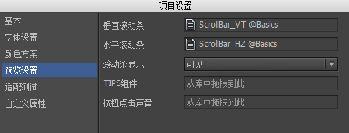

Set some parameters used by the editor preview. **Note that these parameters are only used in the editor, and you need to reset them with UIConfig at runtime.**

- `Vertical scrollbar` `Horizontal scrollbar` Sets the scrollbar resource that is required for all containers with scrolling functionality when making the UI. That is to say, after you set the "overflow processing" of a component or a list to "vertical scrolling", "horizontal scrolling" or "free scrolling", you don't need to set the scrollbar every time, it will automatically use the scrolling set here. Resources. If a component needs to use a different scrollbar than the global setting, the editor also provides separate settings, which are explained in the following sections.

- `Scroll bar shows` the display strategy of the scrollbar. This is a global setting and can be set separately in the scrolling property settings of the component or list.
    - `Visible` means that the scrollbar is always displayed.
    - `Show when scrolling` means that the scrollbar will only be displayed when scrolling, and will be automatically hidden in other cases.
    - `Hide` indicates that the scrollbar is always invisible, in which case the scrollbar doesn't occupy the position.

- `TIPS component` Sets the component used to display TIPS. This component should be expanded to a label. Usage reference [here](object.html#TIPSproperty).

- `Button click sound` Sets the default click sound of the button. Once set, all button clicks will play this sound, unless the button itself sets another sound. The global button click sound at runtime needs to be set via UIConfig.buttonSound.

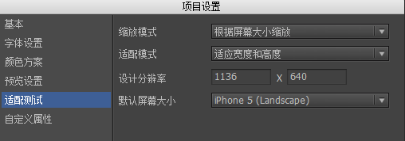

Adapt test settings. Please read the detailed introduction[自适应](adaptation.html).

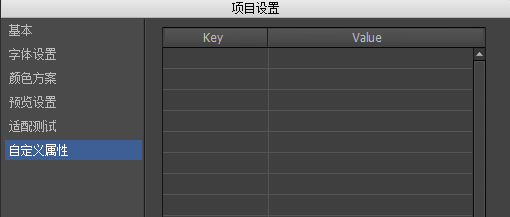

Custom property settings. Custom properties are only available to plugin developers. Not accessible during runtime.

## Preferences Dialog

Open the Preferences dialog: `Main Menu -> "Edit" -> "Preferences"`.

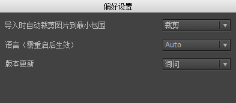

- `Automatically crop the image to the minimum bracket when importing`. If set to crop, the image will be automatically clipped off when the image is added to the project. If you set it to not crop, and then want to crop it, double-click the image to open the Picture Properties dialog box. There is a function button that provides cropping at the bottom left of the dialog box.

- `Language` Set the interface language of the editor.

- `Version Update` Set whether to automatically update the software.

## Package Settings Dialog

Open the package settings dialog: `Main Menu -> "File" -> "Package Settings"`.


- `Package Name` View and modify the name of the selected package.

- `JPEG quality` Applicable to projects such as AS3 and Haxe that don't use the Atlas. When a JPEG image is imported, it's automatically compressed with the specified quality. Other types of items don't compress JPG images.

- `Compressed PNG` Applies to projects such as AS3 and Haxe that don't use the Atlas. After checking, the PNG image will be automatically compressed into PNG8 when the PNG image is imported. You can also set the image separately for compression, double-click the image to open the image properties dialog box, and adjust the quality options. Other types of items don't compress PNG images.

## Publish Settings Dialog

Open the `Publish Settings dialog`: `Main Menu -> File -> Publish Settings`. Or click the small triangle next to the `Publish` button on the main toolbar.

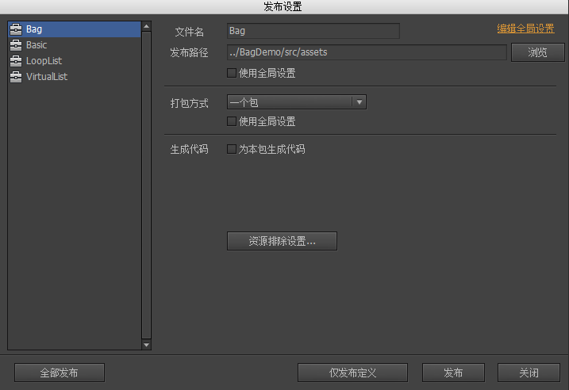

On the left is the package list, and on the right is the release settings for the selected package. Set the settings and global settings of this package, click the yellow link in the upper right corner to enter the global settings. Global settings apply to all packages.

- `File name` The name of the file to be published. This file name is different from the package name. When we load the package, we need to use the file name set here, and when creating the object, we need to use the package name. E.g

```csharp
    UIPackage.AddPackage("file_name"); // Here is the name of the file being published.
    UIPackage.CreateObject("Package1", "Component1"); // Here Package1 is the name of the package.
```

- `Publish path` The directory where the content is posted. For the Unity platform, **it's recommended to be published directly to the directory within the Unity project**, so the editor will automatically provide the correct meta file for the newly released texture based on the version of Unity. If this isn't the case, then when you manually copy into the Unity project, please pay attention to check if the texture settings meet the requirements.
-
- `Package mode` You can choose to package into one package or two packages. The two packages separate the resources such as XML definitions and images. The advantage of this is that if you only modify the component (not adding new materials or deleting any materials), you can simply publish and push the definition package to the user, reducing the user's data consumption.

- `Generate code` to generate the bound code. Generating the bundled code provides more intuitive access to the various nodes of the component, but it also results in a coupling between the art work and the programmer's work.

- `Compressing the description file` The Laya and Egret projects provide a publishing option that allows you to control whether the published description file is compressed. The default is compressed. If you have already used the gzip compression feature of the web server, or if you compress it yourself, you can choose a format that isn't compressed.
  

- `Use binary format` The publishing format is set to binary format. Using the binary format can reduce the consumption of load packets when it's reduced. It is recommended. This format requires a certain version of SDK support: Unity-3.0, Cocos2dx-2.0, other SDKs please use the source code after September 2018. If you're upgrading from an old SDK, please see the upgrade instructions: [Upgrade to Binary Package Format](upgrade_binary_format.html).

- `Publish only definitions` Usually published content includes material (pictures, sounds, etc.) and XML definition files. If you have not added or deleted material, you can only publish the XML definition file, avoiding the time consumption caused by regenerating the atlas. .

### Texture Set Definition


- `None POT` None Short for Power Of Two, after checking, the size of the output texture allowed **isn't limited to the power of**. Note that some texture formats specify that the size must be a power of two.

- `Square` Check to limit the width and height of the output texture to be equal.

- `Allow rotation` Allows you to rotate the image to achieve greater texture space utilization. *(Not supported on Egret and LayaAir platforms)*

- `Separate Alpha Channel` This option is only available for Unity. With this method, you can set the original texture in Unity to a format that doesn't support alpha channel (such as ETC1) to reduce memory usage. The FairyGUI-unity SDK provides specialized shaders for mixing.

- `Textset definition` For platforms that support texture sets, such as Unity/Egret/Starling, you can plan to place images in different texture sets. The significance of this feature is:
  1. The picture is too large, assuming the texture set supports up to 2048×2048 (this is adjustable), you can use multiple texture sets beyond this range;
  2. The images are inconsistent. For example, a large-sized background image with a large size isn't suitable for putting together a single color UI material, which will make the final png image too large. It is a good solution to put a large size background image on a texture set separately;
  3. The characteristics of the image are inconsistent. For example, in the Unity platform, you can set a separate Filter Mode, compression format, etc. for the texture set.
  Only 10 texture set settings are provided here. If a package has more than 10 texture sets, it's recommended to consider subcontracting.

- `Compress` compresses textures using the PNG8 format. This compression method can greatly reduce the size of the PNG file, but it will also make the image distortion more serious, especially the color is rich, or contains gradient pictures, please use with caution. The Unity engine shouldn't use this compression function, because Unity's texture compression should be set in Unity. Unity will automatically compress the texture according to the format set when packaging. The compression used here doesn't reduce the file size except the image quality.

### Resource Exclusion Settings


If some material is only used for testing purposes, such as a loader, put an image into it only to see the effect, but this image isn't released with the package (subsequently through external loading), then you can put this image in this interface. Drag in, then the image won't be included when it's released.

### Publish Settings


- `File Path` The path to the saved code.

- `Class Name Prefix` prefixes the class name generated by each component. For example, if the component name is "Component1" and the prefix is ​​set to "T", then the last generated class name is "TComponent1". The prefix can be empty. Note that if the component name is Chinese, it will be automatically converted to Pinyin.

- `Member Name Prefix` Prefix the name of each component in the component. For example, if the component name is "n10" and the prefix is ​​set to "m_", the name of the last generated class member is "m_n10". The prefix can be empty, but this isn't recommended. Because the component name is likely to conflict with some of the class's properties and method names. For example, if the component name is "icon", it conflicts with the icon property of GObject.

- `Ignore not renamed child`. When checked, the names automatically generated by such systems such as "n1", "n2", or the names of the extensions such as "title", "icon", etc. will be Member acquisition codes aren't generated for components of these names. If a component is a component of these names, then the entire component will not generate code. For example, a button with only the symbols named "title" and "icon" will not generate code for this button, because using the base class GButton is sufficient.

 - `Use name to get child` If unchecked, the component is initialized with the index to get the child object; if checked, the child object is obtained with the name. The former is highly efficient and recommended; the latter is more compatible, for example, if the order of the components is adjusted, no anomalies will occur.

- `Package Name` For AS3 code, the package of the released code; for C# code, the namespace of the released code; for Typscript code, the module of the released code; for C++ code, the code for the release Namespace.

- `Code Type` For the Laya engine, you can choose to publish the AS3 code or the TS code.

The way to use the published code:

```csharp
    // First call BindAll. The released code has a file named XXXBinder
    // Note: Be sure to call it at startup.
    XXXBinder.BindAll();

    // Create a UI interface. Note: Not directly new XXX.
    XXX view = XXX.CreateInstance();
    view.m_n10.text = ...;
```

The code template is used when publishing the code. The code template is in the template directory under the editor installation directory. If you need a custom template, you need to copy the template directory to the root of the UI project and make changes. The parameters supported in the template are:

```csharp
    Component.template
    -------------
    {packageName} UIModuleName
    {componentName} UIComponentParentClassName
    {className} UIComponentClassName
    {uiPkgName} UIResourcePackageName
    {uiResName} UIResourceName
    {uiPath} UIResourcePath

    Binder.template
    -------------
    {className}  UIModuleName+"Binder"
    {packageName} UIModuleName
```

## Dependency Query Dialog

In the repository, click on a resource, right-click on the `"Dependency Query"` menu, or in `Main Menu -> "Tools" -> "Dependency Query"`, to open the Dependency Query dialog box.

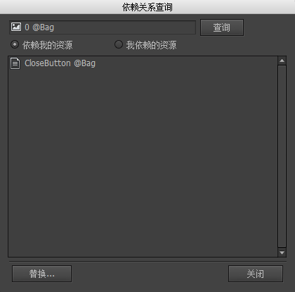

Querying the dependencies between resources:


If the A resource is queried by the B, C, and D components, then the A in these components can be replaced with other resources.

## Import and Export Resource Bundles

- `Export Resource Bundles`

Select one or more resources in the repository, or select a folder or package, then click on `Main Menu -> "Resources" -> "Export Resources"`:


Here is a list of selected resources and the resources they depend on. Click Export to generate a file with the extension fairpackage.

- `Import Resource Bundles`

Click on `Main Menu -> "Resources" -> "Import Resources"` and follow the prompts to select a file with the extension fairpackage.


Select the imported location, then click Import, and the resources in the fairypackage are imported to get the specified location.

- `Import Built-in Resource Bundles` FairyGUI comes with a few sets of skins, click on `Main Menu -> "Resources" -> "Import built-in resource bundles"`, and then select one of the packages to import. For example, `BlueSkin.fairypackage` contains:

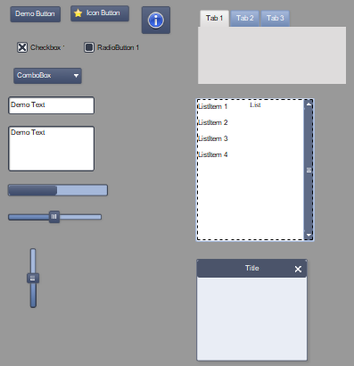

## String Import and Export

Using the FairyGUI editor makes it easy to support multiple languages in your game.

Click on `Main Menu -> "Tool" -> "String Import and Export"`, pop-up window as shown below:


Use the "Export all strings to file" function, get an xml file after you finish,


This file contains all the text that appears on the UI (excluding pure Arabic numerals), and then this file can be submitted for translation. After the translation, we have two ways to make the new language file take effect:

"If the export target file already exists, merge with the target file": This option means that, for example, the output contains a string with an id of x1, the value is a, and the target file also has a string with the id x1. The value is b, and the value of x1 in the exported result file is b.

- Using the string import function of the above window, directly import the translated file back to the editor, the text on the UI will be completely replaced. This method is suitable for the way each project uses one project.

- Dynamically load language files at runtime. This method is relatively flexible.

```csharp
    // Unity

    string fileContent; // Load the language file yourself, assuming it has been loaded into this variable
    FairyGUI.Utils.XML xml  = new FairyGUI.Utils.XML(fileContent);
    UIPackage.SetStringsSource(xml);
```

```csharp
    // AS3

    var fileContent:String; // Load the language file yourself, assuming it has been loaded into this variable
    var xml:XML = new XML(fileContent);
    UIPackage.setStringsSource(xml);
```

## Editor Plugin

Click on `Main Menu -> "Tools" -> "Plugin Management"`, pop-up window as shown below:

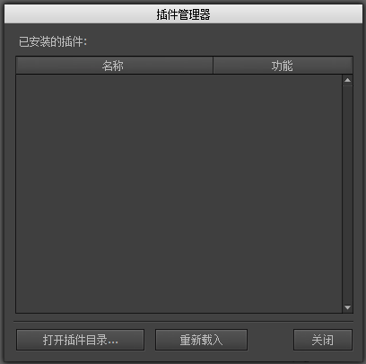

这里列出了编辑器已装载的插件。目前只能使用AS3语言编写编辑器插件，而且插件能做的东西也非常有限，不建议使用。如果确实需要编写插件，目前只有一个资料可供参考:[编辑器插件怎么写？](http://ask.fairygui.com/?/question/5)

## Command-line Publishing

Support for command-line publishing (experimental features):

```
FairyGUI-Editor -p project_desc_file [-b package_names] [-x callback] [-o output_path]
```

* project-desc-file: Project description file path, such as d:?a.1.fairy.
* package-names: Optional. Not available for all packages, multiple packages separated by commas.
* callback: Optional. Call the program after the publishing is complete.
* output-path: optional. If specified, override the project settings, using the location specified here directly.
