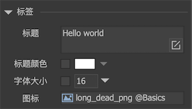

The label component is very simple. It has no special behavior. It can provide the title and icon attributes for the component by placing the title and icon components.

## Create label

There are two ways to create a label component.

- Click on the main menu "Resources"-> "New Tab".
- Create a new component and select Expand to "Label" in the component properties.

## Instructions

- `title`Can be plain text, rich text, labels, buttons.

- `icon`It can be a loader, or a label or button.

Note: There are not only "title" and "icon" in the label component, you can place any component, such as placing as many texts, loaders, etc. The "title" and "icon" settings are only used for the label component to be set intuitively when the editor is instantiated.

## Instance properties

Select a label component on the stage, and the property panel list on the right appears:



- `title`The set text is assigned to the text property of the "title" element inside the label component. If the "title" element does not exist, nothing will happen.

- `Title color`The default title color is the text color of the "title" element in the label component. After checking, you can modify the text color. If the "title" element does not exist, nothing will happen.

- `font size`The default font size is the font size of the "title" element in the label component. After checking, you can modify the font size. If the "title" element does not exist, nothing will happen.

- `icon`The set URL will be assigned to the icon attribute of the "icon" element in the label component. If the "icon" element does not exist, nothing will happen.

If "title" is input text, it will appear in the properties panelButton, click to enter the input settings panel. The setting method can refer to the text tutorial.

## GLabel

Set the title or icon of the label. You don't need to force the object to be the type of GLabel. You can use the interface provided by GObject directly, for example:

```csharp
GObject obj = gcom.GetChild ("n1");
    obj.text = "hello";
    obj.icon = "ui://package name/image name";
```

Modify the title color like this:

```csharp
GLabel label = gcom.GetChild("n1").asLabel;
    lable.titleColor = ...;
```

In addition, the label is also a standard component, so all methods of GComponent are available. For example, you can use GetChild to access any child component.