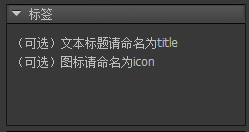
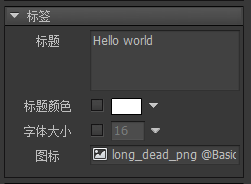

The `Label` component is very simple, it has no special behavior. You can provide `title` and `icon` properties for the component by placing a component named "title" and a component named "icon".

## Create Labels

There are two ways to create a label component.

- Click on `Main Menu -> "Resources" -> "New Tab"`.
- Create a new component and select `Expand as "Label"` in the component properties.

## Design Properties

In the component editing state, the properties panel of the label component is:



**命名约定**

- `title` 可以是普通文本，富文本，也可以是标签、按钮。

- `icon` 可以是装载器，也可以是标签、按钮。

注意:标签组件内并非只能有“title”和“icon”，你可以放置任何元件，例如放置任意多的文本、装载器等。“title”和“icon”的设定只是用于标签组件在编辑器实例化时能够直观设置而已。

## 实例属性

在舞台上选中一个标签组件，右边的属性面板列表出现:



- `标题` 设置的文本将赋值到标签组件内的“title”元件的文本属性。如果不存在“title”元件，则什么事都不会发生。
  这里的输入框比较小，如果要输入大文本，则可以在输入激活时，按CTRL+ENTER，然后会弹出一个专门用于输入文本的窗口。

- `标题颜色` 默认的标题颜色是标签组件内的“title”元件的文字颜色，勾选后，可以修改文字颜色。如果不存在“title”元件，则什么事都不会发生。

- `字体大小` 默认的字体大小是标签组件内的“title”元件的字体大小，勾选后，可以修改字体大小。如果不存在“title”元件，则什么事都不会发生。

- `图标` 设置的URL将赋值到标签组件内的“icon”元件的图标属性。如果不存在“icon”元件，则什么事都不会发生。

如果“title”是输入文本，则属性面板内会出现按钮，点击后出现输入设置面板。设置方法可参考文本的教程。

## GLabel

设置标签的标题或者图标，你甚至不需要强制对象为GLabel的类型，直接用GObject提供的接口就可以，例如:

```csharp
    GObject obj = gcom.GetChild("n1");
    obj.text = "hello";
    obj.icon = "ui://包名/图片名";
```

修改标题颜色可以这样:

```csharp
    GLabel label = gcom.GetChild("n1").asLabel;
    lable.titleColor = ...;
```

另外，标签也是一个标准的组件，因此GComponent的所有方法都是可以使用的，例如你可以用GetChild访问任何子组件。