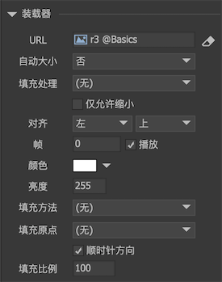

The purpose of the loader is to dynamically load resources. Click in the main toolbarButton to generate a loader.

## Instance properties



- `URL`The resource pointed to by the URL can be an image, movieclip, or component. If selected, The value set here will be automatically cleared when publishing.

- `Auto size`Sets whether the loader automatically resizes itself based on the size of the content. For example, if the size of the image is 100x100, the size of the loader automatically becomes 100x100.

- `Fill processing`The zoom strategy to use when the image or movieclip to be displayed is not the same size as the loader.
   - `no`The content does not undergo any scaling.
   - `Proportional zoom (show all)`Scale at the minimum ratio without distortion, and one side may be left blank.
   - `Proportional scaling (borderless)`Scaled at maximum ratio without distortion, one side may exceed the loader rectangle.
   - `Proportional scaling (adapt to height)`The content height fills the loader height, and the width is scaled proportionally.
   - `Proportional scaling (fit to width)`The content width occupies the loader width, and the height is scaled proportionally.
   - `Free scaling`The content is scaled to fill the rectangle of the loader without maintaining proportions.
   Remarks:
   1. **If auto size is set, this padding process is meaningless. Because this option is only handled when the loader size does not match the content size.**
   2. **The loader does not have a trimming function. If you want to trim the excess, you need to put the loader into an overflow hidden component.**


- `Allow only zoom out`After checking, during processing`Fill processing`The content loaded by the loader will never be enlarged, but can be reduced.

- `Aligned`Sets the alignment of the loader contents.

- `frame`If the content is an movieclip, you can set the current frame of the movieclip. If the content is a image, this setting is meaningless.

- `Play`If the content is an movieclip, you can set whether the movieclip is played or stopped. If the content is an image, this setting is meaningless.

- `colour`Modify the color to change the color of the loader.

- `brightness`Adjust the light and shade. This is actually modified by`colour`The property achieves the same effect as setting the color to grayscale.

- `Filling method`Setting the fill method can achieve some cropping effects of the image. For details, please refer to the image[Filling method](image.html#实例属性)。

## GLoader

The loader supports dynamic creation. The size of the loader must be set dynamically, otherwise it will not be displayed. E.g:

```csharp
GLoader aLoader = new GLoader ();
    aLoader.SetSize (100,100);
    aLoader.url = "ui://package name/image name";
```

GLoader can load images, movieclips and components. If it is a resource in a UI package, it can be loaded by using the format of "ui://package name/image name". But in actual projects, we may also need to load and display some images that are not in the UI package, which we call "external". The default GLoader has a limited ability to load external resources. They are:

- AS3 uses flash.display.Loader to load external resources.
- Starling uses bitmap resources loaded by flash.display.Loader. Converted into Texture after loading.
- Egret uses egret.RES.getResAsync to load external bitmap resources.
- Layabox uses Laya.loader.load to load external resources.
- Unity uses Resources.Load to load external texture resources.

E.g:

```csharp
// AS3, load a network image
    aLoader.url = "http://www.fairygui.com/logo.png";

    // Egret, here demoRes is a resource defined in resources.json
    aLoader.url = "demoRes";

    // Unity, here is a texture with the path Assets / Resources / demo / aimage
    aLoader.url = "demo/aimage";
```

If these default external loading mechanisms cannot meet your needs, for example, you want to get resources from AssetBundle, or you need to add a cache mechanism (this is necessary, if you need to load repeatedly, it is recommended to cache), or you need to control the material Lifetime (this is also necessary because GLoader does not destroy externally loaded resources), then you need to extend GLoader.

1. First write your Loader class. There are two important methods to override:

```csharp
class MyGLoader: GLoader
  {
      override protected function LoadExternal ()
      {
          / *
          Start external loading, the address is in the url property
          Call OnExternalLoadSuccess after loading is complete
          Load failed call OnExternalLoadFailed

          Note: If it is external loading, after loading is finished, before calling OnExternalLoadSuccess or OnExternalLoadFailed,
          A more rigorous approach is to first check if the url attribute does not match the loaded content.
          If they do not match, the loader has been modified.
          In this case, you should give up calling OnExternalLoadSuccess or OnExternalLoadFailed.
          * /
      }

      override protected function FreeExternal (NTexture texture)
      {
          // Release externally loaded resources
      }
  }
```

2. Register the Loader class we want to use. After registration is complete, in-game**All loaders**All become instantiated by MyGLoader.

```csharp
UIObjectFactory.SetLoaderExtension(typeof(MyGLoader));
```

In the Unity platform, if you need to assign a Texture2D object to GLoader on some special occasions, such as a video map, you can do this:

```csharp
// It must be noted that GLoader does not manage the life cycle of external objects and will not actively destroy your_Texture2D
  aLoader.texture = new NTexture (your_Texture2D);
```
