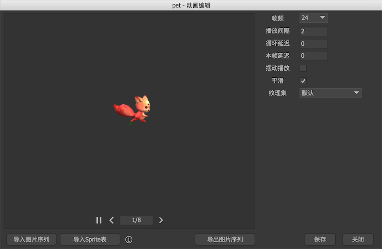

## Create movieclip

The editor supports creating, editing, and using sequence frame movieclips. There are several ways to create a sequence frame movieclip:

1. Use movieclip editing tools such as Adobe Animate CC / Flash to make movieclips, export the description file with plist or eas extension and related maps (should be placed in the same directory), and then drag the description file (only description file, not map) The editor can generate movieclip material.

2. Click the menu "Resources"-> "New movieclip", or click the main toolbarButton to create a new blank movieclip. Then click "Import image Sequence" in the movieclip editing interface to import multiple images.

3. Drag a GIF file directly into the editor, and the GIF will be automatically converted into a sequence frame movieclip.

4. Flash projects support direct import and use of SWF files.

Regardless of how the movieclip is created, in the editor, the movieclip material exists as a single file (with the extension jta). In other words, no matter whether the movieclip is created from the image file in the library or imported from the outside, there will no longer be a dependency on a single image. For example, if you drag an image from the asset library into the movieclip editor to create the movieclip, after the creation is complete, these images have no relationship with the movieclip anymore. If you want to set the texture set of the movieclip, set the movieclip in the movieclip editor. The settings for those images are invalid.

## Edit movieclip

In the resource library or on the stage, double-click the movieclip to enter the movieclip property setting dialog box:



- `Frame rate`Available in 24, 30 and 60. It can be modified according to the settings of the source movieclip.

- `Play interval`How many frames to play a image at. Increasing or decreasing this value can reduce or increase the speed of movieclip playback.

- `Cycle delay`When the movieclip is over, how many frames to pause before restarting the playback.

- `This frame is delayed`How many frames to pause after playing the current frame before continuing playback.

- `Swing play`The default playback format is to play from the first frame to the last frame, and then play from the first frame to the last frame in the next loop. If the swing play is checked, the first frame is played to the last frame, and then the last frame is played back to the first frame in reverse order, and so on.

- `Texture set`Sets the movieclip to publish to the specified texture set. **movieclip does not support texture paging, that is, when the texture is set to automatic paging, if the movieclip is distributed to different texture set pages, a display error will occur at runtime. At this time you can arrange the movieclip to be placed on a separate texture set, or on the same texture set as other movieclips.**

- `Allow smoothing`It indicates whether the movieclip is smoothed when stretched. If this movieclip is used to make a character in a pixel game, you may need to turn off smoothing, otherwise you should generally turn it on. This option is not available for platforms such as Unity that use texture sets.

function button:

- `Import image sequence`Update movieclip from sequence images.

- `Import Sprite Table`Import movieclip files exported by Adobe Animate CC or other movieclip tools.

- `Export image sequence`Export the movieclip as a sequence of images.

## Instance properties

Select an movieclip on the stage, and the property panel list on the right appears:


- `frame`Set the current frame.

- `Play`Sets whether the movieclip is playing.

- `colour`Modify the value of each color channel of the movieclip to make the movieclip change color.

- `brightness`Adjust the brightness of the movieclip. This is actually modified by`colour`The property achieves the same effect as setting the color to grayscale.

## GMovieClip

We generally do not use new directly to create movieclips, and there is rarely a need to create movieclips separately. It is usually placed directly in other components as a constituent element. If you really need to instantiate an movieclip, you can use the following methods:

```csharp
GMovieClip aMovie = UIPackage.CreateObject ("package name", "movieclip name").asMovieClip;
```

The commonly used APIs are:

```csharp
aMovie.playing = false; // Switch playback and stop status
    aMovie.frame = 5; // If the movieclip is stopped, you can set the frame to stop at
```

Set the loop playback of the movieclip, such as from frame to frame, how many times to loop, etc .:

```csharp
aMovie.SetPlaySettings(0, -1, 0, -1);
```

For other controls on the movieclip playback process, you can use the MovieClip object:

```csharp
// Return to play head
    ((MovieClip) aMovie.displayObject) .Rewind ();
```

You can get a callback notification when the movieclip is completed: (If it is looped, the playback is not completed until all the loops are completed)

```csharp
//Unity/Cry
    aMovie.onPlayEnd.Add(...);

    //AS3
    aMovie.setPlaySettings(..., callback);

    //Egret
    aMovie.setPlaySettings(..., callback, this);

    //Laya
    aMovie.setPlaySettings(..., Handler.create(callback, this));

    //Cocos2dx
    aMovie->setPlaySettings(..., CC_CALLBACK_0(AClass::onPlayComplete, this));
```
