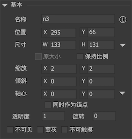
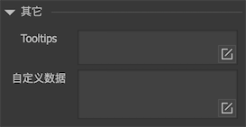

The constituent elements in each stage are called components. There are many types of components. They are:
- `Basic element`Images, graphics, movieclips, loaders, text, rich text, groups, components.
- `Combination element`Labels, buttons, drop-down boxes, scroll bars, sliders, progress bars.
- `Special element`List.

Select any component on the stage, and common property setting panels appear in the property bar on the right:

## Basic properties



- `Name`Set the name of the component. This component can be obtained at runtime by GetChild (name). The component allows duplicate names, but the editor will prompt you with duplicate names in the display list view. You can ignore this prompt.

   

- `Position`Set the XY coordinates of the component.

- `Size`Set the width and height of the component.

- `Source size`Check the original size to restore the component size to the original size of the material. When the material is modified externally, for example, an image material, it is changed from 50x50 to 100x100 by the designer. If the original size is checked here, the width and height of the component will automatically become 100x100. The width and height will remain 50x50, and the image will be scaled.

- `Keep ratio`When designing, keep the length-width ratio of the component unchanged, that is, when changing the width or height, the height or width will change at the same time. This is a design aid and has no effect at runtime. If you want an image to maintain its proportions at runtime, you can put the image into the loader and set the fill processing of the loader to "fit to height" or "fit to width".

- `Size`Check the arrow to the right of the size to display the size limit input interface. 0 means unlimited. Note: Modifying the size limit does not modify the current width and height, even if the current width and height value exceeds the limit value.

- `Scale`Scale and width and height can also change the display size of the component. The difference is that:

   - Scale is the overall direct scaling, while width and height change the enclosing size of the component. For example, for a image with a 9-grid grid set, if you change its Scale value, the 9-grid grid will not work. If you change the width and height of the image, the 9-grid grid will work. For another example, if a component changes its Scale value, the component as a whole will be enlarged or reduced, and its relationship will not take effect; if the width and height of the component are changed, only the rectangular area of the component is increased or reduced The content in it does not automatically increase or decrease, it depends on the correlation function to adjust. So remember one principle:**Use width and height for layout and Scale for effects.**

   - The correlation system is only valid for the width and height of the component, and does not count the effect of Scale.

- `Skew`Sets the tilt value of the component. For the Unity platform, you can safely use tilt for images, movieclips, and loaders, which will bring almost no extra cost, but for other types of components, such as components, please use it with caution. The tilt of the component needs to use the PaintMode technology provided by FairyGUI. The target component will be converted to RenderTexture, and then tilt will be applied, which will have a certain memory consumption. Be sure to read[PaintMode](../unity/special.html#PaintMode)

- `Pivot`Rotate, scale, and tilt the pivot points of these transformations. The value ranges from 0 to 1. For example, X = 0.5 and Y = 0.5 represent the center position. Click the small triangle on the right to quickly set some commonly used values, such as center, lower left corner, lower right corner, etc.

- `As anchor`When this option is checked, the origin position of the component will be set to the position of the axis. By default, (0,0) of each component is in the upper left corner; when the axis is also selected as the anchor point, the (0,0) of the component is at the position of the axis.

- `Alpha`Sets the transparency of the symbol. 0 means fully transparent and 1 means fully opaque.

- `Rotation`Sets the rotation angle of the component in degrees. Positive numbers indicate clockwise rotation, negative numbers indicate counterclockwise rotation.

- `Invisible`Make the component invisible. In the edit state, even if it is checked, the component is still visible. Only the preview state and running state are effective.

- `Grayed`Gives the component a grayscale effect. By default, FairyGUI uses a color filter to generate a grayscale effect for it. But for components, in addition to using color filters to change the overall grayscale, you can also customize the effect. For example, a button component consists of a basemap and the text of the image above. The left side is the normal state, and the middle is the effect after "graying" is set. If we just want to be grayed out, as long as the image text is grayed out, and we don't want the base image to be grayed out, then we can define a controller named "grayed" in the component like the image on the right, and this controller will control Concrete grayed out state. When a controller with this name is defined, the default overall graying effect disappears.

   

- `touchable`Make the component non-interactive. Neither mouse clicks nor touch screen touches will generate any events. Note: images, plain text (excluding input text and rich text), and movieclip are never touchable. If you want to listen to click events on them, convert to components, or use a rich text, GLoader.

## Effect properties


- `BlendMode`This provides part of the blending options setting. For the Unity platform, you can safely modify the BlendMode of images, movieclips, and text. But for components, use with caution. The BlendMode of the component needs to use the PaintMode technology provided by FairyGUI. The target component will be converted to RenderTexture, and then use the hybrid option, which will have a certain memory consumption. Be sure to read[PaintMode](../unity/special.html#PaintMode)

   The Blend effect in Unity may be different from the preview in the editor. Developers can redefine the blending effect by using the following code. Note: Display objects with a special BlendMode cannot be combined with other display objects.

   ```csharp
   BlendModeUtils.Override(BlendMode.Add,
      UnityEngine.Rendering.BlendMode.XX, UnityEngine.Rendering.BlendMode.XX);
   ```

- `Filter`Currently the editor supports the definition of two filters, the color filter and the blur filter. For H5 platforms, please use filters with caution, because it will bring some consumption; for Unity platform, you can safely use color filters for images, movieclips, and loaders, which will bring almost no additional consumption, but for Use other types of components, such as components, with caution. The filter of the component needs to use the PaintMode technology provided by FairyGUI. The target component will be converted to RenderTexture, and then the filter will be used, which will have a certain memory consumption. Be sure to read[PaintMode](../unity/special.html#PaintMode)

   Note: Display objects with filters cannot be combined with other display objects.

## Other properties



- `Tooltips`

   The role of Tooltips: When the mouse moves over the component range, a text prompt pops up. After moving out of the component range, the text tip disappears automatically. To use Tooltips, follow these steps:
   1. Make a component. The "extended" attribute of this component needs to be defined as "label" so that the system sets the TIPS text to the "title" attribute of the label.
   2. Open the editor's main menu "File-> Project Settings", and select "Default" in the pop-up dialog box. A "TIPS component" setting will appear on the right panel. Drag the label component you made into it.
   3. After completing the above two steps, the editor can use Tooltips preview normally. But the runtime needs to be set again using code:
   ```csharp
   UIConfig.tooltipsWin = "ui://package name/component name";
   ```

- `Custom data`

   You can set a custom data. This data is not parsed by FairyGUI, and is published to the final description file as it is. Developers can get it at runtime. The way to get it is:`GObject.data`or`GObject.userData`（Cocos2dx、Vision）。

## GObject

- `Set coordinates`SetXY, SetPosition or set x and y individually.

- `Set size`SetSize or set width and height individually. SetSize can also take a third parameter:

```csharp
// Ignore the influence of the axis, that is, if the axis is set, changing the size will not change the coordinates at the same time.
   aObject.SetSize (100,100, true);
```

- `Set size limit`minWidth、maxWidth、minHeight、maxHeight。

- `Setting up Scale`SetScale or set scaleX and scaleY individually.

- `Set axis`SetPivot or individually set pivotX, pivotY.

```csharp
aObject.SetPivot (0.5f, 0.5f); // Set the axis
    aObject.SetPivot (0.5f, 0.5f, true); // Set the axis and use it as the anchor point
```

- `Settings visible`visible = true/false。 Note: Even if the object is set to visible = false, it is still in the display list, so it still consumes some computing resources (but does not consume rendering resources), so if it is hidden for a long time, it is recommended to remove the display list, that is, RemoveFromParent. In addition, do not confuse with the display controller, the two are independent. Even if the object is visible = true, if it is not in the specified page of the display controller, the object is still invisible.

- `Set up interaction`touchable = true/false。

- `Settings grayed out`grayed = true/false。

- `Set activation`enabled = true/false。 The activation state of the element is actually composed of graying out + non-touchable.

```csharp
// equivalent to calling GObject.grayed = true + GObject.touchable = false
    aObject.enabled = false;
```

- `Set rotation`rotation。 Unity version also supports rotationX and rotationY. The 2D UI is rendered by an orthogonal camera. Setting rotationX or rotationY can have a rotation effect, but no perspective effect. FairyGUI provides the function of perspective simulation. E.g:

   ```csharp
   // Set the practical perspective simulation of the object
  aObject.displayObject.perspective = true;
  // Can set camera distance
  aObject.displayObject.focalLength = 2000;

  // At this time, rotating the X or Y axis can have a perspective effect.
  aObject.rotaionX = 30;
   ```

- `Get native object`displayObject/node*(CocosCreator)*。 E.g:

   ```csharp
   // Get the native object
  DisplayObject displayObject = aObject.displayObject;

  // CococCreator gets the native object
  let node: cc.Node = aObject.node;

  // Unity version gets GameObject
  GameObject go = displayObject.gameObject;
   ```

- `destroy`Dispose. Destroy the object, and it must be called when the object is no longer used. Note: Textures, sounds and other public resources are managed by UIPackage. Destroying objects will not recycle these resources. If you want to recycle these resources, you should use UIPackage.RemovePackage.

- `resourceURL`The URL address of the object in the resource library. Only images, movieclips, components and other objects with linked resources can get this URL value. You can use this URL to compare whether two component objects are constructed from the same component resource. The URL is internally encoded and unreadable. If you want to get the resource name, you can use the following methods:

   ```csharp
   // The name of the object in the resource library
  Debug.Log (aObject.packageItem.name);

  // Get the resource name based on the URL
  Debug.Log (UIPackage.GetItemByURL (resourceURL) .name);
   ```

- `onStage`Gets whether the object is on the stage. Whether an object is on the stage is affected by many factors, such as whether the object is in the display list, whether it is hidden by the display controller, or whether it is hidden by the group's display control.