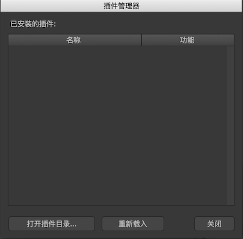

编辑器支持插件。插件可以实现以下这些功能：
1. 显示自定义的视图。（限专业版）
2. 显示自定义的Inspector。（限专业版）
3. 自定义菜单。
4. 导入资源。
5. 添加元件到舞台，以及设置舞台上的元件的属性。（限专业版）
6. 插入自定义操作到发布流程。例如自定义发布代码。

## 开发

目前插件只支持AS3语言开发。

1. 从[仓库](https://github.com/fairygui/FairyGUI-Editor/tree/master/plugin)下载最新版本的插件接口和示例。
2. 使用你熟悉的AS3开发工具创建一个**库项目**，并将下载的插件接口放入工程内。
3. 设置libs/FairyGUI-as3.swc为外部链接，即不打包到最终的swc中。这点很重要。
4. 插件入口在PlugInMain这个类里。
5. `fairygui.plugin`下的接口是旧版本的接口，社区版用户只能访问这部分接口。
6. `fairygui.editor.api`下的接口是5.x版本的接口，只有专业版用户才能使用。

## 部署

将生成的插件swc拷贝到插件目录，也就是在软件安装目录/plugins下。
点击菜单“工具->插件管理”，弹出窗口如下图：

如果从列表里看到你的插件的名字，说明安装已成功。

## 调试

可以通过输出信息到控制台进行调试。

## 参考资料

1. [编辑器插件怎么写？](http://ask.fairygui.com/?/question/5)
2. [FairyGUIToLua](https://github.com/ZxIce/FairyGUIToLua)