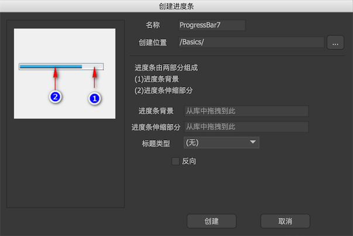
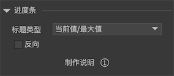
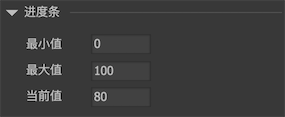

The principle of the progress bar is very simple, that is to change the width, height, or fill ratio of a component according to the progress. There are two types of progress bars, horizontal and vertical.

## Create progressbar

There are two ways to create a progress bar component.

- Click the main menu "Resources"-> "New Progress Bar" and follow the wizard's prompts to complete step by step.

   

- Create a new component and select Expand to "Progress Bar" in the component properties.

## Edit-mode properties

In the component editing state, the properties panel of the progress bar component is:



- `Title type`If there is a component named "title" in the component, the progress bar can display a text expressing the current progress.
   - `percentage`Displays the current progress percentage, such as "88%".
   - `Current value / maximum value`For example "50/100".
   - `The current value`For example "50".
   - `Max`For example "10000".

- `Reverse`For a horizontal progress bar, in general, the larger the progress, the more the telescopic bar extends to the right. If it is reversed, the right edge of the telescopic bar is fixed. The larger the progress, the more the telescopic bar extends to the left. For a vertical progress bar, In general, the larger the progress, the more the telescopic bar extends downward. If it is reversed, the bottom edge of the telescopic bar is fixed. The larger the progress, the more the telescopic bar extends upward.

   Compare the following two progress bars. The first is the normal progress bar and the second is the reverse.

   
   

## Instructions

- `bar`When the progress changes, change the width of the "bar" object. Generally used for horizontal progress bar. Note: Be sure to set the width of the bar object to the width when the progress bar is at its maximum.

   The "bar" element can be of any type and is not limited to images.

   In particular, if the "bar" object is an image or loader with a special fill mode, when the progress changes, it will change its fill ratio, not the width.

- `bar_v`When the progress changes, change the height of the "bar_v" object. Generally used for vertical progress bar. Note: Be sure to set the height of the bar_v object to the height when the progress bar is at its maximum.

   The "bar_v" element can be of any type and is not limited to images.

   In particular, if the "bar_v" object is an image or loader with a special fill mode, when the progress changes, it will change its fill ratio, not the width.

- `title`It can be a loader, or a label or button. A title to display progress. What is displayed is determined by the "Title Type".

- `years`Is an movieclip object. When the progress changes, the frame index of the modified movieclip is equal to the progress value (0-100).

You can use the relation to make a richer progress bar component. For example, the following progress bar, the moving squirrel establishes an relation with the bar component "right-> right", so when the progress changes, the squirrel also follows Already.


## Instance properties

Select a progress bar component on the stage, and the property panel list on the right appears:



- `Minimum value`The minimum progress value.

- `Max`The maximum progress value.

- `The current value`Current progress.

## GProgressBar

```csharp
GProgressBar pb = gcom.GetChild ("n1").asProgress;
    pb.value = 50;

    // If you want to change the progress value, there is a dynamic process
    pb.TweenValue (50, 0.5f);
```
