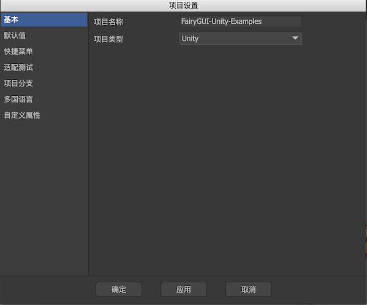
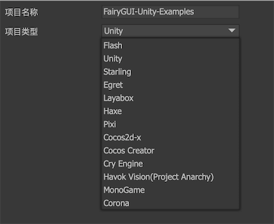
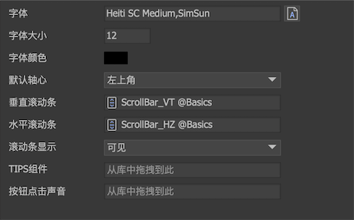
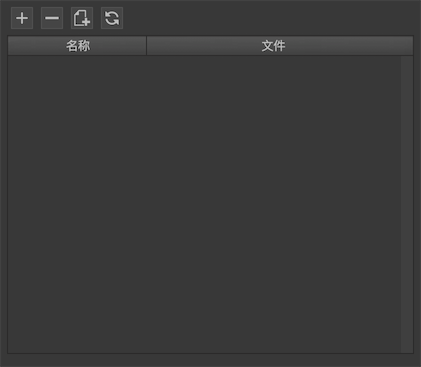

Open the Project Settings dialog via the main menu "File-> Project Settings".

## General

- `project name`Modify the name of the UI project here.
- `project type`UI project type, that is, the platform on which the UI actually runs. You can switch arbitrarily here. Different platforms have certain differences in display effects and release results.

## Defaults

**Note: These parameters are the default values in the editor and have nothing to do with runtime. Need to run`UIConfig`Redo the global settings. And the latter setting does not necessarily need to be the same as the setting here.**

- `Font`Sets the default font for all text. **Can enter font name directly**You can also click the "A" button to select the font in the system. If you need to use a ttf file, please install the file in the operating system (usually double-click the ttf file), and then select it here (you need to restart the editor to see the newly installed fonts). This font setting is only used in the editor. What font should be used at runtime?`UIConfig.defaultFont`set up. In order to make the editor effect consistent with the runtime effect, you should try to choose the same font or a font with a similar shape.

- `font size`Sets the default font size when new text is created on the Stage.

- `Disable font rendering position optimization`This option is only available for Egret and Laya versions. When checked, FairyGUI will use the default position of the system for rendering text, and no automatic optimization will be performed. This difference is particularly obvious for Microsoft Yahei. This option can help solve the problem of font position in some H5 engines.

- `font color`Sets the default color when new text is created on the Stage.

- `Default axis`You can set a default axis for newly placed components on the Stage.
   - `Top left corner`The axis position is in the upper left corner, which is the software's default setting.
   - `Center as axis`The axis position is in the center.
   - `Center as anchor`The axis position is at the center, and the anchor point is also set to the center, that is, the origin of the component is at the center.

- `Vertical scroll bar` `Horizontal scroll bar`Set the scrollbar resources that need to be used by all containers with scrolling functions when making UI. That is to say, after you set the "overflow processing" of a component or a list to "vertical scrolling", "horizontal scrolling" or "free scrolling", you do not need to set the scroll bar every time, and the scrolling set here will be automatically used Resources. If a component requires a different scroll bar than the global settings, the editor also provides separate settings,[Later chapters](scrollpane.html)Will be explained separately. This setting is only used in the editor and is used at runtime`UIConfig.horizontalScrollBar``And UIConfig.verticalScrollBar`set up.

- `Scroll bar display`Display strategy for scroll bars. This is a global setting and can also be set individually in the scroll container properties. This setting is only used in the editor and is used at runtime`UIConfig.defaultScrollBarDisplay`set up.
   - `visible`Indicates that the scroll bar is always displayed.
   - `Show while scrolling`Indicates that the scroll bar will be displayed (PC) only when scrolling or the mouse is in the scroll container viewport, otherwise it will be hidden automatically.
   - `hide`Indicates that the scroll bar is always hidden, in which case the scroll bar does not occupy the viewport position.

- `TIPS components`Set the component used to display TIPS. [Usage reference here](object.html#其他)。

- `Button click sound`Sets the default click sound for buttons. After setting, all button clicks will play this sound effect, unless the button itself sets another sound effect. This setting is only used in the editor and is used at runtime`UIConfig.buttonSound`set up.

## Quick menu

- `font size`There are usually several fixed font sizes for a game. Once defined here, when you need to enter the font size anywhere, you can directly select it from the drop-down menu.

- `Font`There are usually several fixed schemes for the fonts used in a game. After being defined here, when you need to enter a font anywhere, you can directly select it from the drop-down menu.

- `colour`There are usually several schemes of colors used in a game. After being defined here, when you need to enter a color anywhere, you can directly select it from the drop-down menu.

## Adaptation settings

- `Zoom mode`Set the mapping relationship between physical screens and logical screens.
   - `Scale according to screen size`The physical screen is scaled according to the adaptation mode to obtain a logical screen.
   - `No scaling`The physical screen is the same as the logical screen.

- `Adaptation mode`Sets how the global scaling factor is calculated. Only effective when the zoom mode is "Zoom according to screen size".
   - `Adapt to width and height`Take the smaller ratio of width and height to zoom. For example, if the design resolution is 960x640 and the device resolution is 1280 × 720, then the ratio of the wide side is 1280/960 = 1.33, the ratio of the high side is 720/640 = 1.125, and the smaller 1.125 is taken as the global scale coefficient. This zooming method ensures that the content is always in the screen after zooming. If there is a margin, the margin can be further processed by the relation system. This method is a very adaptive processing method.
   - `Adapted width`The fixed width ratio is used for scaling. The high side may extend beyond the screen. This method requires the designer to design the safe area purposefully.
   - `Adapt to height`Fixed taking a high proportion to scale. The wide edge may extend beyond the screen, which requires the designer to purposefully design a safe area when designing.

- `Design resolution`Usually we choose a fixed resolution for UI design and production, this resolution is called design resolution. For example, 1136 × 640 and 1280 × 720 are more common design resolutions. After selecting a design resolution, the size of the largest UI interface (usually a full-screen interface) is limited to this resolution.

For more detailed analysis, please read[adaptation](adaptation.html)。

## Project branch

- Create a new branch.
- Rename the branch.
- Delete branch.

For more detailed analysis, please read[Branch](branch.html)。

## i18n settings

- Add a language file. After clicking, you will be asked to select a language file from the file system.
- Removing a language file will only remove the record, not the actual file.
- Create a new language file. Click it to create a new language file.
- Refresh all language files. This refresh function only adds or deletes strings, but does not modify them. This mechanism protects translated content from being flushed when refreshed. for example:
There is a component C in the project, and its content is two texts, which are "t1: test 1, t2: test 2". Now there is a language file en, which has two strings, which correspond to two text contents. , And they have been translated into English with the content: "s1: test1, s2: test2". Observe the effects of the following operations on the language files:
   - Change the text of t1 to "Test 2" and click Refresh. The language file en will not change, and the value of s1 will still be "test1".
   - Delete t1 and refresh all language files. The s1 in the language file en is deleted.
   - Add a "t3: test3", and the content of the language file en is updated to "s1: test1, s2: test2, s3: test3".

For more details, please read[multi-lingual](i18n.html)。

## Custom properties

Custom attributes are user-defined Key-Value collections.

Custom properties currently serve two purposes:
1. Available in plugins.
2. The controller can define the homepage as the Key value here. When the component is created, the controller will automatically switch to the page named Value. [Reference here](controller.html#Controller-design)。

The settings here are only used in the editor, and need to be reset with code when running. The API is`UIPackage.SetVar`。