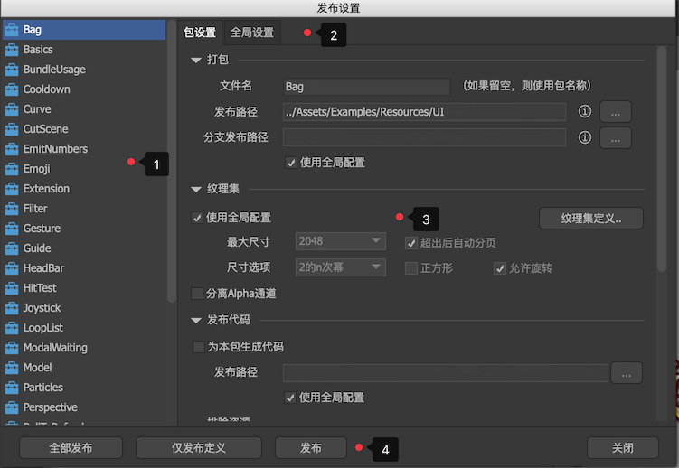
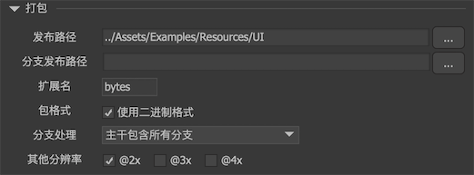
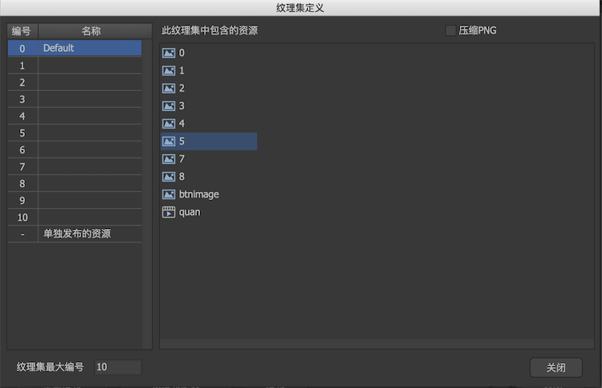
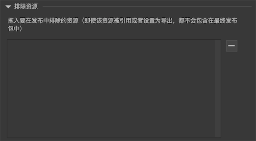

Via the main toolbarButton, or main menu File-> Publish Settings "to open the Publish Settings dialog box.



1. Package list.
2. Switch package settings and global settings.
3. Set the content.
4. function button.
   - `Post all`Publish all packages.
   - `Post definition only`Publish the currently selected package in the package list, but only publish the definition, without regenerating the texture set. Usually published content includes materials (images, sounds, etc.) and definition files. If you have not added, deleted, or modified materials, you can only publish definition files to avoid the time consumption caused by regenerating the atlas.
   - `release`Publish the selected packages in the package list.

## Global Settings

### Packing



- `File path`The directory where the publication results are placed. The release path supports relative and absolute paths relative to the project root. Relative paths need to be entered manually and cannot be selected via the "Browse" button. **Note: If your UI project is used under both Windows and Mac, the path separator should use "/" instead of "\"**。

   The release path supports the use of variables, which are enclosed in square brackets, for example: / home / zhansan / {publish_file_name}. Supported variable names:
   - `publish_file_name`Represents the published file name.
   - “[Project Settings-Custom Properties](project_settings.html#自定义属性)". Assuming there is var1 in the custom attribute, then {var1} can be used in the path.

- `Branch release path`Directory where branch release results are placed. Branch release paths also support relative paths and variables.

- `extension name`The extension of the description file after publishing. Not all engines allow extensions to be modified, such as Unity, which is fixed to bytes and cannot be modified. For H5 game engines, mini-games do not support the default fui extension. You can modify the extensions to the mini-game extensions (please consult the mini-game documentation yourself).

- `Two compressed packages`You can choose to pack into one or two compressed packages. This option is only available for the Flash engine. "Two packages" means separating resources such as XML definitions and images. The advantage of this is that if only the component is modified, no new material is added or deleted, you can only publish and push the definition package to the user, reducing the user's traffic consumption.

- `Use binary format`The editor supports the new release format, namely the binary format, starting from version 3.9.0. Unlike the XML format used in the past, the binary format is more compact, parses faster, and takes up less memory and generates less memory garbage. Unless the old project cannot be upgraded, it is generally recommended to check the binary format.

- `Compressed description file`The Laya / Egret / CocosCreateor project provides such a publishing option, through which you can control whether the published description file is compressed. Compressed by default. If you have used the gzip compression function of the web server, or it will compress itself when it is packaged (such as a small game), you can choose an uncompressed format to avoid repeated compression.

- `Branch processing`How branches are handled during the release process. Please refer to detailed usage[Branch](branch.html)。

- `Other resolutions`Tick Allow HD material suffixes for simultaneous publishing. For example, if a.png and a@2x.png exist in the resource library, if "@ 2x" is checked, both files will be published; if not checked, only a.png will be published. This option will also affect the adaptation test, that is to say, if the option is checked here, the appropriate HD resources will be automatically used in the adaptation test.

### Atlas settings


- `biggest size`Limit the maximum size of the texture set, generally 2048 can be selected.

- `Automatic paging after exceeding`When a texture can't fit all the images, multiple pagination is automatically created. For example, if a texture set can hold all the images, the resulting file is atlas0.png; if it cannot, then the resulting file is atlas0_1.png, atlas0_2.png ...

   **Note: The concept of texture set paging and multiple texture sets is different. Multiple texture sets refer to the user's own division of texture sets; paging refers to the mechanism of automatic paging when a single texture set is overloaded.**

   When using automatic paging, there is a special problem to be aware of:**Movieclip and bitmap fonts do not support texture pagination, that is, when the texture is set to automatic paging, if the movieclip or bitmap font is distributed to different texture set pages, an error will be prompted when publishing. At this time you can arrange the movieclip to be placed on a separate texture set, or on the same texture set as other movieclips.**

- `Size options`When the texture set needs to be compressed into a special format, such as ETC, ETC2, there are usually special requirements for the size of the texture set.
   - `Power of n`Limit the size of the output texture set to the power of n, such as 256, 1024, and 2048.
   - `4 multiples`Limits the size of the output texture set to a multiple of 4.
   - `not limited`Does not limit the size of the output texture set.

- `square`When checked, restricts the width and height of the output texture set to be equal.

- `Allow rotation`Allows you to rotate the image to achieve greater texture set space utilization.

- `Cropped image margins`Automatically crop all transparent pixels around the image when publishing. This feature is transparent to the developer and does not affect the normal use of the image. It is only supported by higher versions of the SDK. If you have upgraded the SDK, it is recommended to enable this option to improve the texture set space utilization.

### Image quality


Visible only on platforms that do not use texture sets (eg Flash, Haxe). Since these platforms are released as separate images, the default quality of the images can be specified here. The quality of the image can also be specified separately. Double-click the image in the resource library to set it.

- `JPEG quality`JPEG quality, 0-100.

- `Compress PNG`Whether to compress PNG images to PNG8.

### Publish code


- `Allow code posting`Whether to generate bound code. Generated binding code can more intuitively access the various nodes of the component, but will cause the coupling of art work and programmer work.

   There are also switches in the package settings that allow code to be published. If unchecked here, all packages will not publish code. If checked here, the switch set by the package determines whether the package publishes code.

- `File path`The path where the published code is saved. The release path supports relative and absolute paths, as well as variables.

- `Component name prefix`Prefix the class names generated by each component. For example, if the component name is "Component1" and the prefix is set to "T", then the final generated class name is "TComponent1". The prefix can be empty. Note that if the component name is Chinese, it will be automatically converted to Pinyin.

- `Member name prefix`Prefix the name of each component in the assembly. For example, if the component name is "n10" and the prefix is set to "m_", then the name of the last generated class member is "m_n10". The prefix can be empty, but this is not recommended. Because the component name is likely to conflict with some attribute and method names of the class. For example, if the component name is "icon", it conflicts with the GObject's icon property.

- `Do not generate members with default names`When checked, for system-generated names such as "n1", "n2", or the names agreed in such extension components as "title" and "icon", member acquisition will not be generated for components with these names Code. If all the components with these names are in a component, no code will be generated for the entire component. For example, a button with only the components named "title" and "icon" will not generate code for this button, because it is sufficient to use the base class GButton.

- `Get member object by name`If unchecked, the index is used to obtain the child object when the component is initialized; if checked, the name is used to obtain the child object. The former is highly efficient and recommended; the latter is more compatible. For example, if the order of the components is adjusted, no exceptions will occur.

- `Package name`For AS3 code, the package of the released code; for C # code, the namespace of the released code; for Typscript code, the module of the released code; for C ++ code, the namespace of the released code.

- `Code type`For the Laya engine, you can choose the code type.
   - `AS3`Release AS3 code.
   - `TypeScript（LayaAir1.x）`Post code for LayaAir 1.x.
   - `TypeScript（LayaAir2.0）`Publish the code for LayaAir2 version, the namespace of the code is fairygui.
   - `TypeScript`Publish the code applicable to LayaAir2 version, the namespace of the code is fgui. If you are using the latest SDK, then select this.

The released code contains a XXXBinder file and multiple class files. note:
1. **Before using the binding class, be sure to call`XXXBinder.BindAll`And is called before any UI is created.**
2. **The API for creating UI using binding classes is`CreateInstance`, Cannot be new directly.**

For example:
```csharp
// First call BindAll. The released code has a file named XXXBinder
    // Note: Be sure to call it at startup.
    XXXBinder.BindAll ();

    // Create UI interface. Note: Not directly new XXX.
    XXX view = XXX.CreateInstance ();
    view.m_n10.text = ...;
```

Code templates are used when publishing code. The code template is in the template directory under the editor installation directory. If you need custom templates,**The template directory needs to be copied to the root directory of the UI project, and then modified**。 The parameters supported in the template are:

```csharp
Component.template
    -------------
    {packageName} UI module name
    {componentName} UI component parent class name
    {className} UI component class name
    {uiPkgName} UI resource package name
    {uiResName} UI resource name
    {uiPath} UI resource path
    
    Binder.template
    -------------
    {className} UI module name + "Binder"
    {packageName} UI module name
```

## Package settings

### Packing


- `file name`The release file name of the package. This file name can be different from the package name. If left blank, the package name is used. **When we load the package, we need to use the file name set here, and when we create the object, we need to use the package name**。 E.g

```csharp
// here file_name is the name of the published file.
    UIPackage.AddPackage ('file_name');

    // Here Package1 is the name of the package.
    UIPackage.CreateObject ("Package1 ',' Component1 ');
```

- `File path`The path where the publication results will be placed. See Global Settings.

- `Branch path`Path where branch release results are placed. See Global Settings.

- `Use global configuration`If checked,`Release path`with`Branch release path`The settings in the global configuration are used. The settings on this page are invalid.

- `Two compressed packages`You can choose to pack into one or two compressed packages. This option is only available on Flash and Haxe platforms. See Global Settings.

### Atlas settings


- `Use global configuration`If checked, the texture set settings use the settings in the global configuration, and the settings on this page are invalid. See Global Settings.

- `Separating Alpha Channel`This option is only available on the Unity platform. With this method, you can set the original texture set to a format that does not support Alpha channels in Unity (such as ETC1) to reduce memory consumption. The FairyGUI-unity SDK provides specialized shaders for blending.

Click the "Texture Set Definition" button to display the following dialog box:



For platforms that support texture sets, you can plan to put images in different texture sets. The significance of this feature is:
- The image is too large, assuming that the texture set supports a maximum of 2048 × 2048 (this can be adjusted), beyond this range, you need to use multiple texture sets;
- The use of the images is inconsistent. For example, a large-sized and colorful background image is not suitable to be placed with UI materials with a single color. This will make the final png image too large. It is a good solution to put a large-size background image in a separate texture set;
- The characteristics of the images are inconsistent. For example, in the Unity platform, you can set a separate Filter Mode, compression format, and so on for the texture set.

The left view is a list of texture sets. By default, there are 11 texture sets numbered from 0 to 10.

The right view is the resources contained in the selected texture set.

- `Texture set maximum number`If necessary, modify the value here to expand the number of texture sets.

- `Compress PNG`Compress the texture set using PNG8 format. This compression method can greatly reduce the size of the PNG file, but it will also cause serious distortion of the image, especially with rich colors or images with gradients. Please use it with caution. The Unity engine should not use this compression function, because Unity's texture set compression should be set in Unity. When packaging, Unity will automatically compress the texture set according to the set format. Using this compression does not reduce the file size in addition to reducing the image quality effect.

### Publish code


- `Generate code for this package`Generate code for this package. Refer to Global Settings for the role of the generated code. Note that even if this is checked, if it is not checked in the global settings, no code will be generated at the end.

- `Release path`The path where the publication results will be placed. See Global Settings.

- `Use global configuration`If checked,`Release path`Using the settings in the global configuration, the settings on this page are invalid.

### Exclusion settings



If some materials are only used for testing purposes, such as a loader, put an image into it only to see the effect, but this image is not released with the package (there may be external loading later), then you can put this image in this interface Drag in, then this image will not be included when publishing.

## Command line publishing

In addition to clicking the publish button in the editor, publishing via the command line is also supported. However, there is still a flaw in the command line release, that is, there is no feedback on the success or failure of the command line, so please use it with caution.

```csharp
FairyGUI-Editor -p project_desc_file [-b package_names] [-t branch_name] [-x callback] [-o output_path]
```

- `project_desc_file`Project description file path, such as d: \ a \ 1.fairy.
- `package_names`Optional. If it is not provided, it is all packages, and multiple packages are separated by commas.
- `branch_name`Optional. Branch name. If not provided, the trunk is published.
- `callback`Optional. Call this program after publishing.
- `output_path`Optional. If specified, it overrides the settings in the project and uses the location specified here directly.
