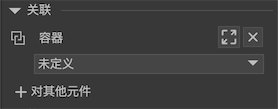
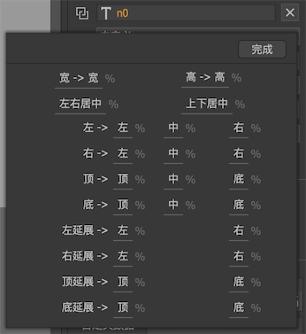
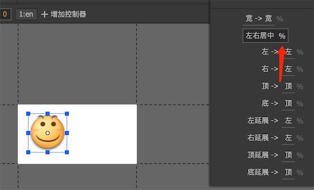

The correlation system is the core technology of FairyGUI to realize automatic layout. The layout systems provided by other UI frameworks generally only provide various fixed layouts or anchor points, which can only define the relationship between components and containers. The relation of FairyGUI can define the relationship between any two components, and the interaction methods are more diverse.

## Set up relation

Select a component, you can see the relation panel appears on the right property bar:



The target of the relation can be any component in the current container, or the container itself (called a container component) being edited.
If the target to be set is a container component, click the drop-down box under "Container" to quickly complete the setting; if it is another component, click "to other components" to enter the interface for selecting the target component. At this time we will You can select the target object from the editing area on the left. After the selection is completed, click "Finish" to complete the setting.



After the target object is set, you can set the relationship between yourself and the target.

The types of relations are: (For the convenience of discussion, it is assumed that they are A and the target element is T)

- `Left-> left`Assume that the left side distance of T and A is X, and when the left side position of T changes, keep the left side distance of T and A at X. Note: It is meaningless to associate left-> left with the container component, because the component is in the container, and the position change of the container component is the movement of the entire container, and it will not affect the coordinates of all components inside the container.

- `Left-> middle`It is assumed that the distance between the center point of T and the left side of A is X. When the center point of T is displaced, the distance between the center point of T and the left side of A is X. There are two cases where the center point of T is displaced, one is that T is displaced, and the other is that the width of T is increased.

   For example, the following text is automatically increased, and the icon and the text establish a left-> center relation, so when the text changes, the icon stays in the center of the text:

   

   Note: relation works only if the position or size of the target changes. For example, in the above example, setting the left-> center of the icon's associated text does not mean that it is centered. The initial position of the icon must be set by yourself. This is a relatively easy mistake for beginners. Again, it just keeps the distance between the center point of T and the left side of A. Look at the following example:

   

   It is still the left-> center relation established. This time we moved the icon a little to the left. It can be seen that the position of the icon and the position of the center line of the text remain unchanged after the text length changes.

- `Left-> right`Suppose that the distance between the right side of T and the left side of A is X. When the right side of T is displaced, the distance between the right side of T and the left side of A is X. There are two cases where the right side of T is displaced. One is that T is displaced, and the other is that the width of T is increased. At first glance, it seems that there is no difference from left-> right, but in complex application scenarios, left-> right has room to play a role. for example:

   

   There is a left-right centered relationship, which will be explained below, but for the time being. It can be seen that when the text content changes, the centerline position of the text does not change, so the question mark icon is set unchanged; but the right side of the text changes, so the exclamation mark icon moves accordingly and remains The distance from the right side of the text.

- `Center left and right`Assume that the distance between the center of T and A is X. When the center of T is displaced, keep the distance between the center of T and A as X. There are two cases where the center of T is displaced, one is that T is displaced, and the other is that the width of T is increased. for example:

   

   The text establishes a left-right centered relation with the container component. You can see that when the component is widened, the text still maintains the middle position. Here again, the left and right centering relationship is not the same as centering. The text can be placed in any position. The relation just guarantees that the distance between the centerlines is always the same.

- `Right-> left`Assume that the distance between the left side of T and the right side of A is X. When the left side of T is displaced, the distance between the left side of T and the right side of A is X. Another feature of the "right" series is that if the width of A changes, A will automatically move to keep X unchanged. for example:

   

   Here the text establishes a right-> left relation with the question mark icon. When the text content changes, the width of the text changes. Normally, the text should stretch to the right after the width changes, but in order to keep the text right The distance between the side and the left of the question mark does not change, and the text automatically extends to the left. Tip: In this example, a right-> left relation between the text and the container component is also the same.

- `Right-> center`It is assumed that the distance between the center of T and the right side of A is X. When the center of T is displaced, the distance between the center of T and the right side of A is X.

- `Right-> right`It is assumed that the distance between the right side of T and the right side of A is X. When the right side of T is displaced, the distance between the right side of T and the right side of A is X.

- `Left extension-> left`Assume that the distance between the left side of T and the left side of A is X. When the left side of T is displaced, the left side of A will move, but the right side of A remains unchanged, that is, A produces an extension (width change )Effect. for example:

   

   The green square establishes an relation with the white square's left extension-> left.

   

   When the white square moves to the left, the left side of the green square follows the white square, but the right side of the green square remains motionless. The effect is that the green square is stretched.

- `Extension left-> right`Assume that the distance between the right side of T and the left side of A is X. When the right side of T is displaced, the left side of A will move, but the right side of A remains unchanged, that is, A produces an extension (width change )Effect.

- `Extend right-> left`Assume that the distance between the left side of T and the right side of A is X. When the left side of T is displaced, the right side of A will move, but the left side of A remains unchanged, that is, A produces an extension (width change )Effect.

- `Extend right-> right`Assume that the distance between the right side of T and the right side of A is X. When the right side of T is displaced, the right side of A will move, but the left side of A remains unchanged, that is, A produces an extension (width change )Effect. Extend right-> right is also commonly used for automatic expansion of containers. for example:

   

   Here the container component is set to the right extension of the text-> right relation (the method of setting the relation of the container component is to click the blank space in the editor area, that is, do not select any components, the relation setting of the container component will appear on the right) This means that when the text expands, the width of the container component increases.

   

   When the container component establishes the right extension of the text, the width of the container component is determined by the width of the text. So when this component is dragged to other places for use, its width cannot be changed manually. It does n’t work to enlarge or reduce the width.

- `Width-> width`Assume that the difference between the width of T and the width of A is X. When the width of T changes, the width of A changes the same. for example:

   

   The background image has a wide-> wide relation with the container component.

   

   Now we take out the made component and use it. It can be seen that when the component is widened, the width of the icon is also widened. If we don't set the relation, then the effect is this:

   

- Top-> Top-Top-> Mid-top-> Bottom-up and down-bottom-> Top-bottom-> Mid-bottom-> Bottom-top extension-> Top-top extension-> Bottom-end extension-> Top-bottom extension-> Bottom height-> High The setting methods and characteristics of these relations are the same as the above-mentioned relations, except that they are changed from horizontal to vertical, and will not be repeated here.````````````````````````

As can be seen from the above discussion, the relation always maintains a set distance. This distance is the absolute distance and the distance of the pixels. Sometimes we need proportional distance. FairyGUI provides such a function, you can use proportional distance when setting the relation. Just check the "%" next to the relationship.

An example of the function of the percentage relationship:



The smiley icon adds a "Left-> Middle" relation to the container component and ticks "Use percentage". The container component is 200 pixels wide, and the x coordinate of the smiley icon is now 50 pixels. In other words, the smiley icon is 1/4 of the container component, and the distance from the center of the container component is also 1/4 of the width.

Now drag the designed component out and use it, and stretch the width of the component to 400 pixels. It can be seen that the smiley icon has been shifted according to the relation rules in the left->. It is now located at 100 pixels and still maintains a width of 1/4 from the center of the container component.


## Relation

In addition to setting relations in the editor, sometimes we also need to add relations dynamically. For example, in a page game, a component that is dynamically added to the stage, and when the width of the stage is changed (such as the browser window being dragged by the player), the component still remains on the right side, so you can call:

```csharp
aObject.AddRelation(GRoot.inst, RelationType.Right_Right);
```

As another example, a component dynamically added to the stage always keeps the full screen size, which can be called like this

```csharp
aObject.SetSize(GRoot.inst.width, GRoot.inst.height);
    aObject.AddRelation(GRoot.inst, RelationType.Size);
```

RelationType.Size is equivalent to the combination of RelationType.Width_Width and RelationType.Height_Height. It is emphasized here that the operation of making the component full screen size must be completed by you, that is, SetSize call in the above code. relation does not accomplish this task, because relation does not matter the current size of the component, it only keeps the difference in size when the target changes.

To delete the relation:

```csharp
// Delete an relation
    aObject.RemoveRelation (targetObject, RelationType.Size);

    // Delete all relations pointing to an object
    aObject.relations.ClearFor (targetObject);
```

## Examples

**Example one**

This is the main interface of a game. The main interface usually needs to be resized to full screen when it is actually displayed. This requires that the interface size be considered when designing. The following figure is the requirements for the layout of individual components in the main interface:


A: Associated with container component "left and right center"
B: Associated with container component "Right-> Right"
C: Associated with the container component "right-> right", "bottom-> bottom"
D: Associated with the container component "bottom-> bottom" and "center left and right%"
E: Associated with the container component "bottom-> bottom"

Then set this interface to full screen at runtime.

```csharp
aComponent.SetSize (GRoot.inst.width, GRoot.inst.height);
    // Keep the full screen when the screen changes. This sentence can also be ignored if the screen size is always the same
    aComoponet.AddRelation (GRoot.inst, RelationType.Size);
```

**Example two**

This is a game's NPC information interface. The intro text of the NPC is dynamic, and the text of auto height is used here. The link below is a list. Requires the list to move up or down automatically when the text content changes. We just need to associate the list "top-> bottom" to the text.


**Example three**

This is a display of the amount of money in the game, requiring that currency icons and text remain centered when the amount changes.


First, the text needs to be set to auto width and height so that the text automatically grows when the amount changes.
The relations used are:
Text: Centered left and right to the container component
Icon: Left-> Left to text
