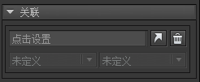
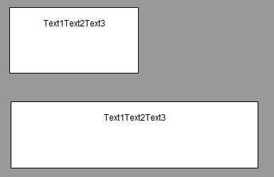
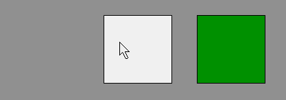
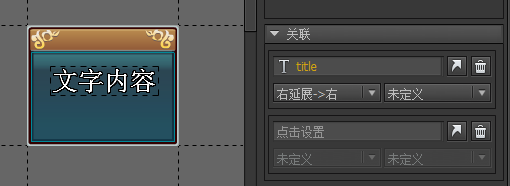
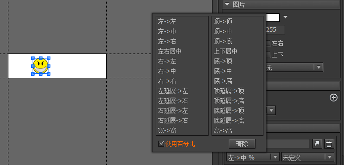
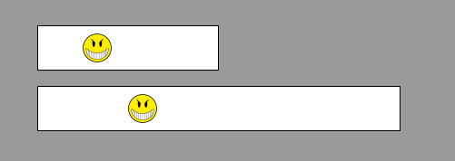
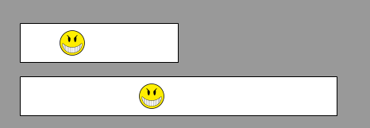

The `Relation` system is the core technology for FairyGUI to achieve an automatic layout. The layout system provided by other UI frameworks generally only provide a variety of fixed layouts, or anchor points, which can only define the relationship between `Component`s and containers. The FairyGUI `Relation` can define the relationship between any two `Component`s, and the interaction is more varied.

## Set Relation

Select a `Component` and you can see that the associated `Relation` panel appears in the property bar on the right:



The `Relation`'s target can be any `Component` in the current container, or the container *itself* being edited (called a "container-component").
如果要设置的目标是容器组件，则点击You can complete the setup quickly. If it is another component, click “Click Settings” to enter the interface of selecting the target component. At this time, we can select the target object from the editing area on the left. If you click on the blank space of the Stage, select `Is The Container Component`. When the selection is complete, click “Finish” to complete the setup.


Once the target object is set up, you can set up your own relationship with the target. There are two drop-down lists for this selection. The left and right drop-down lists are the same function. You can set one or two `Relation`s for each target (if the two are not enough, continue to select this target in the associated sub-panel below). FairyGUI supports setting any number of associated targets.


The types of `Relation`s are: (for the convenience of discussion, assume that you are `A` and the target component is `T`)

- `左->左` Suppose that the left distance of the original `T` and `A` is X, and when the left position of `T` changes, the left distance of `T` and `A` is kept X. Note: Giving the container-component a `Left->Left` `Relation` is meaningless because the component is *in* the container, and the change in position of the container-component is the movement of the entire container and doesn't affect the coordinates of all components inside the container.

- `左->中` Suppose that the distance between the center point of the original `T` and the left side of `A` is X. When the center point of `T` is displaced, the distance between the center point of `T` and the left side of `A` is X. Here, there are two cases in which the center point of `T` is displaced. One is that `T` is displaced, and the other is that the width of `T` is increased.

For example, the text below is automatically incremented, and the icon establishes a left->in `Relation` with the text, so when the text changes, the icon remains at the center of the text:


Note: `Relation`s only work if the location or size of the target changes. For example, in the above example, setting the `Left->Middle` Relation for the icon's text doesn't mean that it's centered. The initial position of the icon is set by itself. This is a mistake that beginners are more likely to make. Again, it just keeps the center point of T and the left side of A. Then look at the demonstration below:


依然是建立的左->中关联，这次我们把图标往左挪动了一点，可以看到，文本长度发生变化后，图标的位置与文本中线的位置保持不变。

- `左->右` It's assumed that the distance between the right side of the original T and the left side of A is X, and when the right side of T is displaced, the distance between the right side of T and the left side of A is X. Here, there are two cases of displacement on the right side of T. One is that T is displaced, and the other is that the width of T is increased. At first glance, it seems that there's no difference with `Left->`, but in complex application scenarios, `Left->Right` has a functioning space. For example:


There is a left-and-right-centered `Relation` here, as explained below, not for the time being. As we can see, when the text content changes, the position of the text's center line doesn't change, so the question-mark icon's position remains unchanged; but the right bit of the text changes, so the exclamation mark icon moves and remains. The distance from the right side of the text.

- `左右居中` 假设原来T的中心和A的中心距离是X，当T的中心发生位移时，保持T的中心和A的中心距离为X。这里T的中心发生位移有两种情况，一是T发生位移，二是T的宽度增大。举例说明:



The text establishes a left-right centering `Relation` with the container-component. As you can see, the text remains in the middle when the component is widened. Again, the left-and-right-centered `Relation`s are not equivalent to centering, and the text can be placed anywhere. The `Relation` is only to ensure that the midline distance remains the same.

- `右->左` It's assumed that the distance between the left side of the original `T` and the right side of `A` is X, and when the displacement of the left side of `T` occurs, the distance between the left side of `T` and the right side of `A` is X. Another feature of the "right" series is that if `A`'s width changes, `A` will automatically move to keep X unchanged. For example:


The text here establishes a `Right->Left` `Relation` with the question-mark icon. When the text's content changes, the text's width changes. Normally, the width should change to the right after the width changes, but in order to keep the text right the distance between the side and the left side of the question mark doesn't change, and the text automatically extends to the left. Tip: In this case, the text and the container-component establishes a `Right->Left` `Relation` with the same effect.

- `右->中` 假设原来T的中心和A的右侧距离是X，当T的中心发生位移时，保持T的中心和A的右侧距离为X。

- `右->右` 假设原来T的右侧和A的右侧距离是X，当T的右侧发生位移时，保持T的右侧和A的右侧距离为X。

- `左延展->左` 假设T的左侧和A的左侧的距离是X，当T的左侧发生位移时，A的左侧会发生移动，但保持A的右侧不变，也就是A产生一个延展（宽度变化）的效果。举例说明:


The green square establishes a `Left Extension->Left``Relation` with the white square.



When the white square moves to the left, the left side of the green square follows the white square, but the right side of the green square remains motionless. The effect is that the green square is elongated.

- `左延展->右` 假设T的右侧和A的左侧的距离是X，当T的右侧发生位移时，A的左侧会发生移动，但保持A的右侧不变，也就是A产生一个延展（宽度变化）的效果。

- `右延展->左` 假设T的左侧和A的右侧的距离是X，当T的左侧发生位移时，A的右侧会发生移动，但保持A的左侧不变，也就是A产生一个延展（宽度变化）的效果。

- `右延展->右` 假设T的右侧和A的右侧的距离是X，当T的右侧发生位移时，A的右侧会发生移动，但保持A的左侧不变，也就是A产生一个延展（宽度变化）的效果。右延展->右一般也用来做容器的自动扩展。举例说明:



Here the container-component sets a right extension to the text -> right `Relation` (the way to set the container-component's `Relation` is to click in the blank space of the editor area. That is, do not select any components, and the container-component's associated settings will appear on the right side) , which means that as the text expands, the container-component's width increases.


When the container-component establishes a `Relation` to the right extension of the text, the container-component's width is determined by the text's width. So when this component is dragged to other places, its width cannot be changed manually. Pulling small or directly inputting the width has no effect.

- `宽->宽`
Assuming that the difference between the `T`'s width and `A`'s width is X, when the width of `T` changes, the width of `A` changes the same. For example:


The background image establishes a `Width->Width` `Relation` with the container-component.


Now that we have taken the finished component out, we can see that when the component is stretched, the icon gets wider. If we don't set the `Relation`, the effect is this:


- `顶->顶` `顶->中` `顶->底` `上下居中` `底->顶` `底->中` `底->底` `顶延展->顶` `顶延展->底` `底延展->顶` `底延展->底` `高->高` The setting methods and characteristics of these `Relation`s are the same as those described above, but only from the horizontal to the vertical, and will not be described here.

- `使用百分比` As can be seen from the above discussion, the `Relation` is always maintaining a set distance, which is the absolute distance, which is the distance of the pixel. Sometimes we need a proportional distance. FairyGUI provides such a feature that you can use proportional distance when setting up `Relation`s. For example:



The smiley icon adds a `Left->Medium` `Relation` to the container-component and checks `Use Percentage`. The container-component's width is 200 pixels, and the smiley icon's x coordinate is now 50 pixels. That is to say, the question-mark icon is at the 1/4 position of the container assembly, and the center distance from the container assembly is also 1/4 of the width.



Now drag the designed-component out, the upper width is 200 pixels, and the component's width is extended to 400 pixels. As we can see, the smiley icon has been displaced according to the `Relation` rule in `Left->`, which is now at 100 pixels and still maintains a width of 1/4 of the center of the container assembly.

Now let's compare the results of not using "Use Percentage". At the original size of 200 pixels, the position of the question-mark icon at the center of the container assembly is 50 pixels. When the (below) component's width increases, the question-mark icon's position and the center of the container-component is still 50 pixels.



## Relation

In addition to setting the `Relation` in the editor, sometimes we also need to dynamically add `Relation`s; For example, in an onboarding component (something that's dynamically added to the Stage). When you want the Stage width to change (such as the browser window being dragged by the player), the component remains in the rightmost position:

```csharp
    aObject.AddRelation(GRoot.inst, RelationType.Right_Right);
```

Another example: a component that's dynamically added to the Stage always maintains a fullscreen size and can be called like this:

```csharp
    aObject.SetSize(GRoot.inst.width, GRoot.inst.height);
    aObject.AddRelation(GRoot.inst, RelationType.Size);
```

`RelationType.Size` is equivalent to a combination of `RelationType.Width_Width` and `RelationType.Height_Height`. It's emphasized here that the operation of making the component fullscreen size must be done by you, which is called `SetSize` in the above code. `Relation` doesn't accomplish this task, because the `Relation` is regardless of the component's current size, it only keeps the difference between the two when the target changes.

The way to remove the `Relation` is:

```csharp
    // Remove a relation
    aObject.RemoveRelation(targetObject, RelationType.Size);

    // Remove all relations for an Object
    aObject.relations.ClearFor(targetObject);
```

## Instance Resolution

**Example 1**

This is the main interface of the game. The main interface usually needs to be resized to the fullscreen when it's actually displayed. This requires the design to take into account the change in interface size. The following figure shows the requirements for the layout of individual components in the main interface:


A: Associated with the container component "centered left and right"
B: Associate with container component `Right->Right`
C: and container component `Right->Righ`, `Bottom->Bottom` association
D: and container component `Bottom->Bottom`, "left and right centered %" association
E: Associated with the container component `Bottom->Bottom`

Then set this interface to fullscreen at runtime:

```csharp
    aComponent.SetSize(GRoot.inst.width, GRoot.inst.height);
    // It remains fullscreen when the screen changes. If the screen size is always the same, this statement can also be ignored.
    aComoponet.AddRelation(GRoot.inst, RelationType.Size);
```

**Example 2**

This is a game's NPC information interface. The NPC's intro text is dynamic, and automatic height text is used here. The link below is a list. The request list is automatically moved up or down when the text content changes. We only need to create a "Top->Bottom" `Relation` of the list to the text.


**Example 3**

This is a currency counter. It requires the currency icon and text to remain centered as the quantity changes.


First, the text needs to be set to automatic width and height so that when the number changes, the text automatically grows.
The `Relation`s used are:
Text: Left-and-right-centered to the container-component
Icon: `Left->Left` `Relation` to text
