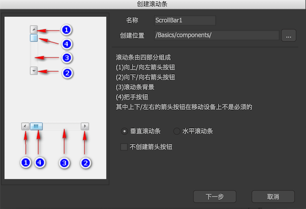

Unlike many UI frameworks, which use skin mechanisms to define scroll bars, in FairyGUI, scroll bars can be freely designed.[Rolling container](scrollpane.html)It is independent from the scroll bar, that is, even if there is no scroll bar, the scroll container can complete the scrolling function.
Note: The scroll bar cannot be dragged directly onto the stage, never do it.

## Create scroll bar

There are two ways to create a scroll bar component.

- Click on the main menu "Resources"-> "New Scroll Bar" and follow the wizard's prompts step by step to complete.

   

- Create a new component and select Expand to "Scrollbar" in the component properties.

## Edit-mode properties

In the component editing state, the properties panel of the scrollbar component is:

- `Fixed scroll slider size`Generally speaking, the scroll slider in the middle of the scroll bar will expand and contract with the size of the scroll area. If the scroll area is small, the slider will be larger; if the scroll area is larger, the slider will be smaller. Check this option if you want the sliders to be the same size at all times. When checked, the size of the slider will remain at its original size.

## Instructions

- `arrow1`If it is a horizontal scroll bar, it means the left arrow button; if it is a vertical scroll bar, it means the upper arrow button. It is optional and can be ignored if your scrollbar does not have an arrow button.
- 
- `arrow2`If it is a horizontal scroll bar, it indicates the right arrow button; if it is a vertical scroll bar, it indicates the lower arrow button. It is optional and can be ignored if your scrollbar does not have an arrow button.

- `grip`Represents the slider button in the middle of the scroll bar.

- `bar`This restricted area indicates the range of the slider when sliding up and down or left and right. Generally, it is indicated by a blank graphic. It is only used for placeholders and has no actual rendering effect.

## Instance properties

There are two ways to use the scroll bar, one is to set it as a global scroll bar resource in "Project Properties"-> "Preview Settings"; the other is to set it in the properties of the scroll container. Either way, the scroll bar is created automatically and then adjusted according to the properties of the scroll container (see[Rolling container](scrollpane.html)You cannot select the scroll bar component for setting properties.

## GScrollBar

The type of the scrollbar component at runtime is GScrollBar, but you don't need to access the GScrollBar object. All scroll related operations are done through ScrollPane, see[Rolling container](scrollpane.html)。