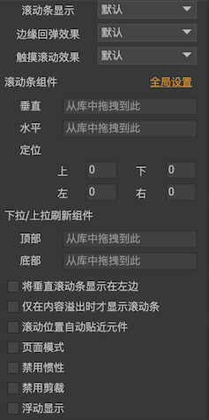
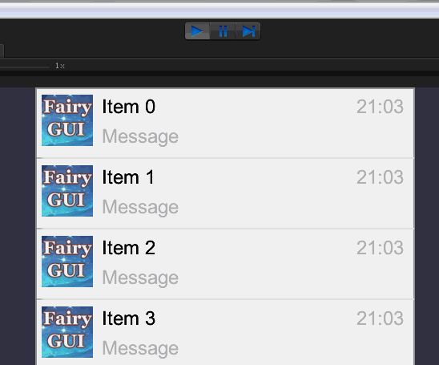

## Scroll property

After the component or list is set to "overflow processing" as "horizontal scroll", "vertical scroll", and "free scroll", the component or list becomes a scroll container. Click next to "Overflow Handling"Button, you can set detailed scroll related properties.



- `Scroll bar display`Display strategy for scroll bars.
   - ``By default, the global settings are used. The editor is set in the main menu "File-> Project Properties-> Preview Settings". When running, you need to go through`UIConfig.defaultScrollBarDisplay`Settings.
   - `visible`Indicates that the scroll bar is always displayed.
   - `Show while scrolling`Indicates that the scroll bar will only be displayed when scrolling, or when the mouse moves into the scrolling area (on a PC), otherwise it will be hidden automatically.
   - `hide`Indicates that the scroll bar is always invisible.

- `Edge rebound effect`Whether to allow sliding / dragging a certain distance when the scroll reaches the edge, showing a rebound effect. Generally used on mobile platforms, less on PCs. **Some developers will ask why the content in my scroll container does not exceed the viewport, but still scrolls. This is actually the edge rebound effect.**

- `Touch scroll effect`Whether to allow the user to directly drag the content in the scroll area. Generally used on mobile platforms, less on PC, generally need to drag the scroll bar on the PC, or use the mouse wheel.

- `Scroll bar component`Set the scroll bar resource. Generally, there is no need to set it. There is a global setting, which is in the main menu "File-> Project Properties-> Default Value". If you want to use a different scrollbar resource than the global setting, then set it here.

- `Positioning`You can set the position of the scroll bar in the container, which is an offset value from the normal position.

- `Pull-down / pull-up refresh component`Set the components to be displayed when pull-up refresh or pull-down refresh. Here is the effect of the drop-down refresh:

   

- `Display vertical scroll bar on the left`Sets the vertical scroll bar to appear to the left of the container, not to the right of the container.

- `Show scrollbar only when content overflows`The scroll bar is displayed only when the content inside the container exceeds the viewport area, otherwise it is hidden. Note: Even if it is not displayed, the scroll bar still has a reserved placeholder. This is not the same as "Scrollbar Display" set to "Hide", which completely cancels the placeholder of the scroll bar.

- `Scroll position close to component automatically`After scrolling, make sure that the scroll position is just above the top (or left) edge of any component.

- `Page mode`The viewport size is the page size, and the distance per scroll is one page. Generally used on mobile platforms, less on the PC, dragging the scroll bar for scrolling operations conflicts with this mode.

- `Disable inertia`When dragging the content with a hand for a distance and releasing the finger, the system will calculate a rate based on the speed of the finger movement, and then the scroll will slowly stop in a manner that attenuates this rate to zero, which is called inertial scrolling. If you do not need this feature, you can turn it off. This function is used in conjunction with the "touch scroll effect".

- `Disable Clipping`In general, the container clips content beyond the viewport. In special cases, for example, if a list's item component is itself a scroll container, then the item component can turn off clipping. Because a lot of tailoring will consume a lot of system performance.

- `Floating display`When checked, the scrollbar does not occupy the position of the viewport, but directly covers the viewport. For example, a scroll bar for mobile phones is thin and translucent. It is only displayed when scrolling, and is used to indicate the scroll position. Then we set it to "floating" so that it does not crowd out the display space of the viewport.

## ScrollPane

When the component's "overflow processing" is set to "rolling",`GComponent.scrollPane`Use scroll-related functions, such as:

```csharp
ScrollPane scrollPane = aComponent.scrollPane;
    // Set the scroll position to 100 pixels
    scrollPane.posX = 100;

    // Scroll to the middle position with animation process
    scrollPane.SetPercX (0.5f, true);
```

After you add or delete subcomponents, or move the position of the subcomponent, adjust the size of the subcomponent, the container automatically updates the scroll area, and does not need to call any API. This refresh occurs before drawing this frame. If you want immediate access to the correct coordinates of the child element, you can call`EnsureBoundsCorrect`Notifies GComponent to reorder immediately. EnsureBoundsCorrect is a friendly function, you don't need to worry about the extra performance cost of repeated calls.

The commonly used APIs in ScrollPane are:

- `viewWidth` `viewHeight`Viewport width and height.

- `contentWidth` `contentHeight`Content height and width.

- `percX` `percY` `SetPercX` `SetPercY`Gets or sets the scroll position, calculated as a percentage, and the value range is 0-1. If you want the scroll bar to change dynamically from the current value to the set value, you can use the Set method, which provides a parameter for whether to use easing.

- `posX` `posY` `SetPosX` `SetPosY`Gets or sets the position of the scroll, calculated in absolute pixel values. The value range is 0-maximum scroll distance. Maximum vertical scroll distance = (content height-viewport height), maximum horizontal scroll distance = (content width-viewport width). If you want the scroll bar to change dynamically from the current value to the set value, you can use the Set method, which provides a parameter for whether to use easing.

- `currentPageX` `currentPageY` `setCurrentPageX` `setCurrentPageY`If scroll is set to page mode, you can set or get the current page index through these methods. If you want to get the number of pages, you can use contentWidth / viewWidth or contentHeight / viewHeight.

- `ScrollLeft` `ScrollRight` `ScrollUp` `ScrollDown`Scroll N * in the specified direction`scrollStep`。 For example, if scrollStep = 20, then ScrollLeft (1) means scroll 20 pixels to the left, and ScrollLeft (2) means scroll 40 pixels to the left. Note: If the scroll property is set close to the component, for example, the size of the component is 41 pixels, the scroll distance needs to be more than 20 pixels in order to actually scroll. If ScrollLeft (1) is called, scrollStep = 20 will cause the To any effect.
If scroll is set to page mode, then these APIs also have the function of "turning a page".

- `ScrollToView`Adjust the scroll position so that the specified component appears in the viewport.

- `touchEffect`Turn the touch scroll function on or off. When touch scrolling is turned off, users cannot drag the viewport to scroll. This function can be set in the editor. If "default" is set in the editor, use UIConfig.defaultScrollTouchEffect.

- `scrollStep`This value refers to the distance by which "one space" is scrolled. This distance has three purposes: a) scrollUp / scrollDown / scrollLeft / scrollRight; b) click the arrow button of the scroll bar; c) the mouse wheel, the distance that the mouse wheel rolls once is scrollStep * 2.

- `bounceBackEffect`The edge rebound function can be turned on or off. This function can be set in the editor. If the editor is set to "default", use UIConfig.defaultScrollBounceEffect.

- `mouseWheelEnabled`Turn mouse scrolling support on or off.

- `decelerationRate`Deceleration rate. Adjusting this value can control the distance and time of inertial rolling. Inertial scrolling means that after the finger drags a certain distance and then releases, the scroll container content continues to scroll a certain distance and then stops. The closer to 1, the slower the deceleration, which means that the sliding time and distance are longer. The default value is UIConfig.defaultScrollDecelerationRate.

- `CancelDragging`When the scroll panel is in the dragging scroll state or is about to enter the dragging state, you can call this method to stop or prohibit the dragging.

You can listen for scroll changes, and in any case the scroll position change will trigger this event.

```csharp
// Unity / Cry
    scrollPane.onScroll.Add (onScroll);

    // AS3
    scrollPane.addEventListener (Event.SCROLL, onScroll);

    // Egret
    scrollPane.addEventListener (ScrollPane.SCROLL, this.onScroll, this);

    // Laya, pay attention to listening with components, not ScrollPane
    aComponent.on (fairygui.Events.SCROLL, this, this.onScroll);

    // Cocos2dx, pay attention to listening with components, not ScrollPane
    aComponent-> addEventListener (UIEventType :: Scroll, CC_CALLBACK_1 (AClass :: onScroll, this));

    // CocosCreator, pay attention to using component listening, not ScrollPane
    aComponent.on (fgui.Event.SCROLL, this.onScroll, this);
```

Events related to scrolling:

- `ScrollEnd`Callback after inertia scrolling is over.
- `PullDownRelease`Drop-down refresh callback.
- `PullUpRelease`Pull-up refresh callback.

```csharp
//Unity/Cry
    scrollPane.onScrollEnd.Add(onScrollEnd);
    scrollPane.onPullDownRelease.Add(onPullDownRelease);
    scrollPane.onPullUpRelease.Add(onPullUpRelease);

    //AS3
    scrollPane.addEventListener(ScrollPane.SCROLL_END, onScrollEnd);
    scrollPane.addEventListener(ScrollPane.PULL_DOWN_RELEASE, onPullDownRelease);
    scrollPane.addEventListener(ScrollPane.PULL_UP_RELEASE, onPullUpRelease);

    //Egret
    scrollPane.addEventListener(ScrollPane.SCROLL_END, this.onScrollEnd, this);
    scrollPane.addEventListener(ScrollPane.PULL_DOWN_RELEASE, this.onPullDownRelease, this);
    scrollPane.addEventListener(ScrollPane.PULL_UP_RELEASE, this.onPullUpRelease, this);

    //Laya，注意是用组件侦听，不是ScrollPane
    aComponent.on(fairygui.Events.SCROLL_END, this, this.onScrollEnd);
    aComponent.on(fairygui.Events.PULL_DOWN_RELEASE, this, this.onPullDownRelease);
    aComponent.on(fairygui.Events.PULL_UP_RELEASE, this, this.onPullUpRelease);

    //Cocos2dx，注意是用组件侦听，不是ScrollPane
    aComponent->addEventListener(UIEventType::ScrollEnd, CC_CALLBACK_1(AClass::onScrollEnd, this));
    aComponent->addEventListener(UIEventType::PullDownRelease, CC_CALLBACK_1(AClass::onPullDownRelease, this));
    aComponent->addEventListener(UIEventType::PullUpRelease, CC_CALLBACK_1(AClass::onPullUpRelease, this));

    //CocosCreator，注意使用组件侦听，不是ScrollPane
    scrollPane.on(fgui.Event.SCROLL_END, this.onScrollEnd, this);
    scrollPane.on(fgui.Event.PULL_DOWN_RELEASE, this.onPullDownRelease, this);
    scrollPane.on(fgui.Event.PULL_UP_RELEASE, this.onPullUpRelease, this);
```
