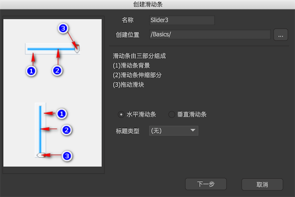
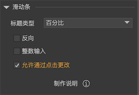
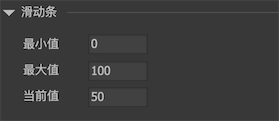

The slider is similar to the progress bar, but the slider has a "button" button that allows the player to drag it to change the value of the progress bar.

## Create slider

There are two ways to create a slider component.

- Click the main menu "Resources"-> "New Slider" and follow the wizard's prompts step by step to complete.

   

- Create a new component and select Expand to "Slider" in the component properties.

## Edit-mode properties

In the component editing state, the properties panel of the slider component is:



- `Title type`If there is a component named "title" in the component, the progress bar can display a text expressing the current progress.
   - `percentage`Displays the current progress percentage, such as "88%".
   - `Current value / maximum value`For example "50/100".
   - `The current value`For example "50".
   - `Max`For example "10000".

- `Reverse`For horizontal sliders, in general, the larger the progress, the more the telescopic bar extends to the right. If it is reversed, the right edge of the telescopic bar is fixed. The larger the progress, the more the telescopic bar extends to the left. For the vertical slider, In general, the larger the progress, the more the telescopic bar extends downward. If it is reversed, the bottom edge of the telescopic bar is fixed. The larger the progress, the more the telescopic bar extends upward.

- `Integer input`When checked, when the slider is swiped by the user, it will only stop at the integer position, that is, the value of the slider is always an integer. This feature can be used to implement hierarchical sliders. The API is wholeNumbers.

- `Allow changes with a click`After checking, you can directly change the value of the slider by clicking the slider; if you do not check, you can only drag the slider to change the value of the slider. The API is changeOnClick.

## Instructions

- `bar`When the progress changes, change the width of the "bar" object. Generally used for horizontal progress bar. Note: Be sure to set the width of the bar object to the width when the progress bar is at its maximum.

   The "bar" element can be of any type and is not limited to images.

- `bar_v`When the progress changes, change the height of the "bar_v" object. Generally used for vertical progress bar. Note: Be sure to set the height of the bar_v object to the height when the progress bar is at its maximum.

   The "bar_v" element can be of any type and is not limited to images.

- `grip`Button for dragging. Note: The grip button should be associated with the bar object and placed where the progress bar is at its maximum. This relation is:
Forward: The left and right grips are associated with bar or the top is associated with bar_v;
Reverse: The top of the grip is associated with bar or the bottom is associated with bar_v.

- `title`It can be a loader, or a label or button. A title to display progress. What is displayed is determined by the "Title Type".

## Instance properties

Select a slider component on the stage, and the property panel list on the right appears:



- `Minimum value`The minimum progress value.

- `Max`The maximum progress value.

- `The current value`Current progress.

## GSlider

```csharp
GSlider slider = gcom.GetChild("n1").asSlider;
    slider.value = 50;
```

There are notification events when the slider progress changes:

```csharp
//Unity/Cry
    slider.onChanged.Add(onChanged);

    //AS3
    slider.addEventListener(StateChangeEvent.CHANGED, onChanged);

    //Egret
    slider.addEventListener(StateChangeEvent.CHANGED, this.onChanged, this);

    //Laya
    slider.on(fairygui.Events.STATE_CHANGED, this, this.onChanged);

    //Cocos2dx
    slider->addEventListener(UIEventType::Changed, CC_CALLBACK_1(AClass::onChanged, this));

    //CocosCreator
    slider.on(fgui.Event.STATUS_CHANGED, this.onChanged, this);
```
