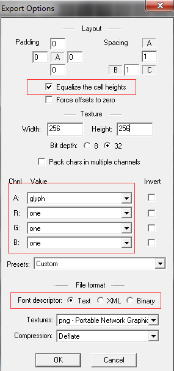
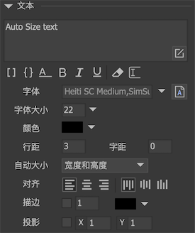
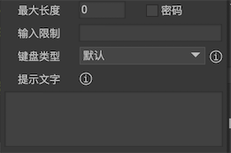

Text is one of the basic controls of FairyGUI. Text does not support interaction, mouse / touch sensing is off.

## Dynamic font

Dynamic Font refers to rendering text directly using TTF fonts. The ttf font file may exist in the operating system or it may be packaged in the game.

The environment in which the FairyGUI editor runs is different from the environment in which the application actually runs. For example, if you make an interface on a PC, the final interface may run on a mobile phone. In the editing interface, the dynamic font is the font used by FairyGUI to use the system environment where the editor is located. At runtime, it is the font provided by the actual operating environment, such as the Android system. The font at design time can be different from the font at runtime, but it is recommended to choose a similar effect.

The font used by the settings editor can be set in the project properties. The runtime font needs to be set by the code:

```csharp
// Droid Sans Fallback is the default font that supports Chinese on Android
    UIConfig.defaultFont = 'Droid Sans Fallback';
```

Set the font used at runtime to ensure that the font also exists on the target platform, otherwise the desired effect cannot be achieved. If you want to package fonts to the target platform, then you need the support provided by the query engine, such as Unity, you can do this:[Use font](../unity/font.html)

If you need to use the ttf file, please install the file in the operating system (usually double-clicking the ttf file), so you can see this font in the font list after restarting the editor.

## Bitmap font

There are often designs in games: some characters expressing special elements are made using images, for example:


FairyGUI editor supports bitmap fonts. First, we create a font. Click on the main toolbarThen, the font editing window pops up. We drag the created digital image from the resource library into the window, and set the characters corresponding to each image. Click Save, and our font is set. If you want to modify the image corresponding to each character, drag the image back in.

The method of using images instead of characters is very convenient for small amounts of text, but if you need to embed hundreds or thousands of words, make images for each word, and then set the corresponding characters for each, this will be a bit heavy . The FairyGUI editor supports external bitmap font creation tools such as BMFont, ShoeBox, etc. For the use of these tools, please refer to the network materials yourself. An external tool will finally export a fnt file ** (note 1: the file format should be fnt format, does not support xml or json) **, click import material in the editor, and then select this fnt file, you can import the font It's in the editor.

Here are the recommended BMFont export settings:



The following describes the functions of the bitmap font setting interface:


- `image`The name of an image in the resource library. If the font is imported by BMFont, this column is blank.

- `character`The character corresponding to the image. Only single characters are supported.

- `Offset X`The offset of the character in the horizontal direction.

- `Offset Y`The offset of the character in the vertical direction. Negative numbers indicate that the characters are shifted up, and integers indicate that the characters are shifted down. However, because the text layout is baseline aligned, the result of the downward shift may be that the entire line is shifted downward.

- `Placeholder`In general, the horizontal placeholder width of a character is determined by the width of the character image. If the value here is not 0, it is used as the horizontal placeholder width of the character.

- `font size`The bit size of the bitmap font. Effective after ticking "Allow dynamic font size change".

- `Default placeholder`Set the default horizontal placeholder width for all characters uniformly.

- `Allows dynamic font size changes`When checked, the text size of this font can be used to set the font size so that the character image is scaled. For example, first set the "font size" of the bitmap font to 12, and then set the font size to 24 in the text settings, then the final bitmap font will be displayed doubled. If it is not checked here, the bitmap font will remain the same regardless of the font size in the text settings, without scaling.

- `Allows dynamic color changes`When checked, the text in this font can be used to set the color of the character image. This change color is similar to the function of changing the color of the image element. If unchecked, the bitmap font will retain its original color regardless of the color of the text in the text settings.

- `Texture set`If the font is imported from BMFont, the character images are all on a poster, which corresponds to the texture resource. It is for display only and cannot be modified. If you want to set which texture set the font will eventually be published to, then you should enter the settings window of this texture image.

## Instance properties

Click in the main toolbarButton to generate a text symbol.



- Set text to support UBB syntax. Using UBB syntax can make a single text contain multiple styles, such as font size, color, etc. [Please refer to UBB syntax](text.html#UBB语法)。 *(Laya / Cocos2dx version does not support multiple styles in ordinary text. If you have this requirement, please use rich text instead)*

- When selected, the text can express a text parameter using syntax such as {count = 100}. [Please refer to the text template](text.html#文本模板)。

- Set the text to a single line. Single-line text does not wrap automatically, and newline characters are ignored.

- Set the text to bold.

- Set the text to italic.

- Set the text to underline.

- Indicates that the text is only used as an editor preview and will be automatically cleared when publishing.

- Set text for input. After checking, click next to the optionThe button pops up the detailed settings of the input type text:

   

   - `The maximum length`The maximum number of characters allowed. 0 means unlimited.

   - `password`When checked, the entered characters will be displayed as "*".

   - `Input restrictions`Limit the characters entered by the user. Generally only used on PC. Here, the syntax of the different platforms is inconsistent.
      - `AS3/Starling`References[TextField.restrict](http://help.adobe.com/zh_CN/FlashPlatform/reference/actionscript/3/flash/text/TextField.html#restrict)。
      - `Egret`References[TextField.restrict](http://developer.egret.com/cn/apidoc/index/name/egret.TextField#restrict)。
      - `Laya`References[Input.restrict](https://layaair.ldc.layabox.com/api/?category=Core&class=laya.display.Input#restrict)。
      - `Unity`References[Regular expression syntax](https://msdn.microsoft.com/zh-cn/library/az24scfc.aspx)。 For example, an expression that restricts numbers only: "[0-9]”。
   - `Keyboard type`Set the type of phone keyboard that pops up when you type on the phone. Whether this is effective or not depends on the support level of the engine.

   - `Prompt text`Set the display content when the input text content is empty, which is generally used to prompt the user what should be entered here. This prompt text can be set in a separate color using UBB syntax (no text check for UBB), for example`[color = # CCCCCC] Prompt text [/ color]`。


- `text`Set the text content. When a new line is needed, you can do it in the editor**Press enter directly**。 You can use "\ n" when you need to use a newline when assigning a value by code.

- `Font`Set the font used for text. ** You don't need to set the font once for each text. ** In the project properties, you can set the default font used for all text in the project. When running`UIConfig.defaultFont`Uniform settings. If you need to use bitmap fonts, you can drag font resources from the resource library here. If you use TTF fonts, then you need to install the fonts into the operating system, then enter the font name here, or click the A button next to it to select.

- `font size`Sets the font size used for text. If you are using a bitmap font, you need to set "Allow dynamic font size change" for the bitmap font for the options here to be effective.

- `colour`Set the text color. If you are using a bitmap font, you need to set "Allow dynamic color changes" to the bitmap font for this option to take effect.

- `Line spacing`The pixel pitch of each row.

- `Kerning`Pixel pitch for each character. *(Neither H5 engines are currently supported)*

- `Auto size`
   - `Auto width and height`The text does not wrap, and both the width and height grow to fit the entire text.
   - `Automatic height`The text is typeset with a fixed width, and it wraps automatically when it reaches the width, and the height grows to accommodate the entire text.
   - `Automatic shrink`The text is typeset with a fixed width. When the width is reached, the text is automatically reduced so that all text is still displayed. If the content width is less than the text width, no processing is done.  *(Bitmap fonts need to check 'Allow font size change' in the font properties to use the auto shrink feature)*
   - `no`Text is typeset with fixed width and height and does not wrap automatically.

- `Aligned`Set the alignment of the text.

- `Single line`Set the text to a single line. Single-line text does not wrap automatically, and newline characters are ignored.

- `Stroke`Sets the stroke effect of the text. The stroke weight value cannot be too large, otherwise the effect will be strange. Strokes are implemented differently in each engine, and the effects are different, and the effects of the editor are for reference only.

- `projection`Sets the drop shadow effect of the text. The projection effect can be regarded as a simplified stroke effect. The stroke is in all directions, and the projection has only one direction. Projection and stroke share a single color setting.


## GTextField

Text supports dynamic creation, for example:

```csharp
GTextField aTextField = new GTextField(); //LayaAir平台用new GBasicTextField
    aTextField.SetSize(100,100);
    aTextField.text = "Hello World";
```

Dynamically change the style of the text (font size, color, etc.). The method is slightly different on different platforms:

```csharp
//Unity/Cry
    TextFormat tf = aTextField.textFormat;
    tf.color = ...;
    tf.size = ...;
    aTextField.textFormat = tf;

    //Cocos2dx
    TextFormat* tf = aTextField->getTextFormat();
    tf->color = ...;
    tf->size  ...;
    aTextField->applyTextFormat();

    //其他平台
    aTextField.color = ...;
    aTextField.fontSize = ...;
```

If you want to set the font of the text to a bitmap font, you can use the font URL directly for the font name, such as ‘ui:// package name/font name’.

## GTextInput

If the text is checked as "Input", the running instance object is GTextInput.

able to pass`UIConfig.inputHighlightColor`with`UIConfig.inputCaretSize`Modify the color and size of the cursor. Note that the size of the input cursor will automatically select the most suitable width according to the screen zoom. In general, you do not need to modify it.

The input text has a notification event when the text changes:

```csharp
//Unity/Cry
    aTextInput.onChanged.Add(onChanged);

    //AS3
    aTextInput.addEventListener(Event.CHANGE, onChanged);

    //Egret
    aTextInput.addEventListener(Event.CHANGE, this.onChanged, this);

    //Laya
    aTextInput.on(laya.events.Event.INPUT, this, this.onChanged);
```

Notification events when gaining focus and losing focus:

```csharp
//Unity
    aTextInput.onFocusIn.Add(onFocusIn);
    aTextInput.onFocusOut.Add(onFocusOut);

    //AS3
    aTextInput.addEventListener(FocusEvent.FOCUS_IN, onFocusIn);
    aTextInput.addEventListener(FocusEvent.FOCUS_OUT, onFocusOut);

    //Egret
    aTextInput.addEventListener(FocusEvent.FOCUS_IN, this.onFocusIn, this);
    aTextInput.addEventListener(FocusEvent.FOCUS_OUT, this.onFocusOut, this);

    //Laya
    aTextInput.on(laya.events.Event.FOCUS, this, this.onFocusIn);
    aTextInput.on(laya.events.Event.BLUR, this, this.onFocusOut);
```

If you want to set the focus actively, you can use

```csharp
aTextInput.RequestFocus();
```

If the input text is set to a single line, an event will be dispatched when the user presses the Enter key (note that it is only valid on a PC. Pressing Done on the keyboard of the mobile phone is not within the scope of support, and the engine generally does not provide an interface to interact with the mobile phone keyboard):

```csharp
//Unity
    aTextInput.onSubmit.Add(onSubmit);
```

## UBB syntax

FairyGUI supports UBB syntax:

- `[img]image_url[/img]`Display a image. The image_url here can be the internal url format of "ui://package name/image name", or it can be the url of an external resource. The image is finally displayed through GLoader. For the ability to support external resources, please refer to GLoader's documentation. Here you cannot set the image size. If you need to set the image size, use HTML syntax instead.

- `[url=link_href]text[/url]`Display a hyperlink. The link_href can be obtained in the event triggered after the link is clicked.

- `[b]text[/b]`Set the text to bold.

- `[i]text[/i]`Set the file to italic.

- `[u]text[/u]`Set the text to underline.

- `[sup]text[/sup]`Set the text to superscript. *(Only supported by the Unity platform, and cannot be previewed temporarily in the editor)*

- `[sub]text[/sub]`Set the text as a subscript. *(Only supported by the Unity platform, and cannot be previewed temporarily in the editor)*

- `[color=#FFFFFF]text[/color]`Set the text color. Note that you must use hexadecimal color codes. Color names like red and blue are not supported. You can also set the text color to a gradient color using the color syntax * (only supported on the Unity platform and cannot be previewed in the editor for the time being) *, for example:

   ```csharp
   // Specify two colors for up and down transition
    [color = # FFFFFF, # 000000] text [/ color]

    // Specify four colors can do left and right transition or two-direction transition
    [color = # FFFFFF, # CCCCCC, # 000000, # FFFF00] text [/ color]
   ```

- `[font=font_face]text[/font]`Set the font of the text.

- `[size=10]text[/size]`Set the font size of the text.

- `[align=left/center/right]text[/align]`Sets the horizontal alignment of the text. *(Only supported by the Unity platform, and cannot be previewed temporarily in the editor)*

Nesting between tags is supported, but cross-nesting is not supported. E.g:

```csharp
//allow
    [color = # FFFFFF] [size = 20] text [/ size] [/ color]

    // not allowed
    [color = # FFFFFF] [size = 20] text [/ color] [/ size]
```

For unsupported labels, such as "[tag]text[/tag]", FairyGUI does not do parsing, this part of the content is output as is. When the "[" character is to be used in non-UBB syntax, you can use "\\ [" to escape it. Note that you can directly enter "\\" when typing in the editor. You need to use "\" in the code. \\\ "This way you can express a backslash. Also, just escape "["No need to escape"]"。

**Normal text does not support the img and url tags in the syntax, because normal text cannot be mixed with graphics. To support mixed graphics, use rich text instead.**

FairyGUI also provides methods to extend the UBB parser. Inherit the UBBParser class and register your own TagHandler. For specific implementation methods, please read the source code of UBBParser or refer to the demo.

## Text template

Using text templates provides more flexibility to dynamically adjust text output. For example, if you need to display "My Ingot: 100 Gold and 200 Silver", the common production methods are:
1. Using a text control display, then the programmer can only retype the entire text when changing the value at runtime. This is undoubtedly a redundant workload and is not conducive to decoupling art and programs.
2. Using four text controls to display, then the runtime programmer only needs to change the text control that displays the value, but the workload of the art increases.

This need can be easily addressed using the text template feature. Just place a text control in the editor, the text is "My Ingot: {jin = 100} 金 {yin = 200} 银", and then check "Use Text Template". In this way, the display is still "My Ingot: 100 Gold and 200 Silver". At runtime, the programmer only needs to execute the following code to update the value:

```csharp
aTextField.SetVar ("jin", "500"). SetVar ("yin", "500"). FlushVars ();
```

Can also be set in batches:

```csharp
Dictionary <string, string> values;
    values ["jin"] = "500";
    values ["yin"] = "500";
    // Note that this method does not need to call FlushVars again
    aTextField.templateVars = values;
```

If you want to dynamically enable the text template function at runtime, you don't need to set any switches, you just need to call SetVar directly.
If you want to dynamically close the text template function at runtime, you only need to set templateVars to null, that is:

```csharp
aTextField.templateVars = null;
```

When the "{" character is not used in the template, you can use "\\ {" to escape it. Note that you can directly enter "\\" when entering in the editor. You need to use "\\\" in the code. \ "This way you can express the backslash. Also, just escape "{", there is no need to escape "}".

Text templates take precedence over UBB parsing, so templates can also be used in UBB, for example the text is: "This can be changed color[color={color=#FF0000}]text[/color]", Which can easily implement the need to dynamically change the color of some text.