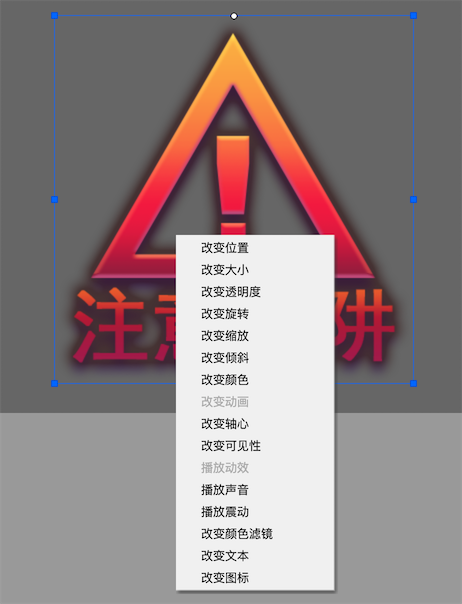
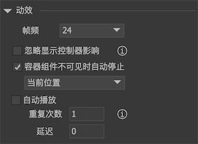
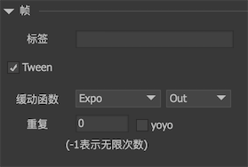
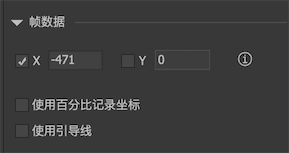
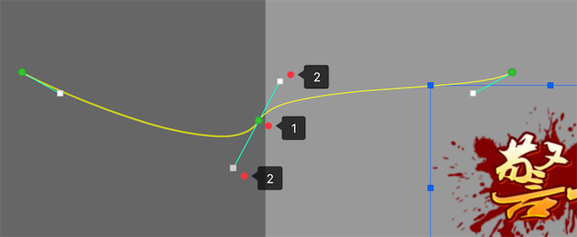
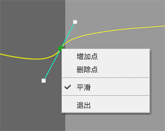
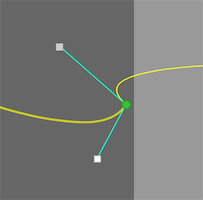

FairyGUI not only provides the editing function of static UI, but also provides powerful dynamic editing functions to make your UI easy to move.

## Name explanation

- `Timeline`A change in an attribute of a component forms a timeline. For a component, the change in its position can become a timeline.

- `frame`The timeline is made up of one or more frames.

- `Keyframe`There are many frames on the timeline, but not all frames can adjust the properties of a symbol. Frames whose component properties can be adjusted are called "key frames". Other normal frames are automatically generated transitions. The difference between the display of key frames and ordinary frames is that there is a white dot in the center:。

- `Tween`Generates an interpolation animation effect between two keyframes. Tween shows:That is, there is an arrow connecting two key frames.

## Edit transition

In the transition list view, create a new transition or double-click on an transition to enter transition editing mode.

To exit transition editing mode, click the button at the top right of the stage:

。

During dynamic editing, you cannot add and delete components, and you cannot modify the controller. If the attribute type of the current frame is not "Change Position", then the component cannot be moved; if the attribute type of the current frame is "Change Size", then the size of the component cannot be changed.

After selecting a symbol on the stage (or unselecting any symbol, Context in the blank space of the stage), create a timeline from the context menu:



Different types can be created with different components.

- `Change position`Change the position of the component (x, y).
- `Change size`Change the width and height of the component (width, height).
- `Change transparency`Change the transparency (alpha) of the symbol.
- `Change rotation`Change the rotation of the component.
- `Change zoom`Change the scale of the component (scaleX, scaleY).
- `Change tilt`Change the tilt of the component (skewX, skewY).
- `Change color`Valid for images, text, and loaders. Change their color attributes.
- `Change animation`Valid for movieclip and loader, change the current playing state of the animation (playing), or set the current frame (frame). Use this feature to easily combine animation with sequence frame animations to make complex effects.
- `Change axis`Change the axis of the component (pivotX, pivotY). In general, the axis should be set to a fixed property of the component, not to change it temporarily in the transition. Here is just a way, not many scenarios are used.
- `Change visibility`Change the visibility of components.
- `Play transition`Valid for the component, playing an transition defined by the component. If no symbol is currently selected, an transition of the current container component is played. This can achieve functions similar to dynamic nesting. For example, if a certain effect in the transition needs to be played in a loop, we can make it into a single transition and then use this method to nest it.
- `Play sound`Play a sound effect.
- `Play vibration`The component displays a vibration effect.
- `Change color filter`Change the color filter of the component.
- `Change text`Change text, label, button, drop-down box, etc. Text value with title attribute.
- `Change icon`Change loader, label, button, drop-down box and other URL values with icon attributes.

**Note: There are very few transition types supported by Groups. If you need complex actions, use components instead.**

## Transition properties



- `Frame rate`You can choose 24, 30 or 60 according to your needs. The frame rate set during the editing period is not related to the final running frame rate, but a higher frame density is helpful for making finer transitions.
- `Ignore display controller effects`When checked, all components participating in the transition at the beginning of the transition are not controlled by the display controller, that is, they will not be hidden by the display controller. Control resumes after the effect is over.
- `Stop automatically when container component is not visible`When the component moves out of the stage, it automatically stops playing transitions, saving CPU resources.
- `Autoplay`When the component is added to the stage, the transition will start playing automatically.
   - `repeat times`Number of repeats for autoplay.
   - `delay`Autoplay delay. Unit of second.

## Frame properties



- `label`Set the label of the frame, an arbitrary string, identifying this frame, for access in the code.

- `Tween`Check this box to create a Tween from this keyframe to the next keyframe. If there is no next key frame, then this Tween is invalid.

- `Easing function`Time / speed curve. Please refer to details[Graphic](../../images/20170802000005.jpg) [Example](https://greensock.com/ease-visualizer)。

- `repeat`The number of repeated playbacks. -1 means loop.

- `yoyo`The effect of playing back and forth. The effect of the default loop playback is from the start point to the end point, and then from the start point to the end point. After selecting yoyo, the effect of loop playback is from the start point to the end point, then from the end point to the start point, and so on.

## Frame data

Different frame types have different data. Only one type of changing position is introduced here.



- `X` ``Y Modify the value of the keyframe. The check mark in front of the input box indicates that if it is not checked, the current attribute value of the component will not be modified.

   There is one key point to note here. Take an example. The X of the current component is 50. Uncheck it. Set X to 100 at the end of the transition, and check it. The first time the transition is played, the component moves from 50 to 100. When the transition is played for the second time, the X value of the first frame is unchecked, that is, the current value is used, that is, 100. Then the effect of the transition is from 100 to 100, which means that no performance is seen. This is a matter of dynamic design. This checked function is generally only used for attribute values that are not involved in transition. For example, if the component only moves horizontally, you can leave the box unchecked to make it easier to adjust the Y value without affecting the motion.

- `Recording coordinates using percentages`Coordinate values are recorded as a percentage. For example, when the component is placed in the horizontal center of the container, the x value is recorded as 50%. When entering this frame, no matter what the size of the container, the coordinates of the component are still at the center, which is 50% of the position.

- `Use guides`If you want the component to do curve motion, you can check this option.

The guideline function must be used in conjunction with Tween. Check the guideline function at the start key frame of Tween.

Enter edit guide mode in two ways:
- Click on the right icon。
- Double-click the symbol on the Stage.

Exit Edit Guideline mode in three ways:

- Select other symbols or other keyframes.
- Double-click on the stage blank.
- Context on the stage blank and select "Exit" from the context menu.

The guideline editing interface is as follows:



1. Waypoint. You can change the coordinates by holding down the path point and dragging it, or you can enter its coordinates directly in the properties panel:

   Add waypoints: Context on the stage blank and select "Add Points" from the menu;

   Delete a waypoint: Context the waypoint and choose "Delete Point" from the menu.

2. Control point. You can hold the control point and drag to change its coordinates, or you can enter its coordinates directly in the properties panel. Each path point has two control points. They are connected by a white line. When one of the control points is dragged, the other control point also moves at the same time. This mechanism can make the curve change smoothly at this point.

If you need to cancel this smoothing function, uncheck "Smooth" in the context menu:



At this time, if you move the control point again, you will find that the two consoles no longer move at the same time, so that the curve can make a larger turn:



## Transition

Transition playback is started in the code, for example:

```csharp
Transition trans = aComponent.GetTransition(“peng”);
    trans.Play();
```

Play has a variety of prototypes, for example, it can be played a certain number of times, and it can be called back when the playback ends. E.g:

```csharp
// There is a callback at the end, but it should be noted that if there is a nested transition in the transition or there is a loop content, it will not be called back until all are finished.
    trans.Play (callback);
```

For example, you can play part of the transition by specifying a time range, such as:

```csharp
// Play the transition from 0.5 seconds to 1.5 seconds, that is, all frames between 0.5 seconds (inclusive) and 1.5 seconds (inclusive).
    trans.Play (1, 0, 0.5, 1.5);
```
The time range can be hard-coded or specified by a label. You can get the time point of a label through GetLabelTime.

It is also possible to place it upside down, but note that you need to perform an upright placement before placing it upside down. E.g:

```csharp
trans.playReverse();
```

Transition can be paused, for example:

```csharp
// Pause transition
    trans.setPaused (true);

    // Resume transition playback
    trans.setPaused (false);
```

To stop the transition playback in the middle, you can call:

```csharp
trans.Stop();
```

The Stop method can also take parameters. The prototype is:

```csharp
public void Stop(bool setToComplete, bool processCallback);
```

`setToComplete`Indicates whether to set the status of the component to the completed status. If not, the status of the component stays at the current time. `processCallback`Whether to call the callback function passed by the Play method.

Note: After the UI transition is finished playing, the state of the component will stay at the last frame, instead of returning to the first frame. If you want the state of the component to return to the state before playing after the transition is played, you need to add a frame again Sets the status of the component. For example, for a motion effect, the design is to change the transparency from 1 to 0 after 1 second, then the transparency will be 0 after the transition effect ends. Some people will ask how to make the transition go back to the first frame, that is, the transparency must be equal to 1, which is very simple. Add a frame at the end of the transparency timeline and set the transparency to 1. Then the transparency is 1 after the transition is finished .

If you need to modify the attribute value of a keyframe, you can use:

```csharp
// For example, the label of a frame is aa, this frame is set to the XY value of a certain element, and the XY value is changed to 100,200.
    trans.SetValue ("aa", 100, 200);
```

Can modify the duration of a Tween, but modify the time of a Tween**will not**Postponing subsequent Tween. E.g:

```csharp
// Modify the duration of a Tween to 0.5 seconds. Note that the label should be on the start key of Tween.
    trans.SetDuration ("aa", 0.5f);
```

You can trigger a callback when the transition reaches a certain frame, for example:

```csharp
// When the key frame labeled aa is run, a callback is triggered.
    trans.SetHook ("aa", callback);
```

You can modify the target object of a motion effect tag for a motion effect, but you must be aware that**To be called when the transition is stopped**,E.g:

```csharp
trans.SetTarget ("aa", newTarget);
```

In Unity, the transition playback speed is not affected by Time.timeScale by default, but you can also set it to be affected:

```csharp
trans.ignoreEngineTimeScale = false;
```

You can also set the dynamic timeScale separately, for example:

```csharp
// The transition playback speed will be half of the original speed.
    trans.timeScale = 0.5f;
```
