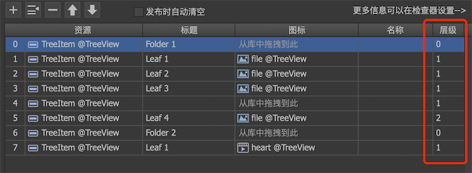

Trees are a special case of lists. Is a special extension of a component. Tick List PropertiesTo make the list a tree.

## Tree properties

Click to the right of the tree viewThe button displays the following interface:


- `Indent each level`The distance in pixels of the tree node is indented to the right for each additional level of depth. For example, if the indentation of each level is 15 pixels, and the level of the tree node is 3 levels, then the indentation of the tree node is 15 * 3 = 45 pixels.

- `Expand / collapse when clicking on a folder`Whether to automatically expand or collapse this node when clicking on a folder node.
   - `no`No action.
   - `Click`Action when clicked.
   - `Double click`Action when double-clicked.

After activating the tree view, the interface for editing list items has also changed, as shown below:



The "Hierarchy" setting has been added to the far right. The top node is level 0, and adding one level indicates that it is a child node of the previous level.

Refer to the following figure, the correspondence between levels and nodes:


## Tree node design

There are several agreed rules for tree node design:

1. Name is`expanded`Controller (optional). If the node is a folder node, when the node is expanded, this controller automatically switches the page to 1; when the node is collapsed, it automatically switches the page to 0. You can use this controller to control the shape of the node in these two states.
If there is a placement button in the tree node (this button should be a check button) for expanding and collapsing, then this button should be connected to the controller, as shown below:

   

2. Name is`leaf`Controller (optional). If the node is a folder node, then the page of this controller is 0; if the node is a leaf node, then the page of this controller is 1. You can use this controller to control the morphology of these two different types of nodes.

3. Name is`indent`The object will be used to set the indentation (optional).assuming the indentation of a node is 45 pixels, the width of the indent object will be set to 45.

## GTree

When a list activates the tree view, its object in the code is GTree. GTree inherits from GList, so all APIs of GList also apply to GTree, but GTree currently**Does not support virtualization**。

```csharp
GTree aTree = aComponent.GetChild("tree").asTree;
GTreeNode rootNode = aTree.rootNode;
```

Here rootNode is the root node of the tree, it is a "fake" node and is not visible.

Create and add nodes:

```csharp
GTreeNode aNode = new GTreeNode (true); // true indicates a folder node, false indicates a leaf node
rootNode.AddChild (aNode);
```

There are two ways to render nodes:

1. Directly operate the component corresponding to the node.
   ```csharp
   GComponent obj = aNode.cell;
obj.GetChild("abc").text = "hello";
   ```
   **This method must be used if the node is already in the tree, which is already AddChild**。

2. Operate through callback functions.
   ```csharp
   aTree.treeNodeRender = RenderTreeNode;

void RenderTreeNode (GTreeNode node, GComponent obj)
{
}
   ```

Clicking on the response tree node is the same as processing the list response item, and it is listening`onClickItem`Event, you can refer[Here](list.html#Event)。 After getting the clicked item object, to get its corresponding GTreeNode object, you can use the API`GObject.treeNode`obtain.

GTree also has a special callback:`treeNodeWillExpand`It fires when the TreeNode is about to expand or shrink. You can add child nodes dynamically in the callback.

```csharp
aTree.treeNodeWillExpand = onExpand;

void onExpand(GTreeNode node, bool expand)
{
}
```

