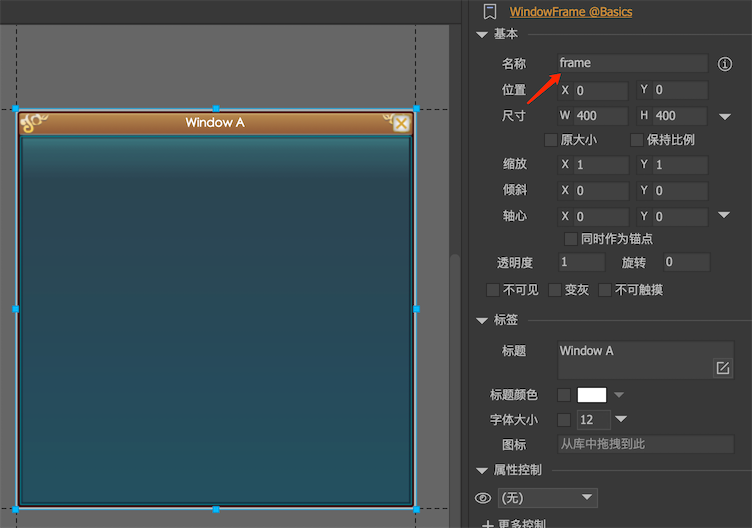

A window is a special extension of a component. There is no concept of a window in the editor, because a window can set any component as its display content. Window = content component + window management API.

## Design window

The window content component needs to be edited in the editor. Usually the window will include a title bar for dragging, a close button, etc. FairyGUI uses convention names to associate some common window functions with our defined components. First of all, a name needs to be placed in the window content component as`frame`This component will be the background of the window or the frame. Extensions for this component are usually chosen as "tags".



The production method of this frame component is:

- `closeButton`A button named closeButton will automatically act as the window's close button.

- `spoil`A graphic named dragArea (type is set to blank) will be automatically used as the detection drag area of the window. When the user presses and drags in this area, the window will be dragged accordingly.

- `contentArea`A graphic named contentArea (type set to blank) will be used as the main content area of the window, this area is only used for ShowModalWait. When ShowModalWait is called, the window is locked. If contentArea is set, only the area specified by contentArea is locked, otherwise the entire window is locked. If you want the window to be able to drag and close in the modalWait state, then don't let the contentArea cover the title bar area.

Note that the above conventions are optional. Whether the component frame or the component frame contains the agreed functional components will not affect the normal display and close of the window.

## Use window

After the content components are created, the runtime can create and use windows in the following ways:

```csharp
Window win = new Window ();
    win.contentPane = UIPackage.CreateObject ("package name", "content component name"). asCom;
    win.Show ();
```

In addition, FairyGUI also provides a set of mechanisms for dynamic window creation. Dynamic creation refers to specifying only the resources that the window needs to use initially, and actually starting to build the content of the window when the window needs to be displayed. First need to be called in the window's constructor`AddUISource`。 This method requires a`IUISource`Type parameters, and IUISource is an interface, and users need to implement the logic of loading related UI packages by themselves. When the window is displayed for the first time, the loading method of IUISource will be called, and wait for the loading to complete before returning to execution.`OnInit`And then the window will be displayed.

transfer`Show`Process of displaying window:


If you need to play the animation effect when the window is displayed, then override`DoShowAnimation`Write your animation code and call onShown after the animation ends.
cover`OnShown`Write other business logic that needs to be handled when the window is displayed.

transfer`Hide`Process of hiding window:


If you need to play the animation effect when the window is hidden, then override`DoHideAnimation`Write your animation code and call it at the end of the animation`HideImmediately`（**Note that onHide is not called directly!**).
cover`one hydrochloride`Write other business logic that needs to be handled when the window is hidden.

## Window

- `Show`The window is displayed.

- `Hide`Hide the window. The window is not destroyed, it is just hidden.

- `isShowing`Gets whether the window is displayed.

- `capital`Sets whether the window is a modal window. A modal window will prevent users from clicking on anything behind the modal window. When the modal window is displayed, a layer of gray color can be automatically covered behind the modal window. This color can be customized:

   ```csharp
   //Unity
  UIConfig.modalLayerColor = new Color(0f, 0f, 0f, 0.4f);

  //AS3
  UIConfig.modalLayerColor = 0x333333;
  UIConfig.modalLayerAlpha = 0.2;
   ```

   If you don't need this gray effect, then set the transparency to 0.

- `ShowModalWait`The window is locked and no operations are allowed. When locked, a prompt can be displayed. The resources of this prompt are specified by the following settings:

   ```csharp
   UIConfig.windowModalWaiting = "ui://package name/component name";
   ```

   This component will be resized to the same size as the contentArea.

- `CloseModalWait`Unlock the window.

## Window management

GRoot provides some common APIs for window management.

- `BringToFront`Bring the window to the front of all windows.
- `CloseAllWindows`Hide all windows. Attention is not destruction.
- `CloseAllExceptModals`Hide all modeless windows.
- `GetTopWindow`Returns the window that is currently displayed at the top.
- `hasModalWindow`Whether any modal windows are currently displayed.

**Adding components directly to GRoot, what is the difference between using Windows?**

GRoot is the root container for 2D UI. After we create the top-level UI interface through UIPackage.CreateObject, add it to GRoot. For example, the game's login interface, main interface, etc. This type of interface is characterized by the bottom layer of the game and is relatively fixed.

The essence of Window is also the top-level UI interface dynamically created through UIPackage.CreateObject, but it provides commonly used window features, such as automatic sorting, show / hide processes, modal windows, etc. Dialog interface for games, such as character status, backpack, mall, etc. This type of interface is characterized by being on top of the game and switching frequently.

**Automatic window sorting**

By default, Window has a click auto-sort function, that is, if you click a window, the system will automatically bring the window to the front of all windows, which is also the specification of all window systems. But you can turn off this feature:

```csharp
UIConfig.bringWindowToFrontOnClick = false;
```
