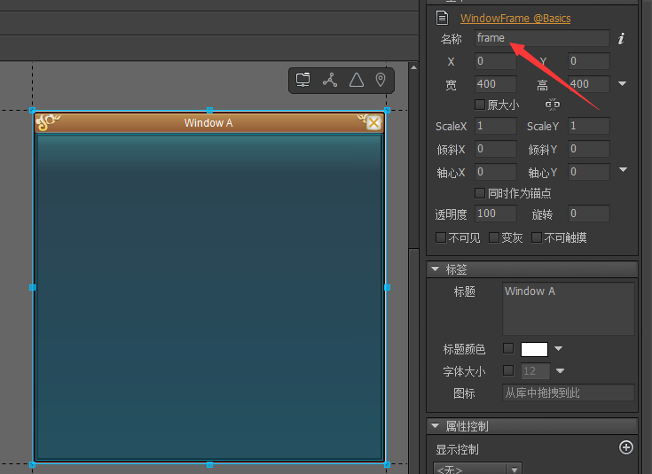
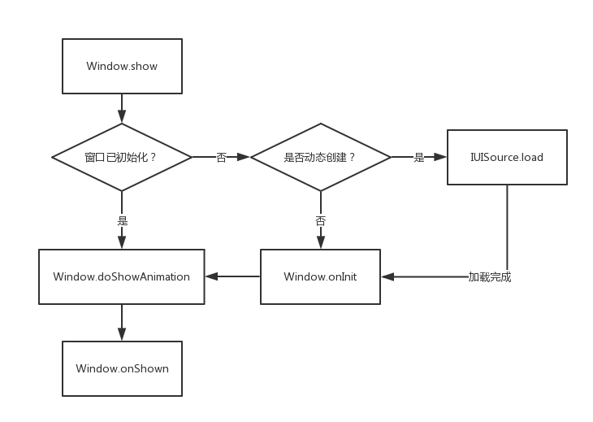
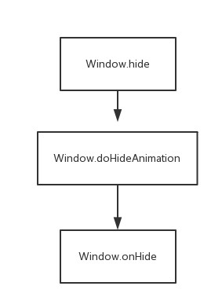

A window is a special extension of a component. **There is no concept of a window in the editor because the window can set any component as its display content.** `Window` = Content Component + Window Management API.

## Design Window

The window content component needs to be edited in the editor. Usually the window will include a title bar that can be used for dragging, a close button, and so on. FairyGUI uses convention names to associate some common window functions with the components we define. First, you need to place a component named `frame` inside the window content component, which will be the background of the window or become the frame. The extension of this component is usually chosen to be "tag".



This frame component is made in the following ways:

- `closeButton` 一A button named `closeButton` will automatically be used as the window's close button.

- `dragArea` 一A graphic named `dragArea` (with the type set to blank) will automatically be used as the detection drag area of the window. When the user presses and drags in this area, the window is dragged.

- `contentArea` 一A graphic named `contentArea` (with the type set to blank) will be used as the main content area of the window, which is only used for `ShowModalWait`. When `ShowModalWait` is called, the window will be locked. If contentArea is set, only the area specified by `contentArea` will be locked, otherwise the entire window will be locked. If you want the window to still be dragged and closed in the modalWait state, then don't let the `contentArea` override the title bar area.

Note that the above conventions are optional. Whether the component frame is included or whether the component frame contains the agreed function components does not affect the normal display and shutdown of the window.

## Use Window

Once the content component is created, the runtime can use the following methods to create and use the window:

```csharp
    Window win = new Window();
    win.contentPane = UIPackage.CreateObject("包名", "内容组件名").asCom;
    win.Show();
```

In addition, FairyGUI provides a mechanism for dynamic window creation. Dynamic creation means that only the resources that the window needs to be used are initially specified, and the contents of the window are actually started when the window needs to be displayed. First you need to call `AddUISource` in the window's constructor. This method requires a parameter of type `IUISource`, and `IUISource` is an interface, and the user needs to implement the logic of loading the relevant UI package. The IUISource's loading method will be called before the window is first displayed, and will wait until the loading is complete before returning to execute `OnInit`, and the window will be displayed.

Call `Show` to display the flow of the window:



If you need to play an animation when the window is displayed, override `doShowAnimation` to write your animation code and call `onShown` after the animation ends.
Override `onShown` to write other business logic that needs to be processed when the window is displayed.

Call `Hide` to hide the window:



If you need to play an animation when the window is hidden, override `doHideAnimation` to write your animation code and call `HideImmediately` at the end of the animation.（**Note that this is instead of calling onHide directly!**)
Override `onHide` to write other business logic that needs to be processed when the window is hidden.

## Window

- `Show` Display window.

- `Hide` Hide the window. The window will not be destroyed, just hidden.

- `isShowing` Gets whether the window is displayed.

- `modal` Set whether the window is a modal window. The modal window will prevent the user from clicking on the content behind any modal window. When the modal window is displayed, the modal window can be automatically covered with a layer of gray color. This color can be customized:

```csharp
    // Unity
    UIConfig.modalLayerColor = new Color(0f, 0f, 0f, 0.4f);

    // AS3
    UIConfig.modalLayerColor = 0x333333;
    UIConfig.modalLayerAlpha = 0.2;
```

If you don't need this gray effect, set the transparency to 0.

- `ShowModalWait` Lock the window and do not allow any action. A prompt can be displayed when locked, the resource of this prompt is specified by the following settings:

```csharp
    UIConfig.windowModalWaiting = "ui://PackageName/ComponentName";
```

This component will adjust to the same size as the `contentArea`.

- `CloseModalWait` Cancel the lock of the window.

**Window Sorting**

By default, `Window` has the function of automatic sorting by clicking, that is, when you click on a window, the system will automatically refer the window to the front of all windows, which is the specification of all window systems. But you can turn off this feature:

```csharp
    UIConfig.bringWindowToFrontOnClick = false;
```

**Window Management**

GRoot provides some common APIs for window management.

- `BringToFront` Put the window to the front of all windows.
- `CloseAllWindows` Hide all windows. Note that they are not destroyed.
- `CloseAllExceptModals` Hide all non-modal windows.
- `GetTopWindow` Returns the window currently displayed at the top.
- `hasModalWindow` Is there a modal window currently displayed?

**What's the difference between directly adding components to GRoot and using Window？**
`GRoot` is the root container of the 2D UI. When we create the top UI interface through `UIPackage.CreateObject`, add it to `GRoot`. For example, the login interface of the game, the main interface, etc., the characteristics of such interfaces are at the "bottom" layer of the game, and relatively fixed.

The essence of `Window` is also the top-level UI interface dynamically created by `UIPackage.CreateObject`, but it provides common window features, such as automatic sorting, show/hide process, mode window, etc. A dialog interface for games, such as character stats, inventories, mailboxes, and the like. This type of interface is characterized by the "upper" layers of the game and is frequently switched.
