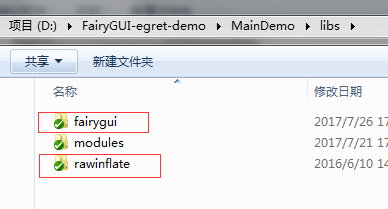
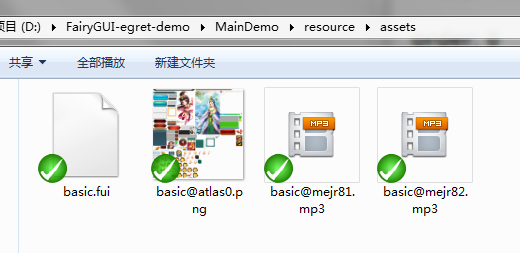
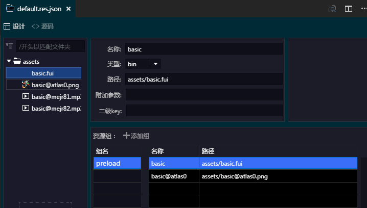

## Steps for usage

1. Copy the FairyGUI library and the dependent rawinflate library to the libs directory. (If you did n’t check it when the editor was published`Compressed description file`, Then this library is not needed).



2. Make a copy of rawinflate.min.js and rename it rawinflate.js. (If you did n’t check it when the editor was published`Compressed description file`, Then this library is not needed).

3. Add in egretProperties.json file:

```csharp
{  
      "name": "rawinflate",  
      "path": "./libs/rawinflate"  
  },  
  {  
      "name": "fairygui",  
      "path": "./libs/fairygui"  
  }
```

4. Use FairyGUI editor to complete UI editing. For the release directory, please select the resource / assets directory of the Egret project. Get two (or more) files after posting.



5. In default.res.json, add the above file to the definition. The file extension is fui. Please select the type as bin. **Note: Egret automatically detects the added resource. The name is usually automatically underlined and suffixed, such as basic.fui. The name is automatically set to "basic_fui". Here we have to manually remove _fui. The name only needs to be "basic".**



Resources are generally added to the preload group. If you are a high-level player, you can also try dynamic loading. Make sure to load it before using the corresponding components.

6. Complete the required initialization in the code, such as setting the default font, scroll bar, etc.

```csharp
/**
   * 创建游戏场景
   * Create a game scene
   */
  private createGameScene():void {
      fairygui.UIPackage.addPackage("basic");
      
      fairygui.UIConfig.defaultFont = "宋体";
      fairygui.UIConfig.verticalScrollBar = fairygui.UIPackage.getItemURL("Basic", "ScrollBar_VT");
      fairygui.UIConfig.horizontalScrollBar = fairygui.UIPackage.getItemURL("Basic", "ScrollBar_HZ");
      fairygui.UIConfig.popupMenu = fairygui.UIPackage.getItemURL("Basic", "PopupMenu");
      fairygui.UIConfig.buttonSound = fairygui.UIPackage.getItemURL("Basic","click");
      
      this.stage.addChild(fairygui.GRoot.inst.displayObject);

      this.mainPanel = new MainPanel();
 }
```

If there is a "fairygui not defined" error, please check once again if there is a reference to fairygui.js in egretProperties.json.

## Must-read game development

1. Because rawinflate has a problem on the small game platform, it is not used directly. Please use the latest editor and check "Don't compress the description file" when publishing. The rawinflate library will no longer be referenced (and no packaging is required).
2. Mini games do not support fui extensions, so in the publishing interface, you must change the extension to the extensions supported by the mini games (check the mini game documentation yourself). Nothing needs to be changed in the code, because the extension is used in default.res.json.
3. In scripts / wxgame / wxgame.ts, add:
```
if(filename == "libs/fairygui/fairygui.js" || filename == "libs/fairygui/fairygui.min.js") {
      content += ";window.fairygui = fairygui;";
  }
```
4. AddPackage has two methods, one is the traditional method of passing in the file name, and the other is to directly pass in the content of the entire file, that is, no matter where your content comes from. Two methods can be selected as required.
5. If you encounter a loading failure, check the loading process of egret. Because FairyGUI is not responsible for loading, you need to ensure that the resources have been successfully loaded before AddPackage.
6. In the publish dialog, global settings, check "Use binary format".