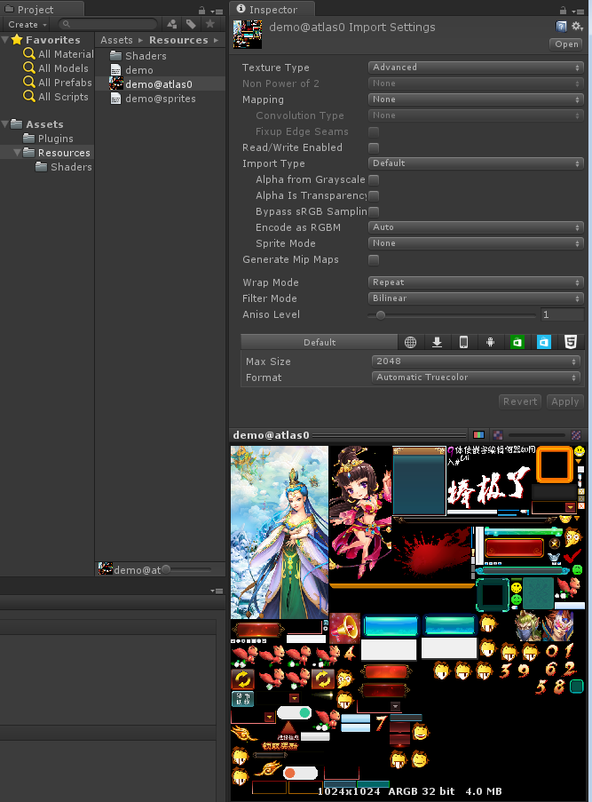
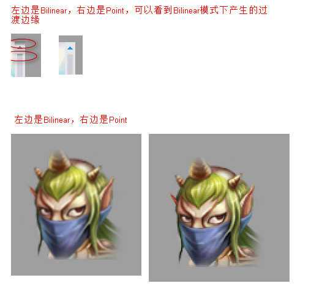
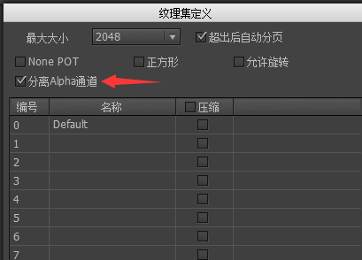

The resources published by the FairyGUI editor to Unity usually contain one or more texture sets. Taking the demo project as an example, here demo@atlas0.png is a texture set.

The texture set is automatically generated by the UI editor, but the properties of the texture set can be changed in Unity. Common settings are:

- `Texture Type`Set to Advanced (pre-5.5) or Default (post-5.5). **Do not set to Sprite.**

- `Texture Shape`Be sure to choose 2D. **This option has appeared since version 5.5. If it is not 2D, there will be a problem that the UI images display white squares.**

- `Generate Mip Maps`Unchecked. The UI does not use Mip Maps.

- `Filter Mode`Use Bilinear, so that the image can produce a smoother transition effect when zoomed, and a side effect is that it will cause some blur. And monochrome image scaling can produce unwanted gradient edges. With Point, the image will become blocky when zoomed.

Generally, you can use Bilinear. You can also arrange images into different texture sets in the UI editor, and then set different Filter Modes for each texture set to meet special needs.

**If you need to eliminate the edge transition caused by the sampling mode of the image, you can set the "Repeat Edge Pixels" in the image properties dialog box.**

- `Max Size`Generally set to 2048.

- `Format`UI texture sets are generally in PNG format with transparent channels. At the same time, the UI has higher requirements for image quality, so it is recommended to choose AutoMatic TrueColor. But the biggest problem with TrueColor is that the files are large and occupy a lot of memory. For example, a 1024 × 1024 atlas will occupy 4MB of memory and 2048 × 2048 will reach 16MB.

If you are sensitive to memory usage, you can also choose a compression format, namely AutoMatic Compressed. It is the same as DXT5 on the desktop platform, equivalent to ETC1 on the Android platform, and PVRTC on the IPhone platform. These formats can greatly reduce memory consumption, and because they are formats that are directly supported by the graphics card, Unity saves the step of decoding bitmaps during loading and can speed up loading. However, they are all lossy compression, and they are definitely not as good as TrueColor in display quality, especially when the texture set is very rich in color or there is a color gradient, the distortion will be more severe. It is particularly important that ETC1 does not support transparent channels, and PVRTC also has weak support for transparent channels, so it is not suitable for atlases with transparent channels. To this end, FairyGUI provides a solution of ETC1 / PVRTC + A. First, check "Separate Alpha Channel" when publishing, as shown below:

In this way, two textures without transparent channels are generated, one with the original image's transparent channel removed, and one with the original texture's transparent channel value converted to an equivalent grayscale. Both posters can be set to Automatic Compressed. (It is important to note that you can no longer set the master map to True Color)

FairyGUI provides a special shader to handle the merging of two posters. Developers do not need to write additional code to use this technique.

You can arrange images without transparent channels (such as some large background images) into a texture set. If all images in a texture set do not contain transparent channels, the final output atlas does not include transparent channels. Atlas without transparent channel can choose Automatic 16bits format.