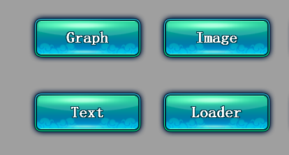
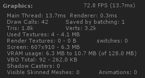
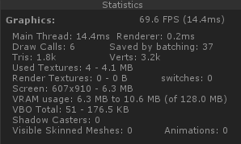

In Unity, the process of each engine preparing data and notifying the GPU is called a Draw Call (DC). The number of draw calls is a very important performance indicator. UI systems generally contain a large number of objects, and effective control of DC is a key factor to measure whether a UI system is practical, especially on mobile devices.

Let's take a look at how NGUI does it. NGUI sorts the widgets in UIPanel by depth, and then meshes the widgets of the same material, such as using the same atlas image or text. The advantage of Mesh merging is that these widgets only generate one DC after merging. However, this merging process needs to calculate the transformation of all Widget coordinates relative to the Panel, and if the behavior of the Widget changes, such as pan, zoom, etc., it will trigger Mesh recombination, which will bring some CPU consumption, which requires developers to carefully organize the UI Elements to each UIPanel, and the depth needs to be carefully arranged, otherwise it is more likely to bring a relatively large CPU consumption while reducing the DC effect.

The principle of UGUI is also similar. Canvas and UIPanel are similar. Each Canvas will be optimized to one Mesh or multiple SubMesh.

FairyGUI did not adopt a strategy of merging Mesh for the following reasons:

- FairyGUI uses a tree-like display object structure, and the hierarchical relationship between various components is very complicated;
- The FairyGUI editor gives users maximum design freedom. With the introduction of dynamic effects, the state of each component changes very frequently;

FairyGUI is based on Unity`Dynamic Batching`Technology that provides`Deep adjustment technology`Perform Draw Call optimization. FairyGUI can adjust objects of the same material to continuous RenderingOrder values as much as possible without changing the final display effect, so that they can be optimized by Unity Dynamic Batching. Dynamic Batching is one of the Draw Call Batching technologies provided by Unity. If dynamic objects share the same material, Unity will automatically batch these objects. But an important premise of Dynamic Batching is that these dynamic objects are continuously rendered. First look at the rendering order of objects in FairyGUI, for example:



There are 4 buttons here, each button is a component, and each component contains an image and a text object. FairyGUI is a tree-like display object structure, so they should be sorted by depth:


Because the text and image materials are not the same, a context switch is generated each time from text to image, so 6 DCs are generated.
FairyGUI's deep adjustment technology can optimize this situation. Observe, in fact, the four buttons do not intersect, so FairyGUI intelligently adjusts the rendering order to:


Because FairyGUI uses atlases, and dynamic text also uses the same textures, in this way, the DC is reduced to two, which achieves the purpose of optimization. The actual situation will be much more complicated than this, but FairyGUI can adjust objects of the same material to continuous RenderingOrder values as much as possible without changing the final display effect, so that they can be optimized by Unity Dynamic Batching. For developers, these adjustments on the bottom layer are transparent, that is, they will not affect the original display object level. In terms of efficiency, this technique only compares whether the display rectangular area (a Rect) between the objects intersects, so the speed is very fast, and it will not cause excessive CPU load.

FairyGUI provides a switch to control whether the depth adjustment is enabled, it is`fairyBatching`,E.g

```csharp
aComponent.fairyBatching = true;
```

If fairBatching is set for a component, there is no need to enable fairBatching in child and grandchildren components. Generally, this function is only turned on in the top-level components, such as the main interface and loading interface. Note that the Window class has opened fairyBatching automatically, which is in line with our usage habits, because we generally arrange functions in units of windows. If the interface is not complicated and the Draw Call is not high, developers can ignore this function. It does not make sense to optimize from 10 DCs to 8 DCs. **Never enable fairyBatching on GRoot.**

For components with fairBatching turned on, when developers call APIs such as SetPosition to change the position, size, rotation, or scaling of child or grandchildren components, depth adjustments are not automatically triggered. For example, an image was originally displayed on the top level of a window. If you use Tween to move it from the original position to another position, the image may be obscured by other elements in the window. At this time, the developer needs to manually trigger the depth adjustment, for example:

```csharp
aObject.InvalidateBatchingState();
```

This API does not need to be called by a component with fairBatching turned on, aObject can be any of the included components. And you can call it at any time, every frame, as long as you confirm that it is needed. Its consumption is not large, but it cannot be said that it is not.

For UI transitions, FairyGUI will automatically call this API after the transition ends. If the size or position of the component is changed during the transition, and the rendering order of the component is observed to be incorrect, you can first try to adjust the design of the transition to avoid changes in the overlapping state between components. You can also force the transition to perform a depth adjustment every frame, for example:

```csharp
aTransition.invalidateBatchingEveryFrame = true;
```

Download and run Demo, you can observe the actual effect of fairyBatching. For example, the front page of this Demo:


After setting FairBatching, it was reduced from 42 DCs to 6 DCs. In addition, you can see the words Saved by batching: 37.




