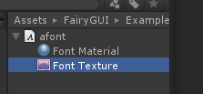

## 使用动态字体

直接使用字体名称即可。例如，设置全局字体：

```csharp
  UIConfig.defaultFont = "Droid Sans Fallback, LTHYSZK, Helvetica-Bold, Microsoft YaHei, SimHei";
```

多个字体名称用逗号隔开。Unity会自动使用第一个能识别的字体名称。但必须有一个是能识别的。能识别的意思是，**必须是在系统环境中存在的字体，且字体名称一定要正确**。假设你设置了“微软雅黑”，那手机上肯定是没有的，显示效果就达不到期望。

 **WebGL平台不支持动态字体（Unity不支持），你必须使用TTF字体**。

## 使用TTF字体

Unity支持直接使用TTF字体资源，只需要将文件名称作为字体名称即可，假设font1.ttf已经放置放置在Resources目录：

```csharp
  UIConfig.defaultFont = "font1";
```

如果TTF文件是放置在Resources目录或者Resources/Fonts目录，那么直接使用字体文件名即可。如果是其他路径，还需要加上路径，假设是放置在Resources/SomePath：

```csharp
  UIConfig.defaultFont = "SomePath/font1";
```

一般来说，字体文件放到Resources目录下即可，如果需要将字体打包到AssetBundle，那么需要自行加载并注册字体，例如：

``` csharp
  Font myFont = myBundle.LoadAsset<Font>(name);
  FontManager.RegisterFont(new DynamicFont("字体名称", myFont),"字体名称");
```

## 字体映射

如果你的界面使用了多种字体，例如对单独的文字设置了字体：


这里用到了"黑体"这个名字的字体，但"黑体"未必能被Unity识别，更加不能在手机上生效。我们需要建立一个这种字体到已知字体的映射。假设我们已经按照上述方法，准备好一个TTF字体HeiTi.ttf，然后：

```csharp
FontManager.RegisterFont(FontManager.GetFont("HeiTi"), "黑体");
```

RegisterFont的第二个参数对应编辑器里使用的字体名称；第一个参数，就是Unity能识别的字体名称，参考上面的“使用动态字体”和“使用TTF字体”。

## 常见问题

### 字体显示变扁了

当你使用部分字体的粗体效果时，你会发现粗体的效果在Unity中的显示不正确，这是因为有些字体不带粗体效果的，这时候Unity就会用拉宽来实现，就像变扁了。FairyGUI可以用额外的mesh来解决粗体的显示。方法是：

```csharp
    FontManager.GetFont("字体名称").customBold = true;
```

某些字体，Unity渲染有粗体效果，但当设置成斜体时，粗体效果又丢失（例如雅黑）。FairyGUI在这种情况可以取消Unity默认渲染粗体的效果，改为增加额外的面渲染粗体。激活这个功能的方法是

```csharp
    FontManager.GetFont("字体名称").customBoldAndItalic = true;
```

如果已经设置了customBold，不需要再设置customBoldAndItalic。

### 文字全部显示为黑色
  
SDK安装不完整，没有放置FairyGUI的着色器。

### 字体显示效果不对

- 如果是动态字体，那么你需要再次确认你的操作系统（例如Windows）里是否有安装这种字体，字体名称是否正确。**对于部分字体，Unity能识别的字体名称不一定是字体的中文名称**。查看准确的系统字体名称，你可以将ttf文件拖入到Unity，就可以在Inspector的"Font Names"里看到正确的字体名称。也可以下载FontCreator软件，查看字体的Font Family属性。

- 如果是TTF字体，运行时在Project视图，点击TTF文件左边的箭头后，可以看到TTF文件下有Font Texture和Font Material。Font Texture里应该有你游戏中使用到的文字，并能看到渲染效果。如果能看到，说明这个字体在Unity中的渲染效果就是这个样子。

  

### 文字出现破碎或者紫色

Unity为字体维护一个动态贴图，里面包含了当前用到的文字。当发生文本赋值时，如果当前贴图不足以容纳新的文字，Unity就会自动重建贴图，那么所有文字对应的UV就会发生变化。这时原来已经在显示的文字就会出现异常，比如破碎，紫色之类的效果。

FairyGUI已经为这种情况内置了应对方案，就是在出现这种情况时马上把所有文字重绘一遍。所以网上一些先行撑大文字贴图的方案在FairyGUI这里并不需要。

但FairyGUI进行这种操作是有时间点的，就是StageEngine.LateUpdate里。如果你的文本赋值发生在LateUpdate，而且很不幸执行顺序在StageEngine.LateUpdate之后，那么FairyGUI没有机会再进行补救了，这帧就会出现文字显示异常的情况。

所以要防止这种情况出现，检查你的文本赋值，尽量放在Update里，不要放到LateUpdate里。如果一定是放到LateUpdate里，调整你的MB的执行顺序在StageEngine之前。