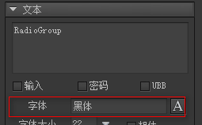

## Use dynamic fonts

Just use the font name. For example, setting a global font:

```csharp
UIConfig.defaultFont = "Droid Sans Fallback, LTHYSZK, Helvetica-Bold, Microsoft YaHei, SimHei";
```

Multiple font names are separated by commas. Unity will automatically use the first recognized font name. But one must be recognizable. Recognizable means,**Must be a font that exists in the system environment, and the font name must be correct**。 Suppose you set "Microsoft Yahei", there must be no on the phone, the display effect will not meet expectations.

**WebGL platform does not support dynamic fonts (not supported by Unity), you must use TTF fonts**。

## Use TTF font

Unity supports the direct use of TTF font resources, just need to use the file name as the font name, assuming font1.ttf has been placed in the Resources directory:

```csharp
UIConfig.defaultFont = "font1";
```

If the TTF file is placed in the Resources directory or Resources / Fonts directory, then use the font file name directly. If it is another path, you also need to add the path, assuming it is placed in Resources / SomePath:

```csharp
UIConfig.defaultFont = "SomePath/font1";
```

Generally speaking, font files can be placed in the Resources directory. If you need to package fonts into AssetBundle, you need to load and register fonts yourself, for example:

```csharp
Font myFont = myBundle.LoadAsset <Font> (name);
  FontManager.RegisterFont (new DynamicFont ("font name", myFont), "font name");
```

## Font mapping

If your interface uses multiple fonts, such as setting fonts for individual text:



The font "Heihei" is used here, but "Heihei" may not be recognized by Unity, and it will not work on mobile phones. We need to establish a mapping of this font to known fonts. Suppose we have prepared a TTF font HeiTi.ttf according to the above method, and then:

```csharp
FontManager.RegisterFont (FontManager.GetFont ("HeiTi"), "Bold");
```

The second parameter of RegisterFont corresponds to the font name used in the editor; the first parameter is the name of the font that Unity can recognize. Refer to "Use Dynamic Font" and "Use TTF Font" above.

## common problem

### Font display becomes flat

When you use the bold effect of some fonts, you will find that the bold effect is displayed incorrectly in Unity. This is because some fonts do not have a bold effect. At this time, Unity will use widening to achieve, Like flattened. FairyGUI can solve bold display with extra mesh. the way is:

```csharp
FontManager.GetFont ("font name"). CustomBold = true;
```

For some fonts, the Unity rendering has a bold effect, but when set to italic, the bold effect is lost again (such as Yahei). In this case, FairyGUI can cancel the effect of Unity's default rendering bold, and add extra face rendering bold. The way to activate this feature is

```csharp
FontManager.GetFont ("font name"). CustomBoldAndItalic = true;
```

If customBold is already set, you do not need to set customBoldAndItalic.

### All text is displayed in black

The SDK installation is incomplete and there is no shader for FairyGUI.

### Incorrect font display

- If it is a dynamic font, then you need to double-check that it is installed in your operating system (such as Windows) and the font name is correct. **For some fonts, the font names that Unity recognizes are not necessarily the Chinese names of the fonts**。 Check the exact system font name, you can drag the ttf file into Unity, and you can see the correct font name in the "Font Names" of the Inspector. You can also download FontCreator software to view the Font Family properties of the font.

- If it is a TTF font, in the Project view at runtime, after clicking the arrow to the left of the TTF file, you can see the Font Texture and Font Material under the TTF file. The Font Texture should contain the text used in your game and you can see the rendering effect. If you can see it, it means that the rendering of this font in Unity looks like this.

   

### Text appears broken or purple

Unity maintains a dynamic map for the font, which contains the text currently in use. When text assignment occurs, if the current map is not enough to accommodate the new text, Unity will automatically rebuild the map, and the UV corresponding to all text will change. At this time, the text already displayed will be abnormal, such as broken, purple and other effects.

FairyGUI has a built-in response to this situation, which is to redraw all the text immediately when this happens. Therefore, some of the online support for large text stickers are not needed here at FairyGUI.

But FairyGUI has time for this kind of operation, which is in StageEngine.LateUpdate. If your text assignment occurs in LateUpdate, and unfortunately the execution order is after StageEngine.LateUpdate, then FairyGUI has no chance to remedy it, and this frame will have abnormal text display.

So to prevent this from happening, check your text assignment and try to put it in Update instead of LateUpdate. If it must be put into LateUpdate, adjust the execution order of your MB before StageEngine.